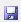
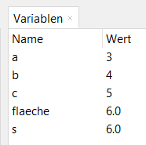

# Python script

Bei komplizierteren Berechnungen kann es sinnvoll sein, 
den Code in einem Skript zu speichern und von dort aus auszuführen. 
Ein Skript ist eine Textdatei, die Python-Code enthält. 
Der Code wird von Python interpretiert und ausgeführt. 
Ein Skript kann in einem Texteditor geschrieben und als Textdatei gespeichert werden. 
Der Dateiname sollte die Endung `.py` haben.

Im linken oberen Bereich der Entwicklungsumgebung Thonny kann man ein neues Skript erstellen.


Unter der Menu-Leiste findest du Buttons zum 
Beginnen eines neuen Skripts
zum Speichern  und 
Öffnen eines bestehenden Skripts .

Du kannst nun z.B. die Zeilen vom vorigen Kapitel zur Berechnung der 
Fläche des Dreiecks hier einfügen und das Skript speichern:


Wenn du das Script nun laufen lässt , 
werden alle Zeilen nacheinander ausgeführt. In jeder Zeile steht eine Anweisung.
Wenn das Script fertig ist, sieht das Variablenfenster so aus:



Beim Ausführen eines Skripts werden die zuvor definierten Variablen gelöscht 
und dafür die neuen Variablen von den Anweisungen des Scripts angelegt.

Du kannst auch am Ende des Skripts die berechnete Fläche mit print ausgeben:

```python
a = 3
b = 4
c = 5
s = (a + b + c) / 2
flaeche = (s * (s - 3) * (s - 4) * (s - 5)) ** 0.5
print("Fläche: ", flaeche)
```

Wenn du das Skript nun laufen lässt, 
wird die Fläche des Dreiecks in der Kommandozeile ausgegeben. Die Anweisung print(...) 
gibt also das, was zwischen den Klammern steht, auf der Konsole aus.

```python
>>> %Run allgemeines_dreieck.py
Fläche:  6.0
```

Wenn du nun die Fläche von mehreren verschiedenen Dreiecken berechnen willst, 
kannst du jedes Mal die Seitenlängen (a, b, c) ändern und das Skript erneut laufen lassen.

## Kommentare

In einem Skript kannst du auch Kommentare einfügen.
Ein Kommentar ist ein Text, der von Python ignoriert wird.
Er dient dazu, den Code zu dokumentieren und zu erklären.

Ein Kommentar wird mit einer Raute `#` eingeleitet.
Alles, was nach der Raute steht, wird von Python ignoriert.

```python
# Berechnung der Fläche eines allgemeinen Dreiecks
a = 3
b = 4
c = 5
s = (a + b + c) / 2
flaeche = (s * (s - 3) * (s - 4) * (s - 5)) ** 0.5
print("Fläche: ", flaeche)
```

## [Übungen](../uebungen/UE_E0_Script.md)


[<<](D0_Variablen.md) &emsp; [>>](F0_Debugger.md)