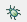
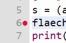

# Debugger

Bald wirst du auch kompliziertere Scripts schreiben, bei denen du nicht mehr so einfach erkennen kannst, 
ob sie richtig funktionieren oder warum sie nicht richtig funktionieren.
Dann ist es hilfreich, wenn du den Debugger benutzt.
Der Debugger ist ein Werkzeug, mit dem du ein Script Schritt für Schritt durchgehen kannst,
um zu sehen, was bei jedem Schritt passiert.

In Thonny kannst du den Debugger starten, indem du auf das kleine Käfer-Symbol 
 klickst.
Dann wird das Script gestartet und bei jeder Anweisung angehalten.
Du kannst dann die Variablenwerte sehen und das Script Schritt für Schritt durchgehen.
Mit diesem Pfeil  gehst du einen Schritt weiter.
Mit Stop  kannst du das Debugging beenden.
Mit dem grünen Pfeil  kannst du das Script weiter laufen lassen. 
Es läuft dann bis zum nächsten Breakpoint oder bis zum Ende.

Einen Breakpoint setzt du, indem du in der Zeile, bei der du anhalten möchtest, auf die linke Seite klickst.

## [Übung](../uebungen/UE_F0_Debugger.md)

[<<](E0_Script.md) &emsp; [>>](G0_Funktionen.md)