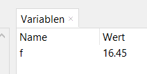
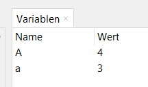
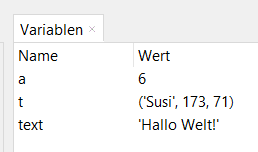

# 3.0 Ergebnisse zwischenspeichern - Variablen

Es ist zwar schön, dass wir in der Python-Konsole Rechnungen durchführen können, 
aber meistens wollen wir die Ergebnisse speichern, 
um sie später wiederzuverwenden. Dazu verwenden wir `Variablen`. 
Eine `Variable` ist ein Behälter, in dem wir Werte speichern können.

Wenn du z.B. das Ergebnis der Berechnung der Fläche eines Rechtecks speichern möchtest, kannst du das so machen:

```python
>>> f = 3.5 * 4.7
```

In der Entwicklungsumgebung Thonny gibt es ein Fenster, in dem du die Werte von Variablen sehen kannst:



Falls dieses Fenster bei dir nicht sichtbar ist, 
kannst du es über das Menu `Ansicht` -> `Variablen` einblenden.

Du kannst hier sehen, dass die Variable den Namen `f` und den Wert `16.45`hat.

## Variablennamen

Variablennamen dürfen nur aus Buchstaben, Zahlen und Unterstrichen bestehen.
Der Name darf nicht mit einer Zahl beginnen.
Der Name darf nur aus einem einzelnen Wort (ohne Leerzeichen) bestehen.
Groß- und Kleinschreibung wird unterschieden:

```python
>>> a = 3
>>> A = 4
```



Du solltest Variablennamen so wählen, dass sie aussagekräftig sind. 
Im oben gezeigten Beispiel ist `f` nicht sehr aussagekräftig.
Besser wäre z.B. `flaeche`:

```python
>>> flaeche = 3.5 * 4.7
```

Das gute an Variablen ist, dass du sie später wieder verwenden kannst:

```python
>>> doppelteFlaeche = 2 * flaeche
>>> doppelteFlaeche
32.9
```

Wie du in diesem Beispiel siehst, kannst du den Wert einer Variable auch anzeigen lassen, indem du einfach den Variablennamen eingibst.

## Kompliziertere Berechnungen mit Hilfe von Variablen

Variablen sind besonders nützlich, wenn du kompliziertere Berechnungen durchführen möchtest.
Hier ein Beispiel, bei dem wir die Fläche eines Dreiecks mit den Seitenlängen 
`a = 4.53`, `b = 5.21` und `c = 6.17` mit der 
[Formel von Heron](https://www.arndt-bruenner.de/mathe/9/herondreieck.htm) berechnen:

$A = \sqrt{s \cdot (s - a) \cdot (s - b) \cdot (s - c)}$

$s = \frac{a + b + c}{2}$

```python
>>> a = 4.53
>>> b = 5.21
>>> c = 6.17
>>> s = (a + b + c) / 2
>>> flaeche = (s * (s - 3) * (s - 4) * (s - 5)) ** 0.5
>>> flaeche
21.463172100149247
```

Man kann hier sehen, dass es einfacher ist, die Variablen `a`, `b` und `c` zu verwenden, 
als die Zahlen direkt in die Formel einzusetzen.

## Inhalte von Variablen

Wir haben also gesehen, dass wir Werte in Variablen speichern und später wieder verwenden können.

Den Inhalt einer Variablen kannst du aber auch verändern:

```python
>>> a = 5
>>> a
5
>>> a = a + 1
>>> a
6
``` 

Bisher haben wir nur Zahlen in Variablen gespeichert.
Du kannst aber auch andere Objekte in Variablen speichern, z.B. Text:

```python
>>> text = "Hallo, Welt!"
>>> text
'Hallo, Welt!'
``` 
(Den Text müssen wir in Anführungszeichen setzen.)

... oder zusammengesetzte Objekte:

```python
>>> t = ('Susi', 173, 71)
>>> t
('Susi', 173, 71)
```

(Ein Objekt, welches aus mehreren Werten in runden Klammern besteht, nennt man Tupel.)

Im Variablenfenster sieht das dann so aus:



Später werden wir noch viele weitere Arten von Objekten kennenlernen, die wir in Variablen speichern können.

## Übungen
[Hier geht's zu den Übungen](../uebungen/UE_03.0_Variablen.md)

## Zusammenfassung
### Wichtige Begriffe
- Variable
- Zuweisung
- Inhalt einer Variable

### Das sollst du können
- Variablennamen wählen (Regeln beachten)
- Werte in Variablen speichern
- Ergebnisse von Berechnungen in Variablen speichern
- Werte von Variablen anzeigen
- Variablen in Berechnungen verwenden


[<<](02.1_PythonAlsTaschenrechner.md) &emsp; [>>](03.1_Datentypen.md)
