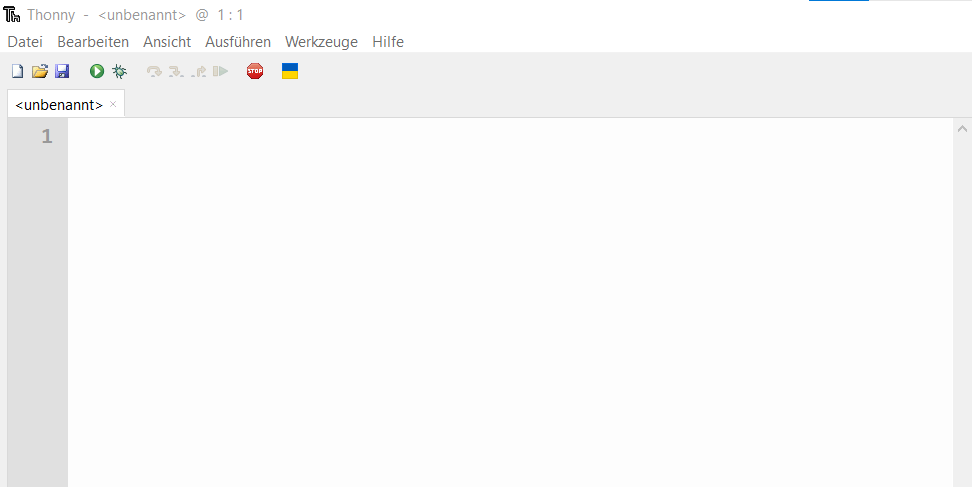
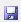
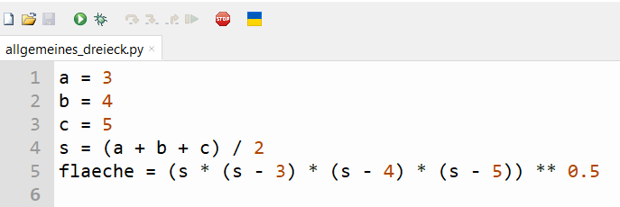
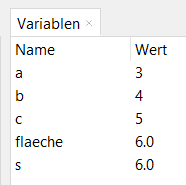

# 4.0 Python script

Wenn du viele Anweisungen schreibst, also dein Programm größer wird, oder du die gleichen Befehle
immer wieder ausführen möchtest ist es sinnvoll, 
die Python-Anweisungen in einem Skript zu speichern und 
dort aus auszuführen. 
Ein Skript ist eine Textdatei, die Python-Code enthält. 
Das ganze Skript wird von Python interpretiert und ausgeführt. 
Ein Skript kann in einem Texteditor geschrieben 
und als Textdatei gespeichert werden. 
Der Dateiname sollte die Endung `.py` haben.
Hinweis: Du musst in Windows Datei-Explorer die Dateiendungen anzeigen. Siehst du keine Dateiendungen wie .py oder .txt, dann lass die Dateiendungen anzeigen.

Ein in Python formuliertes Skript ist also ein Computerprogramm.
Es enthält Befehle, die der Computer der Reihe nach abarbeitet. Gibt es keine weiteren Befehle, endet das Programm.

Im linken oberen Bereich der Entwicklungsumgebung Thonny kann man ein neues Skript erstellen.



Unter der Menu-Leiste findest du Buttons zum 
Beginnen eines neuen Skripts
zum Speichern  und 
Öffnen eines bestehenden Skripts .

Du kannst nun z.B. die Zeilen vom vorigen Kapitel zur Berechnung der 
Fläche des Dreiecks hier einfügen und das Skript speichern:



Wenn du das Script ausführst , 
werden alle Zeilen nacheinander ausgeführt. In jeder Zeile steht eine Anweisung.
Wenn das Script fertig ist, sieht das Variablenfenster so aus:



Beim Ausführen eines Skripts werden die zuvor definierten Variablen gelöscht 
und dafür die neuen Variablen von den Anweisungen des Scripts angelegt.

Du kannst auch am Ende des Skripts die berechnete Fläche mit print ausgeben:

```python
a = 3
b = 4
c = 5
s = (a + b + c) / 2
flaeche = (s * (s - 3) * (s - 4) * (s - 5)) ** 0.5
print("Fläche: ", flaeche)
```

Wenn du das Skript ausführst, 
wird die Fläche des Dreiecks in der Kommandozeile ausgegeben. Die Anweisung print(...) 
gibt also das, was zwischen den Klammern steht, in der Kommandozeile aus.
Hinweis: Suche in einer KI nach einer Erklärung von print in Python. Warum stehen hier Klammern und ein Beistrich? 

```python
>>> %Run allgemeines_dreieck.py
Fläche:  6.0
```

Wenn du nun die Fläche von mehreren verschiedenen Dreiecken berechnen willst, 
kannst du jedes Mal die Seitenlängen (a, b, c) ändern und das Skript erneut ausführen.

## Kommentare

In ein Skript kannst du auch Kommentare einfügen.
Ein Kommentar ist ein Text, der von Python nicht ausgeführt, also ignoriert wird.
Er dient dazu, den Code zu dokumentieren und zu erklären.

Ein Kommentar wird mit einer Raute `#` eingeleitet.
Alles, was nach der Raute steht, wird von Python ignoriert.

```python
# Berechnung der Fläche eines allgemeinen Dreiecks
a = 3
b = 4
c = 5
s = (a + b + c) / 2
flaeche = (s * (s - 3) * (s - 4) * (s - 5)) ** 0.5
print("Fläche: ", flaeche)
```

## Übungen
[Hier geht's zu den Übungen](../uebungen/UE_04.0_Script.md)

## Zusammenfassung
### Wichtige Begriffe
- Skript
- Computerprogramm
- Kommentar
- Ausführen

### Das sollst du können
- Skripte erstellen
- Skripte speichern
- Skripte öffnen
- Skripte ausführen
- Dateiendungen anzeigen
- Kommentare in Skripte einfügen
- print-Anweisung verwenden


[<<](03.0_Variablen.md) &emsp; [>>](04.1_Debugger.md)
