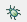
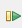
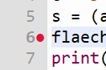

# 4.1 Debugger

Bald wirst du auch kompliziertere Scripts schreiben, bei denen du nicht mehr so einfach erkennen kannst, 
ob sie richtig funktionieren oder warum sie nicht richtig funktionieren.
Die Programme werden sehr schnell ausgeführt und die angezeigten Variablen sind nur die Werte am Ende vom Programm. Du wirst am Ende sicher unerwartete Ergebnisse bekommen und möchtest dann wissen, bei welchem der vielen Befehle ein falscher Wert entstanden ist.
Dann ist es hilfreich, wenn du den `Debugger` benutzt.
Der Debugger ist ein Werkzeug, mit dem du ein Script Schritt für Schritt durchgehen kannst,
um zu sehen, was bei jedem Schritt passiert.

In Thonny kannst du den Debugger starten, indem du auf das kleine Käfer-Symbol 
 klickst.
Dann wird das Script gestartet und bei jeder Anweisung angehalten.
Du kannst dann die Variablenwerte sehen und das Script Schritt für Schritt durchgehen.
Mit diesem Pfeil  gehst du einen Schritt weiter.
Mit Stop  kannst du das Debugging beenden.
Mit dem grünen Pfeil  kannst du das Script weiter laufen lassen. 
Es läuft dann bis zum nächsten Breakpoint oder bis zum Ende.

Einen Breakpoint setzt du, indem du in der Zeile, bei der du anhalten möchtest, auf die linke Seite klickst. Das Programm pausiert dann an dieser Stelle und du kannst die Werte zu diesem Zeitpunkt sehen. Machst du danach einen Schritt vorwärts, wir ein einzelner weiterer Befehl ausgeführt und die Werte der Variablen nach diesem Befehl angezeigt usw.

Funfact: Das Wort Debuggen kommt aus der Zeit, als die Computer noch einen ganzen Raum gefüllt haben und die Schaltkreise riesig und offen waren. Zu der Zeit ist es durchaus vorgekommen, dass Käfer (bugs) in die Schaltkreise gekommen sind und somit einen Kurzschluss oder Fehlfunktion verursacht haben. Diese Käfer mussten entfernt werden => de_bug_ging. 

## Übung 
[Hier geht's zur Übung](../uebungen/UE_04.1_Debugger.md)

## Zusammenfassung
### Wichtige Begriffe
- Debugger
- Breakpoint
- Programmschritt

### Das sollst du können
- Debugger starten
- Breakpoints setzen
- Debugger bis zu Breakpoint weiter laufen lassen
- Script in Einzelschritten durchgehen
- Debugger bis zum Ende weiter laufen lassen
- Debugger beenden

[<<](04.0_Script.md) &emsp; [>>](05.0_Funktionen.md)
