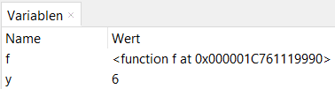
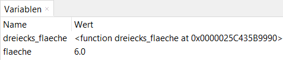
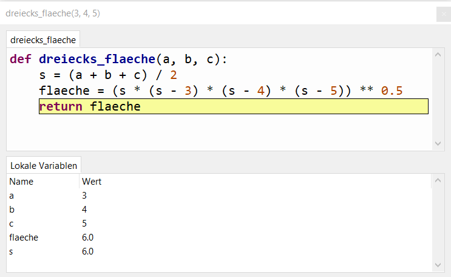

# 5.0 Funktionen

Wahrscheinlich hast du im Mathematikunterricht schon Funktionen kennengelernt.
Dort ist eine `Funktion`  eine Vorschrift, die eine oder mehrere `Eingangsgrößen` 
in eine `Ausgangsgröße` umrechnet. Die Funktion wird 1x geschrieben und kann dann mit verschiedenen Werten aufgerufen werden.

Beispiel: Die Funktion `f(x) = 2*x` multipliziert die Eingangsgröße `x` mit `2`.

Beim Programmieren wird eine Funktion verwendet, um Code, der in einem Programm immer wieder vorkommt nur 1x schreiben zu müssen.
In Python kannst du Funktionen definieren, die **eine** oder **mehrere** Eingangsgrößen haben 
und eine oder mehrere Ausgangsgrößen berechnen. 
Dabei kann die Berechnung durchaus komplizierter sein 
und auch in mehreren Schritten erfolgen und dabei 
Zwischenergebnisse in Hilfsvariablen speichern.
In Python `muss` eine Funktion jedoch keine Eingangs- 
und Ausgangsgrößen haben, wenn du Z.B. die aktuelle Urzeit ausgeben möchtest.

## Funktionen definieren

Eine Funktion wird in Python mit dem Schlüsselwort `def` **def**iniert. 
Die Funktion hat hier den Namen `f`. Achte auf den Doppelpunkt und die Einrückung.
Alles, was nach dem : eingerückt steht, gehört zu der Funktion und wird ausgeführt.
Das Return steht sinnvollerweise erst am Schluss, weil die Funktion sonst früher abbricht und der 
Code nach dem return nicht ausgeführt wird.

```python
def f(x):
    return 2*x
```

Die Funktion `f` hat eine Eingangsgröße `x` und berechnet die Ausgangsgröße `2*x`.
`return` gibt das Ergebnis der Funktion zurück.
Das Ergebnis kann dann ausgegeben oder einer anderen Variable zugewiesen werden.


## Funktionen aufrufen

Du kannst die Funktion `f` mit einem Wert für `x` (z.B. 3) aufrufen:

```python
y = f(3)
```

Vorher haben wir gelesen, dass die Funktion das Ergebnis zurückliefert.
Das Ergebnis des Funktionsaufrufs ist `6` und wird in diesem Beispiel 
in der Variable `y` gespeichert. Die Funktion kann also auf der rechten Seite einer Zuweisung 
verwendet werden. Das Ergebnis der Funktion wird dann für die Zuweisung verwendet.


Sehen wir uns noch einmal den kompletten Python-Code an:

```python
def f(x):
    return 2*x

y = f(3)
```

Die Zeile mit `def f(x):`  wird `Funktionskopf` genannt. 
Hier wird definiert, dass die Funktion `f` heißt und eine Eingangsgröße `x` hat.
Die Eingangsgröße wird auch als `Parameter` oder `Argument` bezeichnet.

Die Zeile `return 2*x` berechnet mit der Eingangsgröße `x` die Ausgangsgröße `2*x`. 
Diese Zeile heißt `Funktionskörper`. Der Funktionskörper wird durch Einrückung 
(4 Leerzeichen bzw. 1 Tabulator) gekennzeichnet. Er kann auch aus mehreren Zeilen bestehen.
Das Schlüsselwort `return` gibt das Ergebnis der Funktion zurück.


`y = f(3)` ruft die Funktion `f` mit dem Wert `3` als Eingangsgröße `x` auf 
und speichert das Ergebnis in der Variable `y`. Mit dieser Variable kann nun 
weiter gerechnet werden.

Nach dem Ausführen des Codes hat das Variablen-Fenster folgenden Inhalt:



Die Variable `y` hat den Wert `6`.

*(Die Funktion `f` wird von Python ebenfalls als Variable behandelt. 
Der Wert dieser Variable ist eine Speicheradresse, die auf den Funktionskörper zeigt.
Die Speicheradresse wird bei dir wahrscheinlich eine andere sein.)*


## Weitere Beispiele

Hier nun ein etwas umfangreicheres Beispiel. 
Kopiere es in eine Script-Datei und führe es aus:

```python
def dreiecks_flaeche(a, b, c):
    s = (a + b + c) / 2
    flaeche = (s * (s - 3) * (s - 4) * (s - 5)) ** 0.5
    return flaeche

ergebnis1 = dreiecks_flaeche(3, 4, 5)
ergebnis2 = dreiecks_flaeche(70, 100, 565)
```

Die Funktion `dreiecks_flaeche` berechnet die Fläche eines Dreiecks mit den 
Seitenlängen `a`, `b` und `c`. So wie bei Variablen sollte man auch bei Funktionen
sprechende Namen verwenden (in diesem Fall `dreiecks_flaeche`).

Die Funktion hat drei Parameter `a`, `b` und `c` und berechnet 
die Ausgangsgröße `flaeche`. Diese wird mit `return` zurückgegeben.

Im Funktionskörper werden die Zwischenergebnisse `s` und `flaeche` berechnet.
Die Variablen `s` und `flaeche` und auch die Parameter `a`, `b` und `c` 
werden nach dem Ausführen des Scripts nicht im Variablenfenster sichtbar sein.
Sie sind nur innerhalb der Funktion definiert.

Beim Aufruf der Funktion werden die Werte `3`, `4` und `5` 
den Parametern `a`, `b` und `c` zugewiesen. 
Man sagt auch, die Werte werden in die Funktion übergeben.
Der Wert der Variable `flaeche` wird mit `return`zurückgegeben 
und in der Variable `ergebnis1` gespeichert.
Die gleiche Funktion wird ein zweites Mal aufgerufen. Hier sieht man den großen Vorteil: Wir müssen den Code für die Berechnung nur einmal schreiben.

Nach dem Ausführen des Codes hat das Variablen-Fenster folgenden Inhalt:



HINWEIS: Die Variablen `s` und `flaeche` 
sind nur innerhalb der Funktion `dreiecks_flaeche` definiert und können
nicht außerhalb dieser Funktion verwendet werden. 
Du siehst sie auch nicht im normalen Variablen-Fenster.

## Vorteil von Funktionen

Der Vorteil von Funktionen ist, dass du den Funktionskörper nur einmal schreiben musst.
Du kannst die Funktion dann beliebig oft aufrufen, um das Ergebnis zu berechnen.
In unserem Beispiel haben wir eine Funktion, die die Fläche eines Dreiecks berechnet.
Diese Funktion können wir nun beliebig oft aufrufen, 
um die Fläche verschiedener Dreiecke zu berechnen.

## Debugging von Funktionen

Wenn du eine Funktion mit dem Debugger Schritt für Schritt durchgehen willst, 
musst du dem Debugger sagen, dass er in die Funktion springen soll.
Das machst du mit dem Symbol .

Danach öffnet sich in der Entwicklunsumgebung Thonny ein neues Fenster:



Hier kannst du nun auch die Werte der Variablen `s` und `flaeche` und auch der 
Parameter `a`, `b` und `c` sehen. Die Variablen werden hier lokale Variablen genannt,
weil sie nur innerhalb der Funktion definiert sind.
Sobald die Funktion beendet ist, sind diese Variablen nicht mehr verfügbar.

## Übungen
[Hier geht's zu den Übungen](../uebungen/UE_05.0_Funktionen.md)

## Zusammenfassung
### Wichtige Begriffe
- Funktion
- Funktionskopf
- Funktionskörper
- Parameter (Eingangsgrößen, Argumente)
- Rückgabewert (return, Ausgangsgröße)
- lokale Variable
- Funktionsaufruf

### Das sollst du können
- Funktionen definieren
- Funktionen aufrufen
- Funktionen debuggen
- Funktionen mit mehreren Parametern definieren
- den Rückgabewert einer Funktion verwenden

[<<](04.1_Debugger.md) &emsp; [>>](05.1_Module.md)


