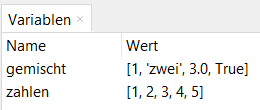

# 9.0 Listen

Im Kapitel [Variablen](03.0_Variablen) habst du bereits gesehen, 
dass eine Variable einen Wert speichert. 
Dort hast du auch schon erfahren, dass es verschiedene Arten von
Werten gibt, welche in Variablen gespeichert werden können: 
Zahlen, Zeichenketten, Wahrheiswerte, ...
Es wurd dort auch bereits angedeutet, dass es auch möglich ist,
mehrere bzw. zusammengesetze Werte in einer Variable zu speichern.

Eine Möglichkeit, mehrere Werte in einer Variable zu speichern,
sind Listen.

## Listen erstellen

Eine Liste ist eine geordnete Sammlung von Werten, 
die in eckigen Klammern stehen.

```python
>>> zahlen = [1, 2, 3, 4, 5]
```

In diesem Beispiel wird eine Liste mit den Zahlen 1 bis 5 erstellt
und in der Variablen `zahlen` gespeichert.

Listen können auch Werte unterschiedlicher Typen enthalten:

```python
>>> gemischt = [1, "zwei", 3.0, True]
```

In diesem Beispiel wird eine Liste mit einer Zahl, einem String, 
einer Gleitkommazahl und einem Wahrheitswert erstellt.
(So etwas wird allerdings eher selten gemacht.)

## Listen anzeigen

Um den Inhalt einer Liste anzuzeigen, gibst du einfach den Namen der Liste ein:

```python
>>> zahlen
[1, 2, 3, 4, 5]
>>> gemischt
[1, 'zwei', 3.0, True]
```

Wie immer kannst du den Inhalt der Variablen auch im Variablenfenster sehen:



## Zugriff auf Listenelemente

Du kannst auf die Elemente einer Liste zugreifen, 
indem du den Index des Elements in eckigen Klammern hinter den Namen der Liste schreibst.
Der Index des ersten Elements ist 0, der des zweiten Elements 1, usw.

```python
>>> zahlen[0]
1
>>> zahlen[2]
3
```

Der Index gibt also die Position des Elements in der Liste an. Die Nummerierung beginnt bei 0.
So kannst du nun z.B. den Wert des zweiten Elements der Liste an eine andere Variable zuweisen:

```python
>>> a = zahlen[1]
>>> a
2
```

Du kannst auf diese Weise auch den Wert eines Listenelements verändern:

```python
>>> zahlen[3] = 42
>>> zahlen
[1, 2, 3, 42, 5]
```

## Listenlänge

Die Anzahl der Elemente einer Liste kannst du mit der Funktion `len()` ermitteln:

```python
>>> l = len(zahlen)
>>> l
5
```

## Listenoperationen

Du kannst Listen verketten:

```python
>>> alles = zahlen + gemischt
>>> alles
[1, 2, 3, 4, 5, 1, 'zwei', 3.0, True]
```

Du kannst eine Liste mit einem Wert multiplizieren:

```python
>>> doppelt = zahlen * 2
>>> doppelt
[1, 2, 3, 4, 5, 1, 2, 3, 4, 5]
```

Damit wird die Liste `zahlen` zweimal hintereinander geschrieben.

Du kannst Listen **umkehren**:
```python
>>> forward = [1,2,3]
>>> reverse = list(reversed(forward))

>>> print(forward)
[1,2,3]
>>> print(reverse)
[3,2,1]
```

Oder ohne neue Variable

```python
>>> lst = [1,2,3]

>>> print(lst)
[1,2,3]
>>> lst.reverse()
>>> print(lst)
[3,2,1]
```

> [Quelle](https://www.geeksforgeeks.org/python-reversing-list/)

## Elemente anhängen

Du kannst ein Element an das Ende einer Liste anhängen:

```python
>>> zahlen.append(6)
>>> zahlen
[1, 2, 3, 4, 5, 6]
```

`append(6)` ist der Aufruf der Methode mit dem Namen `append`. 
Damit wird das Element `6` an die Liste `zahlen` angehängt.

*(Methoden sind Funktionen, 
die zu einem Objekt - in diesem Fall zu einer Liste - gehören. 
Wir werden uns in einem spätern Kapitel 
noch ausführlicher mit Objekten und Methoden beschäftigen.)*


## Elemente einfügen

Du kannst ein Element an einer bestimmten Position in eine Liste einfügen:

```python
>>> zahlen.insert(2, 2.5)
>>> zahlen
[1, 2, 2.5, 3, 4, 5, 6]
```
Die Methode `insert` fügt das Element `2.5` an der Position `2` in die Liste `zahlen` ein.


## Übungen
[Hier geht's zu den Übungen](../uebungen/UE_09.0_Listen.md)

[Hier geht's zu weiteren Übungen zum Selbststudium](../uebungen/UE_09.3_Weitere_%C3%9Cbungen.md)


## Zusammenfassung
### Wichtige Begriffe
- Liste
- Index
- `len()`
- `append()`
- `insert()`

### Das sollst du können
- Listen erstellen
- Listen anzeigen
- auf Listenelemente zugreifen
- Listenlänge ermitteln
- Elemente an eine Liste anhängen
- Elemente in eine Liste einfügen

[<<](08.0_IfElse.md) &emsp; [>>](09.1_Iteration.md)
