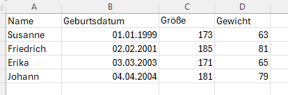

# 13.0 CSV-Dateien

CSV-Dateien sind Textdateien, die Tabellenstrukturen enthalten.
CSV steht für "Comma Separated Values".
Jede Zeile der Datei entspricht einer Zeile der Tabelle.
Die Werte in den Zeilen sind durch Trennzeichen getrennt.
In den meisten Fällen sind das Kommas, Strichpunkte oder Tabulatoren.

In diesem Kapitel werden wir uns darauf beschränken, CSV-Dateien einzulesen und die Daten zu verarbeiten.

CSV-Dateien können mit Excel oder anderen Tabellenkalkulationsprogrammen 
erstellt und geöffnet werden.

Verwende Excel, um eine Datei mit folgendem Inhalt zu erstellen
(natürlich kannst du auch andere Werte verwenden):



Speichere die Datei als CSV-Datei ab.
Alternativ kannst du auch die Datei [demo.csv](../daten/demo.csv) verwenden.
Die Datei muss in deinem Python Arbeitsverzeichnis liegen.
Schau dir die Datei zuerst in einem Texteditor 
(z.B. Notepad oder auch Thonny) an, 
um zu sehen, wie sie aufgebaut ist.
(Standardmäßig wird Excel die Datei mit Semikolons statt Kommas trennen.)

## CSV-Datei einlesen

Es gibt in Python viele Möglichkeiten, CSV-Dateien einzulesen.
Wir verwenden hier die Bibliothek `pandas`.

Bevor du `pandas` verwenden kannst, musst du es installieren. 
Gib in der Kommandozeile den folgenden Befehl ein.

```python
>>> ! pip install pandas
```

Mit `pandas` ist es sehr einfach, eine CSV-Datei einzulesen:

```python
>>> import pandas
>>> data = pandas.read_csv("demo.csv", delimiter=";")
>>> data
        Name Geburtsdatum  Größe  Gewicht
0    Susanne   01.01.1999    173       63
1  Friedrich   02.02.2001    185       81
2      Erika   03.03.2003    171       65
3     Johann   04.04.2004    181       79
```

Die Variable `data` enthält nun die Daten aus der CSV-Datei.
Sie hat den Datentyp `DataFrame`.

Ein DataFrame Objekt enthält die Daten einer ganzen Tabelle.
Die Zeilen sind durchnummeriert (beginnend bei 0).
Die Spalten haben die Namen, 
welche in der ersten Zeile der CSV-Datei stehen.

## Daten verarbeiten

Auf eine Spalte des DataFrames kannst du über den Namen zugreifen:

```python
>>> s = data["Größe"]
>>> s
0    173
1    185
2    171
3    181
Name: Größe, dtype: int64
```

Das Ergebnis ist eine `Serie`. 
Eine `Serie` ist eine spezielle Art von Liste.
Du kannst eine normale Liste daraus machen:

```python
>>> l = list(s)
>>> l
[173, 185, 171, 181]
```

Du kannst auch auf eine Zeile des DataFrames zugreifen:

```python
>>> zeile = data.iloc[2]
>>> zeile
Name                 Erika
Geburtsdatum    03.03.2003
Größe                  171
Gewicht                 65
Name: 2, dtype: object
```

Auch hier ist das Ergebnis eine `Serie`.
In diesem Fall kannst du auf die einzelnen Elemente der Zeile wie
auf ein Tupel zugreifen:

```python
name, geburtsdatum, groesse, gewicht = zeile
print(name)
print(geburtsdatum)
print(groesse)
print(gewicht)
```


Du kannst auch auf ein einzelnes Element zugreifen:

```python
>>> name, geburtsdatum, groesse, gewicht = zeile
>>> name
'Erika'
>>> geburtsdatum
'03.03.2003'
>>> groesse
171
>>> gewicht
65
```

Das folgende Skript liest die CSV-Datei und findet heraus,
wer die größte Person ist:

```python
import pandas
data = pandas.read_csv("demo.csv", delimiter=";")
max = 0
person = ""
for i in range(len(data)):
    zeile = data.iloc[i]
    name, geburtsdatum, groesse, gewicht = zeile
    if groesse > max:
        max = groesse
        person = name
print(person, "ist die größte Person.")
```

In diesem Skript wird eine Schleife 
über alle Zeilen des DataFrames ausgeführt.
Für jede Zeile wird die Größe der Person überprüft.
Wenn die Größe größer ist als die bisher größte Größe (`max`),
wird `max` aktualisiert und der Name der Person gespeichert.

## Übungen
[Hier geht's zu den Übungen](../uebungen/UE_13.0_CSV_Dateien.md)


[<<](12.0_Tupel.md) &emsp; [>>](14.0)


