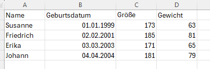

# 14.0 CSV-Dateien / DataFrame

CSV-Dateien sind Textdateien, die Tabellenstrukturen enthalten.
CSV steht für "Comma Separated Values".
Jede Zeile der Datei entspricht einer Zeile der Tabelle.
Die Werte in den Zeilen sind durch Trennzeichen getrennt.
In den meisten Fällen sind das Kommas, Strichpunkte oder Tabulatoren.

In diesem Kapitel werden wir uns darauf beschränken, CSV-Dateien einzulesen und die Daten zu verarbeiten.

CSV-Dateien können mit Excel oder anderen Tabellenkalkulationsprogrammen 
erstellt und geöffnet werden.

Verwende Excel, um eine Datei mit folgendem Inhalt zu erstellen
(natürlich kannst du auch andere Werte verwenden):



Speichere die Datei als CSV-Datei ab.
Alternativ kannst du auch die Datei [demo.csv](../daten/demo.csv) verwenden.
Die Datei muss in deinem Python Arbeitsverzeichnis liegen.
Schau dir die Datei zuerst in einem Texteditor 
(z.B. Notepad oder auch Thonny) an, 
um zu sehen, wie sie aufgebaut ist.
(Standardmäßig wird Excel die Datei mit Semikolons statt Kommas trennen.)

## CSV-Datei einlesen

Es gibt in Python viele Möglichkeiten, CSV-Dateien einzulesen.
Wir verwenden hier die Bibliothek `pandas`.

Bevor du `pandas` verwenden kannst, musst du es installieren. 
Gib in der Kommandozeile den folgenden Befehl ein.

```python
>>> ! pip install pandas
```

Mit `pandas` ist es sehr einfach, eine CSV-Datei einzulesen:

```python
>>> from pandas import read_csv
>>> data = read_csv("demo.csv", delimiter=";")
>>> data
        Name Geburtsdatum  Größe  Gewicht
0    Susanne   01.01.1999    173       63
1  Friedrich   02.02.2001    185       81
2      Erika   03.03.2003    171       65
3     Johann   04.04.2004    181       79
```

Die Variable `data` enthält nun die Daten aus der CSV-Datei.
Sie hat den Datentyp `DataFrame`:

```python
>>> type(data)
pandas.core.frame.DataFrame
```

Ein DataFrame Objekt enthält die Daten einer ganzen Tabelle.
Die Zeilen sind durchnummeriert (beginnend bei 0).
Die Spalten haben die Namen, 
welche in der ersten Zeile der CSV-Datei stehen.

## Daten verarbeiten

Auf eine Spalte des DataFrames kannst du über den Namen zugreifen:

```python
>>> s = data["Größe"]
>>> s
0    173
1    185
2    171
3    181
Name: Größe, dtype: int64
```

Wenn der Name aus nur einem Wort besteht, geht es auch so:

```python
>>> s = data.Größe
>>> s
0    173
1    185
2    171
3    181
Name: Größe, dtype: int64
```


Das Ergebnis ist eine `Serie`:

```python
>>> type(s)
pandas.core.series.Series
```

Eine `Serie` ist eine spezielle Art von Liste.
Du kannst eine normale Liste daraus machen:

```python
>>> l = list(s)
>>> l
[173, 185, 171, 181]
```

Du kannst auch auf eine Zeile des DataFrames zugreifen:

```python
>>> zeile = data.iloc[2]
>>> zeile
Name                 Erika
Geburtsdatum    03.03.2003
Größe                  171
Gewicht                 65
Name: 2, dtype: object
```

Auch hier ist das Ergebnis eine `Serie`.
In diesem Fall kannst du auf die einzelnen Elemente der Zeile wie
auf ein Tupel zugreifen:

```python
name, geburtsdatum, groesse, gewicht = zeile
print(name)
print(geburtsdatum)
print(groesse)
print(gewicht)
```

Wenn du alle Zeilen eines DataFrames durchgehen möchtest,
kannst du die Methode `iterrows` verwenden:

```python
for index, zeile in data.iterrows():
    print(zeile)
```

`iterrows` liefert also so etwas wie eine Liste von Tupeln, 
wobei jedes Tupel aus dem Index der Zeile und den Daten der Zeile besteht.
Die Daten sind wieder ein Tupel.

Das folgende Skript liest die CSV-Datei und findet heraus,
wer die größte Person ist:

```python
from pandas import read_csv
data = read_csv("demo.csv", delimiter=";")
person = None   # wir speichern hier den Namen der größten Person
max = 0         # wir speichern hier die Größe der größten Person
for index, zeile in data.iterrows():
    _, _, groesse, _ = zeile  # uns interessiert hier nur die Größe
    if groesse > max:
        max = groesse
        person = zeile
name, _, _, _ = person  # wir interessieren uns nur für den Namen
print(name, "ist die größte Person.")
```

In diesem Skript wird eine Schleife 
über alle Zeilen des DataFrames ausgeführt.
Für jede Zeile wird die Größe der Person überprüft.
Wenn die Größe größer ist als die bisher größte Größe (`max`),
wird `max` aktualisiert und die Zeile in der Variable `person` gespeichert.

## Zeilen filtern

Wenn du mit DataFrames arbeitest, musst du nicht alles selbst programmieren.
Zum Beispiel kannst du von einem DataFrame Zeilen auswählen,
indem du in eckigen Klammern (wie bei einem Index) ein Kriterium 
angibst, welche Zeilen ausgewählt werden sollen.

Beispiel:

```
>>> from pandas import read_csv
>>> df = read_csv("demo.csv", delimiter=';')
>>> df
        Name Geburtsdatum  Größe  Gewicht
0    Susanne   01.01.1999    173       63
1  Friedrich   02.02.2001    185       81
2      Erika   03.03.2003    171       65
3     Johann   04.04.2004    181       79
```

Um von diesem Datensatz jene Personen auszuwählen, 
welche mehr als 70 kg wiegen kannst du folgendes tun:

```
>>> df[df['Gewicht'] > 70]
        Name Geburtsdatum  Größe  Gewicht
1  Friedrich   02.02.2001    185       81
3     Johann   04.04.2004    181       79
```

Alternativ geht auch folgender Befehl, 
wenn die Spaltenüberschrift nur ein Wort ist:

```
>>> df[df.Gewicht > 70]
        Name Geburtsdatum  Größe  Gewicht
1  Friedrich   02.02.2001    185       81
3     Johann   04.04.2004    181       79
```

Erklärung:

- `df['Gewicht'] > 70` liefert eine Serie von Wahrheitswerten.
- `df[df['Gewicht'] > 70]` liefert ein neues DataFrame, 
  das nur die Zeilen enthält, für die der Wahrheitswert `True` ist.


`DataFrame`- Objekte bieten noch viel mehr Möglichkeiten an.
Einen guten Überblick über die Funktionen des `pandas`- Packages findest du hier:

https://www.w3schools.com/python/pandas/default.asp


            

## Übungen
[Hier geht's zu den Übungen](../uebungen/UE_14.0_CSV_Dateien.md)

## Zusammenfassung
### Wichtige Begriffe
- CSV-Datei
- Modul `pandas`
- Funktion `read_csv`
- Datentyp `DataFrame`
- Datentyp `Series`
- `iloc`
- `iterrows`


### Das sollst du können
- eine CSV-Datei einlesen
- auf die Spalten und Zeilen eines DataFrames zugreifen
- Zeilen aus einem DataFrame herausfiltern
- eine Serie in eine Liste umwandeln
- auf die Elemente einer Serie zugreifen
- Informationen aus einer CSV-Datei extrahieren


[<<](13.0_Datum_und_Uhrzeit.md) &emsp; [>>](15.0_set_dict.md)


