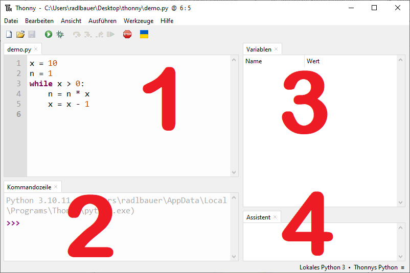
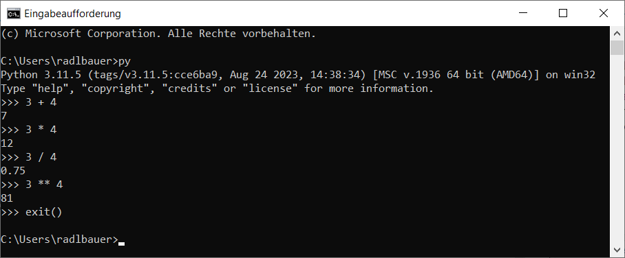

# 2.0 Programmieren mit Python

Für den Einstieg ins Programmieren werden wir die 
[Programmierprache](https://de.wikipedia.org/wiki/Programmiersprache) 
[Python](https://de.wikipedia.org/wiki/Python_(Programmiersprache)) verwenden.
Als [Entwicklungsumgebung](https://de.wikipedia.org/wiki/Integrierte_Entwicklungsumgebung) 
werden wir [Thonny](https://thonny.org/) verwenden.

Die Benutzeroberfläche von Thonny sieht folgendermaßen aus:

Sie besteht aus verschiedenen Bereichen.

Im Bereich 1 kannst du Scripts (= Programme) erstellen und in einer Datei speichern.

Der Bereich 2 wird Kommandozeile oder auch Python Konsole genannt. 
Hier kannst du einzelne Python-Befehle
eingeben. Diese werden sofort ausgeführt.

In den Bereichen 3 und 4 kannst du verschiedene Fenster öffnen. 
Welche Fenster dort sichtbar sind, kannst du über 
das Menu "Ansicht" steuern.

Ein Fenster, welches du oft verwenden wirst, ist das Fenster "Variablen",
welches du über das Menu "Ansicht" -> "Variablen" öffnen kannst.

Python-Befehle kann man aber auch in der Konsole von Windows eingeben:

## Übungen
[Hier geht's zu den Übungen](../uebungen/UE_2.0_ProgrammierenMitPython.md)

## Zusammenfassung
### Wichtige Begriffe
- Programmiersprache
- Entwicklungsumgebung
- Python
- Thonny

### Das sollst du können
- Thonny starten
- Python-Befehle in Thonny eingeben
- Python-Befehle in der Windows-Konsole eingeben

[<<](1.0_ComputerGrundkenntnisse.md) &emsp; [>>](2.1_PythonAlsTaschenrechner.md)