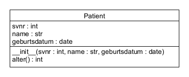

# 22.1 UML Klassendiagramme

Umfangreichere Softwareprojekte erfordern eine 
klare Struktur und Planung.
UML (Unified Modeling Language) ist eine standardisierte Sprache 
zur Visualisierung, Spezifikation, 
Konstruktion und Dokumentation von Softwarearchitekturen.

UML-Klassendiagramme sind ein zentrales Element der UML
und dienen dazu, die Struktur eines Systems
durch die Darstellung von Klassen,
Attributen und Beziehungen zwischen Klassen zu beschreiben.

## UML-Klassendiagramm

Hier soll vorerst nur die Darstellung einzelner Klassen
und deren Attribute und Methoden behandelt werden.
Die Beziehungen zwischen Klassen
werden in späteren Kapiteln behandelt.

Ein UML-Klassendiagramm besteht aus Rechtecken,
die die Klassen repräsentieren.
Jede Klasse wird in drei Abschnitte unterteilt:
- **Klassenname**: Der Name der Klasse wird im oberen Abschnitt angezeigt.
- **Attribute**: Der mittlere Abschnitt listet die Attribute der Klasse auf.
- **Methoden**: Der untere Abschnitt enthält die Methoden der Klasse.

Hier ist ein einfaches Beispiel für ein UML-Klassendiagramm. 
Es stellt die Klasse `Patient` aus dem vorherigen Abschnitt dar:

Die Klasse `Patient` hat folgende Attribute:
- `svnr`: Sozialversicherungsnummer des Patienten (int)
- `name`: Name des Patienten (str)
- `geburtsdatum`: Geburtsdatum des Patienten (date)

Wie bei den Python type hints werden die Datentypen der Attribute
nach einem Doppelpunkt angegeben.

Die Klasse hat folgende Methoden:
- `__init__(self, svnr: int, name: str, geburtsdatum: date)`: Konstruktor, der die Attribute initialisiert.
- `alter(self) -> int`: Gibt das Alter des Patienten in Jahren zurück.

Der Parameter `self` wird in UML nicht explizit dargestellt.

Die Datentypen der Parameter und Rückgabewerte der Methoden
werden ebenfalls nach einem Doppelpunkt angegeben.

## Übungen

Erstelle für jede Klasse, welche in den 
[Übungen zum Abschnitt 22.0](../uebungen/UE_22.0_Klassen.md) 
zu erstellen waren, ein UML Klassendiagramm.
Zeichne es entweder auf Papier und gib ein Foto davon ab,
oder verwende ein Software-Tool deiner Wahl.
Zum Beispiel [UMLetino](https://www.umletino.com/umletino.html)

## Zusammenfassung

### Wichtige Begriffe

- UML (Unified Modeling Language)
- UML-Klassendiagramm

### Das sollst du können
- UML-Klassendiagramme lesen und verstehen
- UML-Klassendiagramme für einfache Klassen erstellen

[<<](22.0_Klassen.md) &emsp; [>>](23.0_Assoziationen.md)
