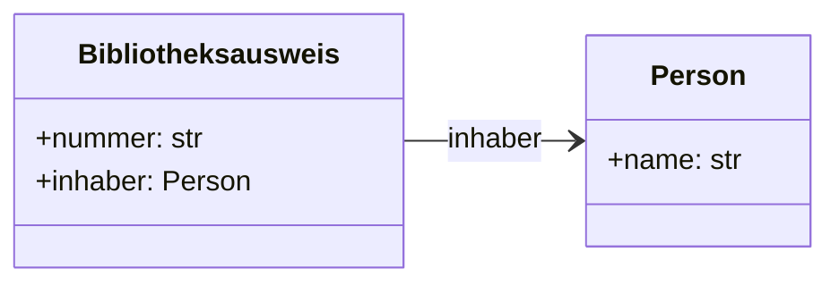
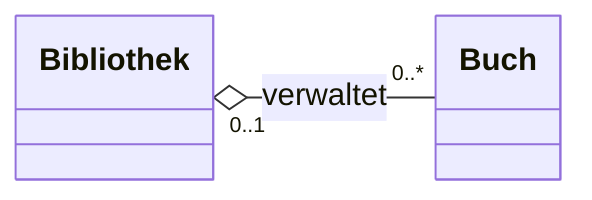
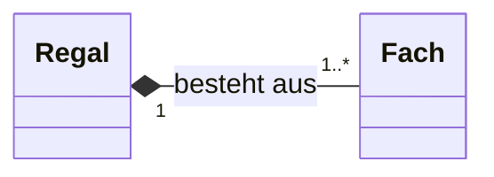
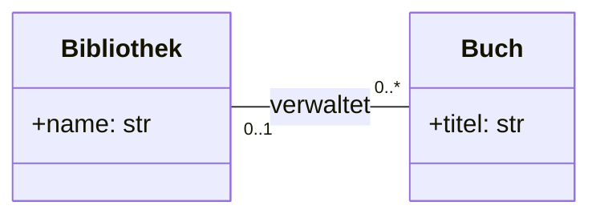
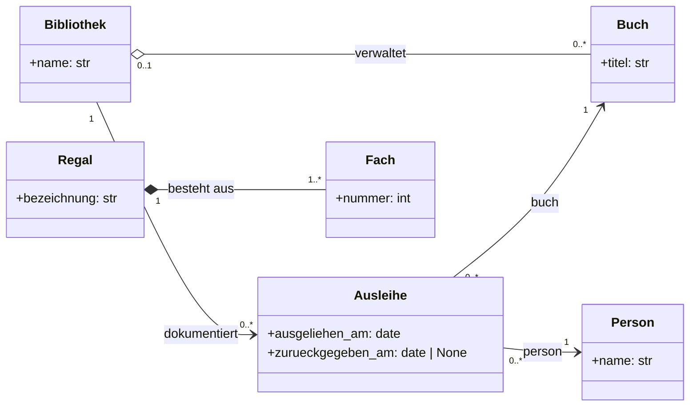

# 23.0 Assoziationen zwischen Klassen

## Lernziele

Nach diesem Kapitel kannst du ...

- erklären, was eine **Assoziation** zwischen Klassen bedeutet.
- zwischen einer Beziehung im **Klassenmodell** und konkreten Verbindungen zwischen **Objekten zur Laufzeit** unterscheiden.
- erklären, wie Assoziationen in Python durch **Referenzen in Attributen** umgesetzt werden.
- zwischen **Assoziation**, **Aggregation** und **Komposition** unterscheiden.
- erklären, warum diese drei Begriffe vor allem etwas über **Modellierung und Lebenszyklus** aussagen.
- **Multiplizitäten** wie `1`, `0..1`, `0..*` und `1..*` lesen und verwenden.
- einseitige und beidseitige Beziehungen unterscheiden.
- Eins-zu-eins-, Eins-zu-viele- und Viele-zu-viele-Beziehungen modellieren.
- erkennen, wann eine eigene Klasse für eine Beziehung sinnvoll ist.
- verstehen, warum Python Aggregation und Komposition nicht automatisch erzwingt.
- typische Fehler beim Implementieren von Beziehungen zwischen Objekten vermeiden.
- UML-Diagramme mit Assoziationen lesen und in Python-Code übertragen.
- Python-Code analysieren und daraus passende UML-Beziehungen ableiten.

---

# 1. Von einzelnen Objekten zu zusammenarbeitenden Objekten

Im letzten Kapitel haben wir eigene Klassen definiert.

Zum Beispiel:

```python
class Buch:
    def __init__(
        self,
        titel: str,
        autor: str
    ) -> None:
        self.titel: str = titel
        self.autor: str = autor
```

Damit können wir einzelne Objekte erzeugen:

```python
buch1 = Buch("Momo", "Michael Ende")
buch2 = Buch("Der Hobbit", "J. R. R. Tolkien")
```

Ein größeres Programm besteht aber nur selten aus vollständig voneinander unabhängigen Objekten.

In einer Schulbibliothek gibt es beispielsweise:

- Bücher,
- Personen,
- eine Bibliothek,
- Regale,
- Ausleihen.

Diese Objekte stehen in Beziehungen zueinander.

Zum Beispiel:

```text
Eine Bibliothek verwaltet mehrere Bücher.

Eine Person kann Bücher ausleihen.

Ein Buch kann aktuell von einer Person ausgeliehen sein.

Ein Regal besitzt mehrere Fächer.
```

Solche Beziehungen zwischen Klassen werden in der objektorientierten Modellierung **Assoziationen** genannt.

---

# 2. Klassen stehen in Beziehung – Objekte sind konkret miteinander verbunden

Bei UML zeichnen wir Beziehungen zwischen **Klassen**:

```text
Bibliothek ───────── Buch
```

Zur Laufzeit arbeiten aber konkrete **Objekte** miteinander:

```text
schulbibliothek ─────────► buch1
                   └─────► buch2
```

Das ist ein wichtiger Unterschied.

```text
UML-Klassenebene
→ Welche Arten von Objekten dürfen miteinander verbunden sein?

Objektebene
→ Welche konkreten Objekte sind gerade miteinander verbunden?
```

Eine Assoziation im Klassendiagramm beschreibt also mögliche Verbindungen zwischen Instanzen dieser Klassen.

---

# 3. Wie entsteht eine Beziehung in Python?

In Python entsteht eine dauerhafte Objektbeziehung meistens dadurch, dass ein Objekt eine **Referenz auf ein anderes Objekt in einem Attribut speichert**.

Beispiel:

```python
class Person:
    def __init__(self, name: str) -> None:
        self.name: str = name


class Buch:
    def __init__(
        self,
        titel: str,
        ausgeliehen_an: Person | None = None
    ) -> None:
        self.titel: str = titel
        self.ausgeliehen_an: Person | None = ausgeliehen_an
```

Nun erzeugen wir Objekte:

```python
anna = Person("Anna")
buch = Buch("Momo")

buch.ausgeliehen_an = anna
```

Vereinfacht entsteht folgende Struktur:

```text
anna ───────────────► Person-Objekt
                         ▲
                         │
                         │
buch ─► Buch-Objekt ─────┘
        ausgeliehen_an
```

Das Attribut

```python
self.ausgeliehen_an
```

enthält eine Referenz auf ein `Person`-Objekt.

Genau solche Referenzen bilden in Python die Grundlage vieler Assoziationen.

---

# 4. Assoziation ist der Oberbegriff

Im Alltag werden die Begriffe manchmal so dargestellt, als wären

- einfache Assoziation,
- Aggregation,
- Komposition

drei vollständig getrennte Dinge.

Genauer ist:

> **Assoziation** ist der allgemeine Begriff für eine strukturelle Beziehung zwischen Klassen.

**Aggregation** und **Komposition** sind speziellere Formen einer Teil-Ganzes-Beziehung.

Vereinfacht:

```text
Assoziation
│
├── allgemeine Assoziation
│
└── Teil-Ganzes-Beziehung
    │
    ├── Aggregation
    └── Komposition
```

Die Grenzen – besonders bei Aggregation – sind in realen Modellen nicht immer eindeutig.

---

# 5. Eine Assoziation ist nicht dasselbe wie eine kurzfristige Verwendung

Betrachte:

```python
class Drucker:
    def drucke(self, text: str) -> None:
        print(text)


class Bericht:
    def ausgeben(self, drucker: Drucker) -> None:
        drucker.drucke("Bericht")
```

`Bericht` erhält einen `Drucker` nur während eines Methodenaufrufs.

Er speichert den Drucker nicht dauerhaft.

In UML wird eine solche kurzfristige Verwendung normalerweise eher als **Abhängigkeit** bezeichnet.

Eine Assoziation ist typischerweise struktureller und dauerhafter:

```python
class Arbeitsplatz:
    def __init__(self, drucker: Drucker) -> None:
        self.drucker: Drucker = drucker
```

Hier kennt ein `Arbeitsplatz` dauerhaft einen bestimmten `Drucker`.

Für dieses Kapitel gilt daher als nützliche Faustregel:

> Wird eine Referenz dauerhaft als Attribut gespeichert, spricht das stark für eine Assoziation.

---

# 6. Einfache Assoziation

Wir beginnen mit einer Beziehung zwischen einer Person und einem Bibliotheksausweis.

Ein Ausweis gehört zu einer bestimmten Person.

```python
class Person:
    def __init__(self, name: str) -> None:
        self.name: str = name


class Bibliotheksausweis:
    def __init__(
        self,
        nummer: str,
        inhaber: Person
    ) -> None:
        self.nummer: str = nummer
        self.inhaber: Person = inhaber
```

Verwendung:

```python
anna = Person("Anna")

ausweis = Bibliotheksausweis(
    "A-1042",
    anna
)

print(ausweis.inhaber.name)
```

Ausgabe:

```text
Anna
```

Der `Bibliotheksausweis` speichert eine Referenz auf ein `Person`-Objekt.

```text
Bibliotheksausweis ─────► Person
```

---

## UML

In Mermaid kann die Beziehung beispielsweise so dargestellt werden:


```mermaid
classDiagram
direction LR

class Person {
    +name: str
}

class Bibliotheksausweis {
    +nummer: str
    +inhaber: Person
}

Bibliotheksausweis --> Person : inhaber
```

Der Pfeil zeigt hier, dass der Ausweis die Person kennt.

---

# 7. Navigierbarkeit: Wer kennt wen?

Im bisherigen Beispiel kennt der Ausweis die Person:

```python
ausweis.inhaber
```

Die Person kennt ihren Ausweis aber nicht automatisch.

Die Beziehung ist also zunächst **einseitig navigierbar**:

```text
Bibliotheksausweis ─────► Person
```

Das bedeutet:

```text
Vom Ausweis zur Person
→ möglich

Von der Person zum Ausweis
→ nicht direkt möglich
```

---

# 8. Beidseitige Assoziation

Manchmal sollen beide Objekte einander kennen.

```python
class Person:
    def __init__(self, name: str) -> None:
        self.name: str = name
        self.ausweis: Bibliotheksausweis | None = None


class Bibliotheksausweis:
    def __init__(
        self,
        nummer: str,
        inhaber: Person
    ) -> None:
        self.nummer: str = nummer
        self.inhaber: Person = inhaber

        inhaber.ausweis = self
```

Nun kann man in beide Richtungen navigieren:

```python
anna = Person("Anna")
ausweis = Bibliotheksausweis("A-1042", anna)

print(ausweis.inhaber.name)
print(anna.ausweis.nummer if anna.ausweis is not None else "Kein Ausweis")
```

Vereinfacht:

```text
Person ◄────────────► Bibliotheksausweis
```

Beidseitige Beziehungen sind praktisch, bringen aber zusätzliche Verantwortung mit sich.

---

# 9. Beidseitige Beziehungen müssen konsistent bleiben

Angenommen, beide Seiten speichern eine Referenz:

```text
Person.ausweis
Bibliotheksausweis.inhaber
```

Dann müssen beide Angaben zusammenpassen.

Problematisch wäre:

```text
Anna.ausweis ─────► Ausweis A

Ausweis A.inhaber ─────► Ben
```

Das Modell widerspricht sich.

Deshalb sollte eine beidseitige Beziehung möglichst über Methoden gepflegt werden, die beide Seiten gemeinsam aktualisieren.

> Je mehr Richtungen eine Beziehung besitzt, desto wichtiger wird die Konsistenz der Referenzen.

---

# 10. Multiplizität: Wie viele Objekte dürfen verbunden sein?

Eine Beziehung beschreibt nicht nur, **welche Klassen** miteinander verbunden sind.

Oft ist auch wichtig:

> Wie viele Objekte dürfen auf jeder Seite beteiligt sein?

Das nennt man in UML **Multiplizität**.

Typische Angaben sind:

| Multiplizität | Bedeutung |
|---|---|
| `1` | genau ein Objekt |
| `0..1` | kein oder genau ein Objekt |
| `*` | beliebig viele |
| `0..*` | kein, ein oder beliebig viele |
| `1..*` | mindestens ein Objekt |
| `2..5` | zwei bis fünf Objekte |

---

# 11. Eins-zu-eins-Beziehung

Beispiel:

```text
Ein Bibliotheksausweis gehört genau einer Person.
```

Vereinfacht:

```text
Person "1" ───────── "1" Bibliotheksausweis
```

Wenn eine Person höchstens einen Ausweis haben darf, aber noch keinen besitzen muss:

```text
Person "1" ───────── "0..1" Bibliotheksausweis
```

Im Python-Code passt dazu beispielsweise:

```python
self.ausweis: Bibliotheksausweis | None = None
```

`None` drückt aus, dass die Beziehung auch fehlen kann.

---

# 12. Eins-zu-viele-Beziehung

Eine Bibliothek verwaltet viele Bücher.

Ein einzelnes Buch gehört in unserem vereinfachten Modell höchstens zu einer Bibliothek.

```text
Bibliothek "1" ───────── "0..*" Buch
```

In Python wird eine Mehrfachbeziehung häufig mit einer Sammlung umgesetzt:

```python
class Buch:
    def __init__(self, titel: str) -> None:
        self.titel: str = titel


class Bibliothek:
    def __init__(self, name: str) -> None:
        self.name: str = name
        self.buecher: list[Buch] = []

    def buch_aufnehmen(self, buch: Buch) -> None:
        self.buecher.append(buch)
```

Die Multiplizität `0..*` wird hier durch `list[Buch]` repräsentiert.

---

# 13. Viele-zu-viele-Beziehung

Eine Person kann viele Bücher ausleihen.

Ein Buch kann im Laufe der Zeit von vielen Personen ausgeliehen werden.

Wenn wir die **Ausleihgeschichte** betrachten, entsteht eine Viele-zu-viele-Beziehung:

```text
Person "0..*" ───────── "0..*" Buch
```

Solche Beziehungen werden in Programmen oft nicht einfach als zwei Listen modelliert.

Denn häufig besitzt die Beziehung selbst zusätzliche Informationen:

```text
Ausleihdatum
Rückgabedatum
Frist
Status
```

Dann ist eine eigene Klasse für die Beziehung sinnvoll.

---

# 14. Eine Beziehung kann selbst ein Objekt werden

Wir führen die Klasse `Ausleihe` ein:

```python
from datetime import date


class Person:
    def __init__(self, name: str) -> None:
        self.name: str = name


class Buch:
    def __init__(self, titel: str) -> None:
        self.titel: str = titel


class Ausleihe:
    def __init__(
        self,
        person: Person,
        buch: Buch,
        ausgeliehen_am: date
    ) -> None:
        self.person: Person = person
        self.buch: Buch = buch
        self.ausgeliehen_am: date = ausgeliehen_am
        self.zurueckgegeben_am: date | None = None
```

Eine `Ausleihe` verbindet genau eine Person mit genau einem Buch.

Zusätzlich besitzt sie eigene Daten.

```text
Person ◄──── Ausleihe ────► Buch
              │
              ├── ausgeliehen_am
              └── zurueckgegeben_am
```

Ein solches Objekt wird oft als **Assoziationsklasse** oder als eigenes Beziehungsobjekt verwendet.

---

# 15. Warum ist eine eigene Beziehungsklasse oft besser?

Ohne `Ausleihe` könnte man direkt im Buch speichern:

```python
self.ausgeliehen_an: Person | None
```

Das reicht für den **aktuellen Zustand**.

Es reicht aber nicht für eine vollständige Historie:

```text
Wer hat das Buch früher ausgeliehen?

Wann wurde es ausgeliehen?

Wann wurde es zurückgegeben?
```

Sobald die Beziehung eigene Daten oder eigenes Verhalten besitzt, ist eine eigene Klasse häufig die sauberere Modellierung.

> Nicht nur Dinge können Objekte sein. Auch wichtige Beziehungen können als Objekte modelliert werden.

---

# 16. Aggregation

Eine **Aggregation** beschreibt eine Teil-Ganzes-Beziehung, bei der die Teile unabhängig vom Ganzen existieren können.

Ein gutes Beispiel ist:

```text
Bibliothek und Bücher
```

Ein Buch kann existieren, bevor es in eine Bibliothek aufgenommen wird.

Es kann eine Bibliothek verlassen und später in einer anderen verwendet werden.

```python
class Buch:
    def __init__(self, titel: str) -> None:
        self.titel: str = titel


class Bibliothek:
    def __init__(self, name: str) -> None:
        self.name: str = name
        self.buecher: list[Buch] = []

    def buch_aufnehmen(self, buch: Buch) -> None:
        self.buecher.append(buch)
```

Verwendung:

```python
buch = Buch("Momo")

bibliothek = Bibliothek("Schulbibliothek")

bibliothek.buch_aufnehmen(buch)
```

Das Buch wurde **außerhalb** der Bibliothek erzeugt und erst danach an die Bibliothek übergeben.

---

## UML-Symbol

Aggregation wird in UML mit einer **leeren Raute** an der Seite des Ganzen dargestellt.


```mermaid
classDiagram
direction LR

class Bibliothek
class Buch

Bibliothek "0..1" o-- "0..*" Buch : verwaltet
```

Die leere Raute steht bei `Bibliothek`, weil sie hier das Ganze darstellt.

---

# 17. Was bedeutet Aggregation nicht?

Aggregation bedeutet nicht einfach:

> Eine Klasse besitzt eine Liste einer anderen Klasse.

Auch eine Komposition kann mit einer Liste implementiert werden.

Entscheidend ist die **Bedeutung der Beziehung**:

```text
Kann das Teil sinnvoll unabhängig vom Ganzen existieren?

Kann es seinen Besitzer wechseln?

Wer kontrolliert seinen Lebenszyklus?
```

Bei einem Buch lautet die Antwort typischerweise:

```text
Ja, es kann unabhängig von einer bestimmten Bibliothek existieren.
```

Deshalb ist Aggregation hier plausibel.

---

# 18. Komposition

Die **Komposition** ist eine stärkere Teil-Ganzes-Beziehung.

Ein Teil gehört konzeptionell zu genau einem Ganzen und besitzt keinen sinnvollen unabhängigen Lebenszyklus.

Für unsere Bibliotheksgeschichte betrachten wir ein Regal mit fest eingebauten Fächern.

```text
Regal
└── Fächer
```

Die Fächer entstehen als Bestandteile des Regals.

---

# 19. Ein eindeutigeres Kompositionsbeispiel

```python
class Fach:
    def __init__(self, nummer: int) -> None:
        self.nummer: int = nummer


class Regal:
    def __init__(
        self,
        bezeichnung: str,
        anzahl_faecher: int
    ) -> None:
        self.bezeichnung: str = bezeichnung
        self.faecher: list[Fach] = [
            Fach(nummer)
            for nummer in range(1, anzahl_faecher + 1)
        ]
```

Verwendung:

```python
regal = Regal("R1", 4)

for fach in regal.faecher:
    print(fach.nummer)
```

Ausgabe:

```text
1
2
3
4
```

Die `Fach`-Objekte werden innerhalb des `Regal`-Objekts erzeugt.

Der normale Benutzer der Klasse muss die Fächer nicht separat erzeugen und dem Regal hinzufügen.

---

# 20. UML-Symbol der Komposition

Komposition wird in UML mit einer **ausgefüllten Raute** an der Seite des Ganzen dargestellt.


```mermaid
classDiagram
direction LR

class Regal
class Fach

Regal "1" *-- "1..*" Fach : besteht aus
```

Die ausgefüllte Raute steht bei `Regal`.

---

# 21. Python erzwingt Komposition nicht automatisch

Dieser Punkt ist besonders wichtig.

UML sagt bei einer Komposition sinngemäß:

> Der Lebenszyklus der Teile ist eng an das Ganze gebunden.

Python besitzt aber kein eigenes Schlüsselwort für Komposition.

Zum Beispiel:

```python
regal = Regal("R1", 3)

fach = regal.faecher[0]
```

Nun existiert zusätzlich eine Referenz:

```text
fach ─────► Fach-Objekt
```

Auch wenn `regal` später nicht mehr verwendet wird, kann die Variable `fach` das Objekt weiterhin erreichbar halten.

Deshalb gilt:

> Aggregation und Komposition sind in Python vor allem **Modellierungsentscheidungen**. Die Sprache erzwingt ihre UML-Bedeutung nicht vollständig.

---

# 22. Wie drückt man Komposition im Code aus?

Python besitzt dafür keine einzelne spezielle Syntax.

Man kann die Absicht aber deutlich machen.

Typische Hinweise auf Komposition sind:

1. Das Ganze erzeugt seine Teile selbst.
2. Die Teile werden hauptsächlich intern verwendet.
3. Teile werden nicht beliebig zwischen mehreren Ganzen verschoben.
4. Die öffentliche Schnittstelle behandelt die Teile als Bestandteil des Ganzen.

Unser Regal:

```python
self.faecher: list[Fach] = [
    Fach(nummer)
    for nummer in range(1, anzahl_faecher + 1)
]
```

drückt diese Absicht besser aus als eine öffentliche Methode, die beliebige fremde `Fach`-Objekte aufnimmt, wenn Fächer tatsächlich feste Bestandteile genau dieses Regals sein sollen.

---

# 23. Aggregation und Komposition im direkten Vergleich

| Frage | Aggregation | Komposition |
|---|---|---|
| Teil-Ganzes-Beziehung? | ja | ja |
| Teil kann unabhängig existieren? | typischerweise ja | konzeptionell nein |
| Teil kann Besitzer wechseln? | häufig ja | normalerweise nein |
| Lebenszyklus eng gekoppelt? | eher nein | ja |
| UML-Symbol | leere Raute | ausgefüllte Raute |
| Python erzwingt die Beziehung? | nein | nein |

Beispiele aus unserem Modell:

```text
Bibliothek o── Buch
→ Aggregation

Regal *── Fach
→ Komposition
```

---

# 24. Aggregation ist in der Praxis oft weniger wichtig als gedacht

Die UML-Aggregation mit leerer Raute wird in realen Softwaremodellen nicht immer konsequent verwendet.

Der Grund:

> Die genaue zusätzliche Bedeutung gegenüber einer normalen Assoziation ist häufig gering oder interpretationsabhängig.

Viele Modelle verwenden daher:

- normale Assoziation für lose Beziehungen,
- Komposition für wirklich starke Teil-Ganzes-Beziehungen.

Für den Unterricht solltest du Aggregation erkennen und verstehen können.

Bei eigenen Modellen ist aber wichtiger, die **Bedeutung und Lebensdauer der Objekte sauber zu erklären**, als zwanghaft überall eine leere Raute einzusetzen.

---

# 25. Besitz, Referenz und Lebenszyklus sind unterschiedliche Fragen

Betrachte:

```python
class Bibliothek:
    def __init__(self) -> None:
        self.buecher: list[Buch] = []
```

Die Bibliothek speichert Referenzen auf Bücher.

Daraus folgt noch nicht automatisch:

```text
Die Bibliothek besitzt die Bücher exklusiv.
```

Ein anderes Objekt kann dieselben Bücher ebenfalls referenzieren.

> Eine gespeicherte Referenz sagt zunächst nur: „Dieses Objekt kennt jenes Objekt.“

Die fachlichen Regeln müssen wir zusätzlich festlegen.

---

# 26. Beziehungen brauchen Regeln

Angenommen, ein Buch darf gleichzeitig höchstens einer Bibliothek angehören.

Dann sollte unser Programm diese Regel abbilden.

```python
class Bibliothek:
    def __init__(self, name: str) -> None:
        self.name: str = name


class Buch:
    def __init__(self, titel: str) -> None:
        self.titel: str = titel
        self.bibliothek: Bibliothek | None = None
```

Nun drückt

```python
Bibliothek | None
```

aus:

```text
keine Bibliothek
oder
genau eine Bibliothek
```

---

# 27. Beziehung über Methoden pflegen

```python
class Buch:
    def __init__(self, titel: str) -> None:
        self.titel: str = titel
        self.bibliothek: Bibliothek | None = None


class Bibliothek:
    def __init__(self, name: str) -> None:
        self.name: str = name
        self.buecher: list[Buch] = []

    def buch_aufnehmen(self, buch: Buch) -> bool:
        if buch.bibliothek is not None:
            return False

        self.buecher.append(buch)
        buch.bibliothek = self

        return True
```

Die Methode aktualisiert beide Seiten:

```text
Bibliothek.buecher
und
Buch.bibliothek
```

Dadurch bleibt die Beziehung konsistent.

---

# 28. Entfernen aus einer Beziehung

Wenn Beziehungen beidseitig gespeichert werden, muss auch das Entfernen beide Seiten aktualisieren.

Ergänzung in `Bibliothek`:

```python
def buch_entfernen(self, buch: Buch) -> bool:
    if buch not in self.buecher:
        return False

    self.buecher.remove(buch)
    buch.bibliothek = None

    return True
```

Nach dem Entfernen gilt wieder:

```text
Bibliothek kennt das Buch nicht mehr.

Buch.bibliothek == None
```

Eine häufige Fehlerquelle ist, nur eine Seite zu ändern.

---

# 29. Eins-zu-viele in beide Richtungen

Wir können die Beziehung jetzt so lesen:

```text
Bibliothek
→ kennt viele Bücher

Buch
→ kennt höchstens eine Bibliothek
```

UML:


```mermaid
classDiagram
direction LR

class Bibliothek {
    +name: str
}

class Buch {
    +titel: str
}

Bibliothek "0..1" -- "0..*" Buch : verwaltet
```

Aus Sicht eines Buches:

```text
0..1 Bibliothek
```

Aus Sicht einer Bibliothek:

```text
0..* Bücher
```

---

# 30. Wo steht die Multiplizität?

Das ist bei UML anfangs leicht verwirrend.

Betrachte:

```text
Bibliothek "1" ───────── "0..*" Buch
```

Die Multiplizität neben `Buch` beantwortet:

> Wie viele Buch-Objekte können mit **einer Bibliothek** verbunden sein?

Antwort:

```text
0..*
```

Die Multiplizität neben `Bibliothek` beantwortet:

> Mit wie vielen Bibliotheken kann **ein Buch** verbunden sein?

Antwort im Modell:

```text
1
```

Lies Multiplizitäten also immer von einem Objekt zur jeweils anderen Seite.

---

# 31. Rolle und Beziehungsname

UML-Beziehungen können zusätzlich Namen besitzen.

Zum Beispiel:

```text
Bibliothek ─── verwaltet ─── Buch
```

oder Rollen:

```text
Buch ───── bibliothek: Bibliothek
```

Solche Namen helfen dabei zu erklären, **welche Bedeutung** die Beziehung hat.

Im Python-Code wird daraus oft direkt ein Attributname:

```python
self.bibliothek
```

oder:

```python
self.buecher
```

Gute Attributnamen machen die Beziehung im Code verständlich.

---

# 32. Beziehungen mit genau einem Objekt

Wenn eine Beziehung genau ein Objekt verlangt, wird meist direkt eine Referenz gespeichert.

```python
class Ausleihe:
    def __init__(
        self,
        person: Person,
        buch: Buch
    ) -> None:
        self.person: Person = person
        self.buch: Buch = buch
```

Das entspricht:

```text
1 Person
1 Buch
```

---

# 33. Optionale Beziehungen

Wenn eine Beziehung fehlen darf:

```python
self.bibliothek: Bibliothek | None = None
```

Das entspricht:

```text
0..1 Bibliothek
```

Auch ein aktueller Entleiher könnte so modelliert werden:

```python
self.ausgeliehen_an: Person | None = None
```

---

# 34. Beziehungen mit mehreren Objekten

Wenn beliebig viele Objekte verbunden sein können:

```python
self.buecher: list[Buch] = []
```

Das entspricht typischerweise:

```text
0..*
```

Soll mindestens ein Element vorhanden sein, muss der Code diese Regel zusätzlich sicherstellen.

Ein Type Hint wie

```python
list[Buch]
```

garantiert nicht automatisch:

```text
mindestens ein Buch
```

Multiplizitäten sind daher mehr als reine Typinformationen.

---

# 35. Type Hints und Multiplizitäten

Type Hints können viele Beziehungen gut beschreiben:

```python
Person
```

bedeutet ungefähr:

```text
genau ein Person-Objekt
```

```python
Person | None
```

bedeutet ungefähr:

```text
0 oder 1 Person
```

```python
list[Person]
```

bedeutet ungefähr:

```text
0 oder mehr Personen
```

Aber Type Hints können nicht jede UML-Regel direkt ausdrücken.

Zum Beispiel:

```text
1..5 Personen
```

lässt sich nicht allein mit

```python
list[Person]
```

erzwingen.

Dafür benötigt man zusätzliche Programmlogik.

---

# 36. Beispiel: maximale Gruppengröße

```python
class Gruppe:
    def __init__(self, name: str) -> None:
        self.name: str = name
        self.mitglieder: list[Person] = []

    def aufnehmen(self, person: Person) -> bool:
        if len(self.mitglieder) >= 5:
            return False

        self.mitglieder.append(person)
        return True
```

Die UML-Multiplizität könnte lauten:

```text
Gruppe "1" ───────── "0..5" Person
```

Die Grenze `5` muss durch die Methode selbst eingehalten werden.

---

# 37. Viele-zu-viele-Beziehungen richtig modellieren

Betrachte Kurse und Personen:

```text
Eine Person besucht mehrere Kurse.

Ein Kurs hat mehrere Personen.
```

Das ist eine Viele-zu-viele-Beziehung:

```text
Person "0..*" ───────── "0..*" Kurs
```

Eine mögliche einfache Implementierung wäre:

```python
class Person:
    def __init__(self, name: str) -> None:
        self.name: str = name
        self.kurse: list[Kurs] = []


class Kurs:
    def __init__(self, titel: str) -> None:
        self.titel: str = titel
        self.teilnehmende: list[Person] = []
```

Bei einer solchen beidseitigen Beziehung muss beim Hinzufügen wieder auf Konsistenz geachtet werden.

---

# 38. Beziehung oder eigenes Fachobjekt?

Angenommen, bei einer Kursteilnahme möchten wir zusätzlich speichern:

- Anmeldedatum,
- Anwesenheit,
- Note.

Dann reicht die direkte Beziehung

```text
Person ───── Kurs
```

nicht mehr besonders gut.

Wir führen ein eigenes Objekt ein:

```python
from datetime import date


class Teilnahme:
    def __init__(
        self,
        person: Person,
        kurs: Kurs,
        angemeldet_am: date
    ) -> None:
        self.person: Person = person
        self.kurs: Kurs = kurs
        self.angemeldet_am: date = angemeldet_am
        self.note: int | None = None
```

Nun besitzt die Beziehung selbst Zustand.

Das ist ein typisches Muster in objektorientierten Programmen.

---

# 39. Assoziation, Aggregation oder Komposition? Eine Entscheidungshilfe

Bei einer Beziehung kannst du dir nacheinander folgende Fragen stellen.

## Frage 1: Gibt es überhaupt eine dauerhafte Beziehung?

```text
Speichert ein Objekt eine Referenz auf das andere?
```

Wenn nein und das andere Objekt nur kurz verwendet wird, handelt es sich eher um eine Abhängigkeit.

## Frage 2: Ist es eine Teil-Ganzes-Beziehung?

```text
Ist das eine Objekt fachlich Bestandteil des anderen?
```

Wenn nein:

```text
normale Assoziation
```

## Frage 3: Kann das Teil unabhängig existieren?

Wenn ja:

```text
Aggregation kann sinnvoll sein.
```

Wenn nein bzw. der Lebenszyklus eng gekoppelt ist:

```text
Komposition ist wahrscheinlich passender.
```

## Frage 4: Wer erzeugt und verwaltet das Teil?

```text
extern erzeugt und übergeben
→ spricht häufig für lose Beziehung / Aggregation

vom Ganzen selbst erzeugt und intern verwaltet
→ spricht häufig für Komposition
```

Das ist keine absolute Sprachregel, aber eine gute Modellierungshilfe.

---

# 40. Beispiele einordnen

## Arzt und Patient

```text
Patient ─────► Arzt
```

Ein Patient kennt einen Arzt.

Beide existieren unabhängig.

```text
→ normale Assoziation
```

## Team und Spieler

```text
Team o──── Spieler
```

Spieler existieren unabhängig vom Team und können das Team wechseln.

```text
→ Aggregation ist plausibel
```

## Regal und Fach

```text
Regal *──── Fach
```

Das Fach wird als fester Bestandteil genau dieses Regals modelliert.

```text
→ Komposition
```

## Bericht verwendet kurz einen Drucker

```text
Bericht - - - -> Drucker
```

Der Bericht speichert den Drucker nicht dauerhaft.

```text
→ eher Abhängigkeit als Assoziation
```

---

# 41. Typische Fehler und Missverständnisse

## Jede Liste automatisch als Aggregation bezeichnen

```python
self.elemente: list[Element] = []
```

sagt nur, dass Referenzen auf mehrere `Element`-Objekte gespeichert werden.

Ob es sich fachlich um eine normale Assoziation, Aggregation oder Komposition handelt, hängt von Bedeutung und Lebenszyklus ab.

## Komposition nur mit einem Kommentar behaupten

```python
self.messwerte: list[Messwert] = []
# Komposition
```

Ein Kommentar macht die Beziehung nicht automatisch zur Komposition.

Frage stattdessen:

```text
Wer erzeugt die Teile?

Können sie unabhängig existieren?

Können sie zwischen übergeordneten Objekten wechseln?

Wer kontrolliert ihren Lebenszyklus?
```

## Aggregation und Komposition als Python-Sprachfunktionen verstehen

Python besitzt keine Syntax wie:

```text
aggregate
compose
```

Die Unterschiede entstehen durch Architektur, Referenzen und Verantwortlichkeiten.

## Beidseitige Beziehung nur auf einer Seite ändern

Problem:

```python
bibliothek.buecher.append(buch)
```

aber `buch.bibliothek` wird nicht aktualisiert.

Dann widersprechen sich die beiden Seiten.

## `None` bei optionalen Beziehungen vergessen

Wenn ein Buch noch keiner Bibliothek zugeordnet sein kann:

```python
self.bibliothek: Bibliothek | None = None
```

ist präziser.

## Multiplizität nur aus dem Type Hint ableiten

```python
list[Buch]
```

sagt nicht:

```text
höchstens 3 Bücher
```

Solche Regeln müssen zusätzlich programmiert werden.

## Beziehungsklassen vermeiden, obwohl die Beziehung eigene Daten besitzt

Wenn eine Ausleihe ein Datum, eine Frist und einen Rückgabezeitpunkt besitzt, ist eine eigene Klasse `Ausleihe` meist klarer als nur eine direkte Linie zwischen `Person` und `Buch`.

---

# 42. Komplettes Beispiel: Schulbibliothek

Nun kombinieren wir mehrere Arten von Beziehungen.

```python
from datetime import date


class Person:
    def __init__(self, name: str) -> None:
        self.name: str = name


class Buch:
    def __init__(self, titel: str) -> None:
        self.titel: str = titel
        self.bibliothek: Bibliothek | None = None


class Fach:
    def __init__(self, nummer: int) -> None:
        self.nummer: int = nummer


class Regal:
    def __init__(
        self,
        bezeichnung: str,
        anzahl_faecher: int
    ) -> None:
        self.bezeichnung: str = bezeichnung
        self.faecher: list[Fach] = [
            Fach(nummer)
            for nummer in range(1, anzahl_faecher + 1)
        ]


class Ausleihe:
    def __init__(
        self,
        person: Person,
        buch: Buch
    ) -> None:
        self.person: Person = person
        self.buch: Buch = buch
        self.ausgeliehen_am: date = date.today()
        self.zurueckgegeben_am: date | None = None

    def zurueckgeben(self) -> None:
        self.zurueckgegeben_am = date.today()

    def ist_aktiv(self) -> bool:
        return self.zurueckgegeben_am is None


class Bibliothek:
    def __init__(self, name: str) -> None:
        self.name: str = name
        self.buecher: list[Buch] = []
        self.regale: list[Regal] = []
        self.ausleihen: list[Ausleihe] = []

    def buch_aufnehmen(self, buch: Buch) -> bool:
        if buch.bibliothek is not None:
            return False

        self.buecher.append(buch)
        buch.bibliothek = self

        return True

    def regal_hinzufuegen(
        self,
        bezeichnung: str,
        anzahl_faecher: int
    ) -> Regal:
        regal = Regal(bezeichnung, anzahl_faecher)
        self.regale.append(regal)
        return regal

    def buch_ausleihen(
        self,
        person: Person,
        buch: Buch
    ) -> Ausleihe | None:
        if buch not in self.buecher:
            return None

        for ausleihe in self.ausleihen:
            if (
                ausleihe.buch is buch
                and ausleihe.ist_aktiv()
            ):
                return None

        neue_ausleihe = Ausleihe(person, buch)
        self.ausleihen.append(neue_ausleihe)

        return neue_ausleihe
```

---

# 43. Welche Beziehungen stecken in diesem Beispiel?

## Bibliothek und Buch

```text
Bibliothek o──── Buch
```

Die Bücher können unabhängig existieren und werden in die Bibliothek aufgenommen.

```text
→ Aggregation
```

## Regal und Fach

```text
Regal *──── Fach
```

Die Fächer werden beim Erzeugen des Regals erzeugt.

```text
→ Komposition
```

## Ausleihe und Person

```text
Ausleihe ─────► Person
```

Die Ausleihe kennt eine bestimmte Person.

```text
→ Assoziation
```

## Ausleihe und Buch

```text
Ausleihe ─────► Buch
```

Die Ausleihe kennt ein bestimmtes Buch.

```text
→ Assoziation
```

---

# 44. UML-Gesamtbild

Eine vereinfachte Darstellung:


```mermaid
classDiagram
direction LR

class Person {
    +name: str
}

class Buch {
    +titel: str
}

class Bibliothek {
    +name: str
}

class Ausleihe {
    +ausgeliehen_am: date
    +zurueckgegeben_am: date | None
}

class Regal {
    +bezeichnung: str
}

class Fach {
    +nummer: int
}

Bibliothek "0..1" o-- "0..*" Buch : verwaltet
Bibliothek "1" --> "0..*" Ausleihe : dokumentiert
Ausleihe "0..*" --> "1" Person : person
Ausleihe "0..*" --> "1" Buch : buch
Regal "1" *-- "1..*" Fach : besteht aus
```

Beim Lesen solltest du nicht nur auf Linien und Rauten achten.

Frage immer:

```text
Welche Objekte kennen einander?

Wie viele Objekte dürfen beteiligt sein?

Kann die Beziehung fehlen?

Wer verwaltet wen?

Wie hängen die Lebenszyklen zusammen?
```

---

# 45. Vom UML-Diagramm zum Python-Code

Angenommen, das UML-Modell enthält:

```text
Kurs "1" ───────── "0..*" Person
```

Dann überlegen wir:

```text
Ein Kurs kennt viele Personen
→ Sammlung notwendig

0..*
→ leere Sammlung ist erlaubt
```

Passender Code:

```python
class Kurs:
    def __init__(self, titel: str) -> None:
        self.titel: str = titel
        self.teilnehmende: list[Person] = []
```

## `0..1` nach Python übersetzen

UML:

```text
Buch ───────── "0..1" Person
```

Möglicher Code:

```python
self.ausgeliehen_an: Person | None = None
```

## `1` nach Python übersetzen

UML:

```text
Ausleihe ───────── "1" Buch
```

Möglicher Code:

```python
self.buch: Buch = buch
```

---

# 46. Vom Python-Code zum UML-Diagramm

Betrachte:

```python
class Bestellung:
    def __init__(self, kunde: Kunde) -> None:
        self.kunde: Kunde = kunde
        self.positionen: list[Bestellposition] = []
```

Daraus können wir zunächst ableiten:

```text
Bestellung kennt genau einen Kunden.

Bestellung kennt mehrere Bestellpositionen.
```

Aber aus dem Type Hint allein wissen wir noch nicht sicher:

```text
Sind Bestellpositionen Aggregation oder Komposition?
```

Dafür müssen wir den Lebenszyklus und die Fachbedeutung betrachten.

Wenn die Bestellung ihre Positionen selbst erzeugt und diese ohne Bestellung keinen Sinn besitzen, ist Komposition plausibel.

> UML lässt sich nicht immer allein aus einzelnen Codezeilen vollständig rekonstruieren. Fachliche Bedeutung gehört zum Modell.

---

# Übungen

Bei Assoziationen ist es besonders wichtig, nicht sofort Code zu schreiben.

Analysiere zuerst:

```text
Welche Objekte gibt es?

Welche Objekte kennen einander?

Wie viele?

In welche Richtung?

Können die Teile unabhängig existieren?

Besitzt die Beziehung eigene Daten?
```

---

## Übung 1 – Beziehungen einordnen

Ordne die folgenden Situationen ein.

### a)

Eine Lehrperson betreut eine Klasse. Beide können unabhängig voneinander existieren.

### b)

Ein Auto besitzt einen Motor, der in diesem vereinfachten Modell ausschließlich als Bestandteil genau dieses Autos betrachtet wird.

### c)

Ein Musikverein verwaltet Mitglieder. Personen existieren vor, während und nach ihrer Mitgliedschaft unabhängig vom Verein.

### d)

Eine Funktion erhält für einen einzigen Aufruf einen Logger als Parameter, speichert ihn aber nicht.

### Lösungsschema

Prüfe jede Situation mit denselben Fragen:

```text
1. Dauerhafte Referenz?
2. Teil-Ganzes-Beziehung?
3. Unabhängiger Lebenszyklus?
4. Starke Lebenszyklusbindung?
```

Orientierung:

```text
nur kurzfristige Verwendung
→ Abhängigkeit

dauerhafte Beziehung ohne Teil-Ganzes
→ Assoziation

Teil-Ganzes + unabhängige Teile
→ Aggregation

Teil-Ganzes + stark gebundene Teile
→ Komposition
```

<details>
<summary>Vollständige Lösung anzeigen</summary>

### a) Lehrperson und Klasse

```text
Assoziation
```

Beide Objekte existieren unabhängig.

### b) Auto und Motor

Im ausdrücklich vereinfachten Modell:

```text
Komposition
```

In einem realen Modell könnte man anders entscheiden, wenn Motoren ausgebaut und weiterverwendet werden sollen. Das zeigt, dass die Einordnung vom Modell abhängt.

### c) Musikverein und Mitglieder

```text
Aggregation
```

Die Personen existieren unabhängig vom Verein.

### d) Funktion und Logger

```text
Abhängigkeit
```

Der Logger wird nur kurzfristig verwendet und nicht als dauerhafte Objektbeziehung gespeichert.

</details>

---

## Übung 2 – Eine Eins-zu-viele-Beziehung implementieren

Modelliere eine Klasse `Abteilung` und eine Klasse `Mitarbeiter`.

Regeln:

- Ein Mitarbeiter kann zunächst keiner Abteilung angehören.
- Ein Mitarbeiter kann höchstens einer Abteilung angehören.
- Eine Abteilung kann beliebig viele Mitarbeiter enthalten.
- Beim Hinzufügen müssen beide Seiten der Beziehung aktualisiert werden.
- Ein bereits zugeordneter Mitarbeiter darf nicht gleichzeitig einer zweiten Abteilung hinzugefügt werden.

### Lösungsschema

Bestimme zuerst die Multiplizitäten:

```text
Abteilung → Mitarbeiter
0..*

Mitarbeiter → Abteilung
0..1
```

Daraus folgen passende Attribute:

```text
Abteilung:
mitarbeiter: list[Mitarbeiter]

Mitarbeiter:
abteilung: Abteilung | None
```

Beim Hinzufügen:

```text
1. Prüfen, ob Mitarbeiter schon eine Abteilung besitzt.
2. Wenn ja → False.
3. Zur Liste hinzufügen.
4. Rückreferenz setzen.
5. True zurückgeben.
```

<details>
<summary>Vollständige Lösung anzeigen</summary>

```python
class Mitarbeiter:
    def __init__(self, name: str) -> None:
        self.name: str = name
        self.abteilung: Abteilung | None = None


class Abteilung:
    def __init__(self, name: str) -> None:
        self.name: str = name
        self.mitarbeiter: list[Mitarbeiter] = []

    def aufnehmen(self, person: Mitarbeiter) -> bool:
        if person.abteilung is not None:
            return False

        self.mitarbeiter.append(person)
        person.abteilung = self

        return True

    def entfernen(self, person: Mitarbeiter) -> bool:
        if person not in self.mitarbeiter:
            return False

        self.mitarbeiter.remove(person)
        person.abteilung = None

        return True
```

Beispiel:

```python
entwicklung = Abteilung("Entwicklung")
support = Abteilung("Support")

anna = Mitarbeiter("Anna")

print(entwicklung.aufnehmen(anna))
print(support.aufnehmen(anna))

print(
    anna.abteilung.name
    if anna.abteilung is not None
    else "Keine"
)
```

Ausgabe:

```text
True
False
Entwicklung
```

</details>

---

## Übung 3 – Beziehung mit eigenen Daten modellieren

Eine Schule organisiert Projekte.

- Schülerinnen und Schüler können an mehreren Projekten teilnehmen.
- Ein Projekt kann mehrere Schülerinnen und Schüler haben.
- Zu jeder Teilnahme soll zusätzlich eine Rolle gespeichert werden, zum Beispiel `"Teamleitung"` oder `"Entwicklung"`.
- Außerdem soll das Beitrittsdatum gespeichert werden.

Entscheide, ob eine direkte Viele-zu-viele-Beziehung ausreicht oder eine eigene Klasse sinnvoll ist.

### Lösungsschema

Zuerst die fachliche Beziehung:

```text
Schueler 0..* ↔ 0..* Projekt
```

Nun die entscheidende Frage:

```text
Besitzt die Beziehung selbst Daten?
```

Ja:

```text
rolle
beitrittsdatum
```

Deshalb ist eine eigene Klasse sinnvoll:

```text
Schueler ◄──── Projektteilnahme ────► Projekt
```

Die Klasse benötigt mindestens:

```text
schueler
projekt
rolle
beitrittsdatum
```

<details>
<summary>Vollständige Lösung anzeigen</summary>

```python
from datetime import date


class Schueler:
    def __init__(self, name: str) -> None:
        self.name: str = name


class Projekt:
    def __init__(self, titel: str) -> None:
        self.titel: str = titel
        self.teilnahmen: list[Projektteilnahme] = []

    def person_aufnehmen(
        self,
        schueler: Schueler,
        rolle: str
    ) -> Projektteilnahme:
        teilnahme = Projektteilnahme(
            schueler,
            self,
            rolle,
            date.today()
        )

        self.teilnahmen.append(teilnahme)

        return teilnahme


class Projektteilnahme:
    def __init__(
        self,
        schueler: Schueler,
        projekt: Projekt,
        rolle: str,
        beitrittsdatum: date
    ) -> None:
        self.schueler: Schueler = schueler
        self.projekt: Projekt = projekt
        self.rolle: str = rolle
        self.beitrittsdatum: date = beitrittsdatum
```

Verwendung:

```python
projekt = Projekt("Robotik")

anna = Schueler("Anna")
ben = Schueler("Ben")

projekt.person_aufnehmen(
    anna,
    "Teamleitung"
)

projekt.person_aufnehmen(
    ben,
    "Entwicklung"
)

for teilnahme in projekt.teilnahmen:
    print(
        teilnahme.schueler.name,
        teilnahme.rolle
    )
```

Mögliche Ausgabe:

```text
Anna Teamleitung
Ben Entwicklung
```

Die Beziehung wurde als eigenes Objekt modelliert, weil sie selbst relevante Daten besitzt.

</details>

---

# Zusammenfassung

## Assoziation

Eine Assoziation beschreibt eine strukturelle Beziehung zwischen Klassen.

In Python wird sie häufig durch Referenzen in Attributen umgesetzt:

```python
self.person: Person = person
```

## Aggregation

Eine Aggregation ist eine Teil-Ganzes-Beziehung mit relativ unabhängigen Teilen.

```text
Bibliothek o──── Buch
```

Das Buch kann unabhängig von einer bestimmten Bibliothek existieren.

## Komposition

Eine Komposition ist eine starke Teil-Ganzes-Beziehung.

```text
Regal *──── Fach
```

Das Fach wird im Modell als Bestandteil genau dieses Regals betrachtet.

## Abhängigkeit

Eine kurzfristige Verwendung ohne dauerhafte gespeicherte Beziehung ist eher eine Abhängigkeit.

```python
def ausgeben(self, drucker: Drucker) -> None:
    ...
```

## Multiplizität

```text
1
→ genau eines

0..1
→ kein oder eines

0..*
→ beliebig viele, auch keines

1..*
→ mindestens eines
```

## Einseitige Beziehung

Nur eine Seite speichert eine Referenz.

```text
A ─────► B
```

## Beidseitige Beziehung

Beide Objekte speichern Referenzen aufeinander.

```text
A ◄────► B
```

Dann müssen beide Seiten konsistent gehalten werden.

## Assoziationsklasse

Wenn eine Beziehung selbst Daten oder Verhalten besitzt, kann sie als eigene Klasse modelliert werden.

```text
Person ◄──── Ausleihe ────► Buch
```

---

# Wichtige Begriffe

- Assoziation
- Abhängigkeit
- Aggregation
- Komposition
- Teil-Ganzes-Beziehung
- Referenz
- Navigierbarkeit
- einseitige Assoziation
- beidseitige Assoziation
- Multiplizität
- Eins-zu-eins
- Eins-zu-viele
- Viele-zu-viele
- Assoziationsklasse
- Lebenszyklus
- Konsistenz einer Beziehung

---

# Das sollst du können

Nach diesem Kapitel solltest du ...

- erklären können, wie Objektbeziehungen durch Referenzen entstehen.
- eine dauerhafte Assoziation von einer kurzfristigen Abhängigkeit unterscheiden können.
- einfache Assoziationen in Python implementieren können.
- einseitige und beidseitige Beziehungen unterscheiden können.
- beidseitige Beziehungen konsistent aktualisieren können.
- UML-Multiplizitäten lesen können.
- `1`, `0..1`, `0..*` und `1..*` in passende Python-Strukturen übertragen können.
- Eins-zu-eins-, Eins-zu-viele- und Viele-zu-viele-Beziehungen erkennen können.
- Aggregation und Komposition erklären und voneinander abgrenzen können.
- verstehen können, dass Python Aggregation und Komposition nicht automatisch erzwingt.
- bei einer Beziehung den Lebenszyklus der beteiligten Objekte analysieren können.
- erkennen können, wann eine Beziehung als eigene Klasse modelliert werden sollte.
- UML-Assoziationen in Python-Code übertragen können.
- Python-Code analysieren und daraus mögliche UML-Beziehungen ableiten können.
- erklären können, warum die fachliche Bedeutung wichtiger ist als nur die verwendete Datenstruktur.

---

## Merksätze

```text
Assoziation
→ Welche Objekte kennen einander dauerhaft?

Navigierbarkeit
→ Von welchem Objekt komme ich zu welchem anderen Objekt?

Multiplizität
→ Wie viele Objekte dürfen verbunden sein?

Aggregation
→ Teil-Ganzes, aber die Teile können unabhängig existieren.

Komposition
→ starke Teil-Ganzes-Beziehung mit eng gekoppeltem Lebenszyklus.

Assoziationsklasse
→ Die Beziehung selbst besitzt relevante Daten oder Verhalten.
```

Die wichtigste Idee:

> Eine Objektbeziehung ist nicht nur eine Linie im UML-Diagramm.  
> Im laufenden Python-Programm bedeutet sie meist, dass Objekte Referenzen auf andere Objekte speichern, diese Beziehungen nach bestimmten Regeln verändern und gemeinsam einen konsistenten Zustand bilden.

---

## Weitere Übungen

[Hier geht's zu den Übungen](../uebungen/UE_23.0_Assoziationen.md)

---

[<<](22.1_UML.md) &emsp; [>>](24.0_Referenzen.md)
