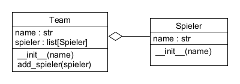

# 23.0 Assoziationen

Im letzen Kapitel haben wir uns mit einzelnen Klassen 
und deren Attributen und Methoden beschäftigt.
In diesem Kapitel werden wir uns mit den Beziehungen
zwischen Klassen, den sogenannten Assoziationen, befassen.

Eine Assoziation kann in verschiedenen Formen auftreten:
- **Einfache Assoziation**: Eine Objekt-Instanz verwendet eine Instanz einer anderen Klasse.
- **Aggregation**: Eine Objekt-Instanz besteht aus mehreren Instanzen einer anderen Klasse.
- **Komposition**: Eine Objekt-Instanz besteht aus mehreren Instanzen einer anderen Klasse,
  die ohne die übergeordnete Klasse nicht existieren können.

## Einfache Assoziation

Eine einfache Assoziation beschreibt eine Beziehung zwischen zwei Klassen,
in der eine Instanz einer Klasse eine Instanz der anderen Klasse verwendet.
Ein Beispiel für eine einfache Assoziation ist 
die Beziehung zwischen einem Patienten und seinem Hausarzt:


```python
class Arzt:
    def __init__(self, name: str):
        self.name : str = name

class Patient:
    def __init__(self, name: str, hausarzt: Arzt):
        self.name : str = name
        self.hausarzt : Arzt = hausarzt  # Ein Patient hat einen Hausarzt
```
In diesem Beispiel hat die Klasse `Patient` ein Attribut `hausarzt`,
das eine Instanz der Klasse `Arzt` repräsentiert.
Das Attribut `hausarzt` ist vom Typ `Arzt`.

## Aggregation

Aggregation beschreibt eine "Teil-von"-Beziehung,
bei der eine Instanz einer Klasse aus mehreren Instanzen 
einer anderen Klasse besteht,
aber die Instanzen der anderen Klasse 
auch unabhängig von der übergeordneten Klasse existieren können.
Ein Beispiel für Aggregation ist die Beziehung 
zwischen einem Team und seinen Spielern:



```python
        
class Spieler:
    def __init__(self, name: str):
        self.name : str = name

class Team:
    def __init__(self, name: str):
        self.name : str = name
        self.spieler : list[Spieler] = []  # Ein Team hat mehrere Spieler

    def add_spieler(self, spieler: Spieler):
        self.spieler.append(spieler)  # Spieler können zum Team hinzugefügt werden
```


In diesem Beispiel hat die Klasse `Team` ein Attribut `spieler`,
das eine Liste von Instanzen der Klasse `Spieler` repräsentiert.
Die Spieler können unabhängig vom Team existieren,
d.h. sie können auch ohne ein Team erstellt und verwendet werden.

## Komposition
Komposition beschreibt eine "Teil-von"-Beziehung,
bei der eine Instanz einer Klasse aus mehreren Instanzen 
einer anderen Klasse besteht,
die ohne die übergeordnete Klasse nicht sinnvoll existieren können.
Ein Beispiel für Komposition ist eine Krankenakte, 
welche aus mehreren Messwerten besteht:


```python
from datetime import date, datetime

class Patient:
    def __init__(self, svnr: int, name: str, geburt: date):
        self.svnr : int = svnr  # Sozialversicherungsnummer des Patienten
        self.name : str = name  # Name des Patienten
        self.geburt : date = geburt  # Geburtsdatum des Patienten

class Messwert:
    def __init__(self, temperatur: float, systole: int, diastole: int):
        self.temperatur : float = temperatur
        self.systole : int = systole
        self.diastole : int = diastole
        self.zeitpunkt : datetime = datetime.now()  # Zeitpunkt der Messung

class Krankenakte:
    def __init__(self, patient: Patient):
        self.patient : Patient = patient  # Eine Krankenakte gehört zu einem Patienten
        self.messwerte : list[Messwert] = []  # Eine Krankenakte hat mehrere Messwerte

    def add_messwert(self, messwert: Messwert):
        self.messwerte.append(messwert)  # Messwerte können zur Krankenakte hinzugefügt werden
```
In diesem Beispiel hat die Klasse `Krankenakte` ein Attribut `messwerte`,
das eine Liste von Instanzen der Klasse `Messwert` repräsentiert.
Die Messwerte können nicht sinnvoll ohne die Krankenakte existieren,
d.h. sie sind Teil der Krankenakte und können nicht sinnvoll
unabhängig davon verwendet werden.

(In diesem Beispiel ist auch eine einfache Assoziation enthalten,
da die `Krankenakte` eine Instanz der Klasse `Patient` benötigt.)


Die Unterscheidung zwischen Aggregation und Komposition
ist oft nicht eindeutig und hängt vom Kontext ab.
In der Praxis wird oft die Aggregation verwendet,
wenn die Beziehung zwischen den Klassen nicht so stark ist,
während die Komposition verwendet wird,
wenn die Beziehung zwischen den Klassen sehr stark ist

## Übungen
[Hier geht's zu den Übungen](../uebungen/UE_23.0_Assoziationen.md)

## Zusammenfassung
### Wichtige Begriffe
- Assoziation
  - einfache Assoziation
  - Aggregation
  - Komposition
  
### Das sollst du können
- Assoziationen zwischen Klassen erkennen und verstehen
- Assoziationen in Python implementieren
- Unterschiede zwischen den verschiedenen Assoziationsarten erkennen
- UML-Diagramme für Assoziationen lesen und erstellen


[<<](22.1_UML.md) &emsp; [>>](24.0_Referenzen.md)