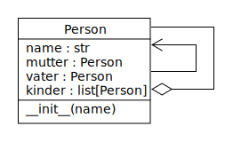

# 24.0 Referenzen

Im [Kaptitel 3.0](03.0_Variablen.md) wurden zum ersten Mal
Variablen erklärt. Dabei wurde erwähnt, 
dass Variablen Namen für "Behälter" sind,
in welchen man Werte speichern kann.
Diese "Behälter" sind Speicherbereiche.

Später wurden Variablen als Namen für Objekte verwendet.
Das heißt, in den benannten Speicherbereichen befinden sich Objekte.
Diese Objekte haben jeweils einen bestimmten Datentyp.
Wir sprechen auch von Objekt-Instanzen.
Während die Objekte zu Beginn ganz einfach waren (z.B. Zahlen oder Texte),
wurden sie später komplexer, z.B. Listen oder Dictionaries,
oder auch Instanzen von Klassen, die wir selbst erstellt haben.

Speicherbereiche können aber nicht nur **einen** Namen haben, 
sondern auch mehrere. 
Das heißt, wir können mehrere Variablen haben,
die auf dasselbe Objekt verweisen:

```python
a = 5
b = a  # b verweist auf dasselbe Objekt wie a
```

In diesem Fall fällt es nicht besonders auf,
dass `a` und `b` auf dasselbe Objekt verweisen,
nämlich auf die Zahl `5`.
Die Zahl `5` ist ein einfaches Objekt,
das nicht verändert werden kann.
Wenn wir zu `5` die Zahl  `1` addieren, wird nicht die Zahl `5` verändert,
sondern es wird eine neue Zahl `6` erstellt:

```python
a = 5       # a ist der Name für die Zahl 5
b = a + 1   # b ist nun der Name für eine neue Zahl 6
```

Anders verhält es sich aber, wenn wir ein komplexeres Objekt haben,
z.B. eine Liste:

```python
a = [1, 2, 3]
b = a  # b verweist auf dasselbe Objekt wie a
b.append(4)  # fügt 4 zur Liste hinzu
print(a)  # Ausgabe: [1, 2, 3, 4]
```
Im Gegensatz zum vorigen Beispiel kann eine Liste verändert werden.
In diesem Fall wird die Liste `a` verändert,
weil `b` auf dasselbe Objekt verweist.
Das bedeutet, dass Änderungen an `b` auch `a` beeinflussen,
da beide Variablen auf dasselbe Objekt im Speicher verweisen.
Es gibt also eigentlich nur ein Objekt,
das von beiden Variablen referenziert wird.

Wir sprechen in diesem Fall von Referenzen.
Das bedeutet, dass `a` und `b` Referenzen auf dasselbe Objekt sind.

Wenn wir wollen, dass `b` eine Kopie von `a` ist,
können wir die Liste kopieren:

```python
a = [1, 2, 3]
b = list(a)  # b ist eine neue Liste mit gleichem Inhalt
b.append(4)  # fügt 4 zur Liste b hinzu - a wird nicht verändert
print(a)  # Ausgabe: [1, 2, 3]
```

Wichtig ist in diesem Zusammenhang zu verstehen,
welche Objekte verändert werden können und welche nicht.
Das ist nicht immer ganz einfach zu erkennen.
Beispielsweise sind Zahlen und Texte unveränderlich (immutable).
Wenn du eine Zahl oder einen Text veränderst,
wird in Wirklichkeit im Speicher ein neues Objekt erstellt:

```python
txt1 = "Hallo"  # txt1 ist eine Referenz auf eine Zeichenkette mit dem Inhalt "Hallo"
txt2 = txt1 + " Welt"  # txt2 ist eine Referenz auf eine neue Zeichenkette
print(txt1)  # Ausgabe: "Hallo"
print(txt2)  # Ausgabe: "Hallo Welt"
```
In diesem Fall ist `txt1` unverändert geblieben,
während `txt2` eine neue Zeichenkette ist,
die aus der Verkettung von `txt1` und `" Welt"` erstellt wurde.

Jetzt verstehst du vielleicht auch besser, 
warum es in Python Listen und Tupel gibt.
Listen sind veränderlich (mutable),
während Tupel unveränderlich (immutable) sind.

## Beispiel

Hier ist ein praktisches Beispiel für die Anwendung von Referenzen. 
In einem Stammbaum ist es nützlich,
wenn ein und dieselbe Person-Instanz unter mehreren Begriffen (=Variablen-Namen) 
angesprochen wird:



```python
class Person:
    def __init__(self, name: str):
        self.name : str = name
        self.mutter : Person = None
        self.vater : Person = None
        self.kinder : list[Person] = []
        
susi : Person = Person("Susi")
fritz : Person = Person("Fritz")
erika : Person = Person("Erika")
erika.mutter = susi  # Erika's Mutter ist Susi
susi.kinder.append(erika)  # Susi hat Erika als Kind
susi.vater = fritz  # Susi's Vater ist Fritz
fritz.kinder.append(susi)  # Fritz hat Susi als Kind
```

In diesem Beispiel haben wir eine Klasse `Person`,
welche den Namen der Person, eine Referenz auf die Mutter, 
eine Referenz auf den Vater und eine Liste
der Kinder speichert.
Die Attribute `mutter` und `vater` sind Referenzen auf 
andere Person-Instanzen,
also einfache Assoziationen.

Das Attribut `kinder` ist eine Liste von Referenzen auf 
andere `Person`-Instanzen,
also eine Aggregation.

Im Konstruktor der Klasse `Person` wird das Attribut `name` gesetzt,
während die Attribute `mutter` und `vater` 
mit dem Wert `None` initialisiert werden.
Das bedeutet, dass die Person zu Beginn keine Mutter und keinen Vater hat.
(In einem echten Stammbaum gibt es auch immer Personen,
deren Eltern nicht bekannt sind.)
Die Liste der Kinder ist zu Beginn leer.

Die Variablen `susi`, `fritz` und `erika` sind Referenzen auf 
`Person`-Instanzen. 
Wie man erkennen kann, wird hier die Person `Susi` von mehreren 
Variablen referenziert:

- Die Variable `susi` ist eine Referenz auf die `Person`-Instanz mit dem Namen "Susi".
- `erika.mutter` ist eine Referenz auf dieselbe `Person`-Instanz, 
  die von der Variable `susi` referenziert wird.
- `fritz.kinder` enthält eine Referenz auf dieselbe `Person`-Instanz,
  welche von der Variable `susi` referenziert wird.

## Übungen
[Hier geht's zu den Übungen](../uebungen/UE_24.0_Referenzen.md)

## Zusammenfassung

### Wichtige Begriffe
- Referenz
- Referenz auf dasselbe Objekt
- Kopie eines Objekts
- unveränderliche Objekte (immutable)
- veränderliche Objekte (mutable)

### Das sollst du können
- Referenzen verstehen
- die Auswirkungen verstehen, 
  wenn mehrere Variablen auf dasselbe Objekt verweisen
- unveränderliche und veränderliche Objekte unterscheiden


[<<](23.0_Assoziationen.md) &emsp; [>>](25.0_Vererbung.md)