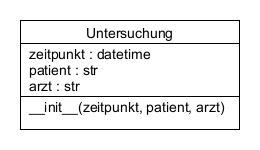
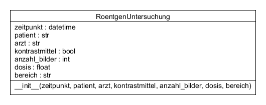
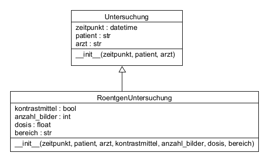
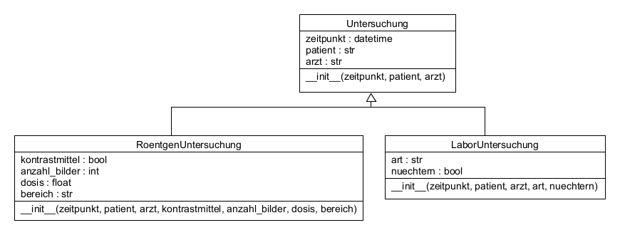
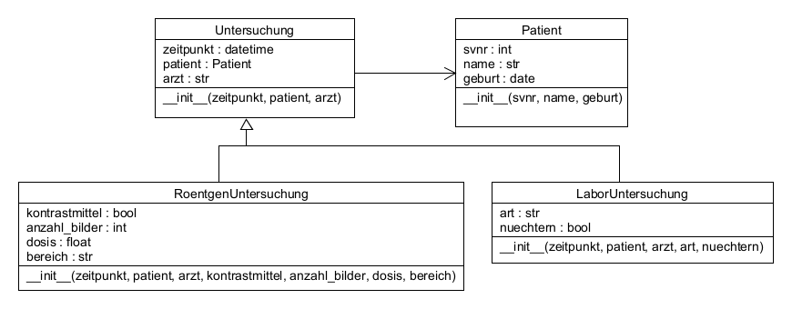

# 25.0 Vererbung

Es gibt Fälle, in denen man zu einer existierenden Klasse
etwas hinzufügen möchte,
aber die existierende Klasse nicht ändern kann oder will.

Als Beispiel soll hier die Klasse `Untersuchung` dienen,
in welcher eine Untersuchung eines Patienten
gespeichert wird:



```python
from datetime import datetime

class Untersuchung:
    def __init__(self, zeitpunkt : datetime, patient : str, arzt : str):
        self.zeitpunkt = zeitpunkt
        self.patient = patient
        self.arzt = arzt
```

Für jede Untersuchung werden der Zeitpunkt der Untersuchung,
der Name des Patienten und der Name des Arztes gespeichert.

Wenn wir nun genauer spezifizieren möchten,
dass es sich bei einer Untersuchung um eine Röntgenuntersuchung handelt,
könnten wir der Klasse `Untersuchung` noch weitere Attribute hinzufügen,
z.B.: `kontrastmittel`, `anzahl_bilder`, `dosis`, `bereich`.

Wir wollen aber die Klasse `Untersuchung` nicht ändern,
da es vielleicht noch andere Arten von Untersuchungen gibt,
welche diese Attribute nicht benötigen (z.B. eine Laboruntersuchung).

Alternativ könnten wir eine neue Klasse `RoentgenUntersuchung` erstellen,
welche wie die Klasse `Untersuchung` aufgebaut ist,
aber zusätzlich die Attribute `kontrastmittel`, 
`anzahl_bilder`, `dosis` und `bereich` enthält:



```python
from datetime import datetime

class RoentgenUntersuchung:
    def __init__(self, zeitpunkt : datetime, patient : str, arzt : str,
                 kontrastmittel : bool, anzahl_bilder : int, dosis : float, bereich : str):
        self.zeitpunkt = zeitpunkt
        self.patient = patient
        self.arzt = arzt
        self.kontrastmittel = kontrastmittel
        self.anzahl_bilder = anzahl_bilder
        self.dosis = dosis
        self.bereich = bereich
```

An dieser Lösung ist nicht optimal,
ist, dass wir den Code der Klasse `Untersuchung` duplizieren.
Das ist nicht nur unnötig,
sondern kann auch zu Problemen führen,
wenn wir die Klasse `Untersuchung` später ändern wollen,
indem wir beispielsweise für Patient und Arzt
jeweils eine eigene Klasse erstellen,
welche dann in der Klasse `Untersuchung` 
anstatt der Namen verwendet wird.

Diese Änderung müsste dann auch in der Klasse `RoentgenUntersuchung`
und vielleicht auch noch anderen Untersuchnungs-Klassen wie
beispielsweise `LaborUntersuchung` vorgenommen werden.

Um dieses Problem zu lösen, verwenden wir **Vererbung**:

Die Klasse `RoentgenUntersuchung` kann von der Klasse `Untersuchung` erben.
Das bedeutet, dass die Klasse `RoentgenUntersuchung`
alle Attribute und Methoden der Klasse `Untersuchung` übernimmt
und zusätzlich noch eigene Attribute und Methoden hinzufügen kann.



```python
class RoentgenUntersuchung(Untersuchung):
    def __init__(self, zeitpunkt : datetime, patient : str, arzt : str,
                 kontrastmittel : bool, anzahl_bilder : int, dosis : float, bereich : str):
        super().__init__(zeitpunkt, patient, arzt)  # ruft den Konstruktor der Basisklasse auf
        self.kontrastmittel = kontrastmittel
        self.anzahl_bilder = anzahl_bilder
        self.dosis = dosis
        self.bereich = bereich
```

Die Syntax `class RoentgenUntersuchung(Untersuchung):` bedeutet,
dass die Klasse `RoentgenUntersuchung` von der Klasse `Untersuchung` erbt.
`RoentgenUntersuchung` hat also die Attribute
`zeitpunkt`, `patient` und `arzt` von der Klasse `Untersuchung`
und zusätzlich die Attribute 
`kontrastmittel`, `anzahl_bilder`, `dosis` und `bereich`.

Die Methode `super().__init__(...)` 
ruft zuerst den Konstruktor der Basisklasse `Untersuchung` auf,
um die Attribute `zeitpunkt`, `patient` und `arzt` zu initialisieren.
Danach werden die zusätzlichen Attribute der Klasse `RoentgenUntersuchung`
initialisiert (`kontrastmittel`, `anzahl_bilder`, `dosis` und `bereich`).

Wenn wir nun noch eine Klasse `LaborUntersuchung` erstellen wollen,
können wir das tun, indem sie ebenfalls von der Klasse `Untersuchung` erbt:



```python
class LaborUntersuchung(Untersuchung):
    def __init__(self, zeitpunkt : datetime, patient : str, arzt : str,
                 art : str, nuechtern : bool):
        super().__init__(zeitpunkt, patient, arzt)
        self.art = art
        self.nuechtern = nuechtern
```

Wir haben nun 2 Klassen, welche von `Untersuchung` erben.
Sie haben die Attribute gemeinsam, welche für alle Untersuchungen gelten,
und zusätzlich noch eigene Attribute, 
welche nur für die jeweilige spezielle Untersuchung relevant sind.

Wenn wir später z.B. ändern wollen, dass vom Patienten auch
Sozialversicherungsnummer und Geburtsdatum 
gespeichert werden, können wir das folgendermaßen durchführen:



```python
class Patient:
    def __init__(self, name: str, svnr: str, geburt: date):
        self.svnr = svnr
        self.name = name
        self.geburtsdatum = geburt
        
class Untersuchung:
    def __init__(self, zeitpunkt: datetime, patient: Patient, arzt: str):
        self.zeitpunkt = zeitpunkt
        self.patient = patient
        self.arzt = arzt
```

Anstatt nur den Namen des Patienten zu speichern,
speichern wir nun für jeder Untersuchung
eine Referenz auf eine Instanz der Klasse `Patient`.

An den Klassen `RoentgenUntersuchung` und `LaborUntersuchung`
müssen wir nur den Typ von Patient in der Parameterliste
des Konstruktors ändern, falls wir Type Hints verwenden.


## Übungen
[Hier geht's zu den Übungen](../uebungen/UE_25.0_Vererbung.md)

## Zusammenfassung

### Wichtige Begriffe
- Vererbung
- Basisklasse
- abgeleitete Klasse
- `super()`


### Das sollst du können
- Verstehen, was Vererbung ist.
- eine Klasse von einer anderen Klasse ableiten (erben lassen)
- den Konstruktor der Basisklasse richtig aufrufen (`super().__init__(...)`)
- ein Konzept für eine Vererbung von Klassen erstellen und
  in einem UML Klassendiagramm darstellen
- ein UML Klassendiagramm mit Vererbung in Python Code umsetzen


[<<](24.0_Referenzen.md) &emsp; [>>](25.1_Polymorphie.md)