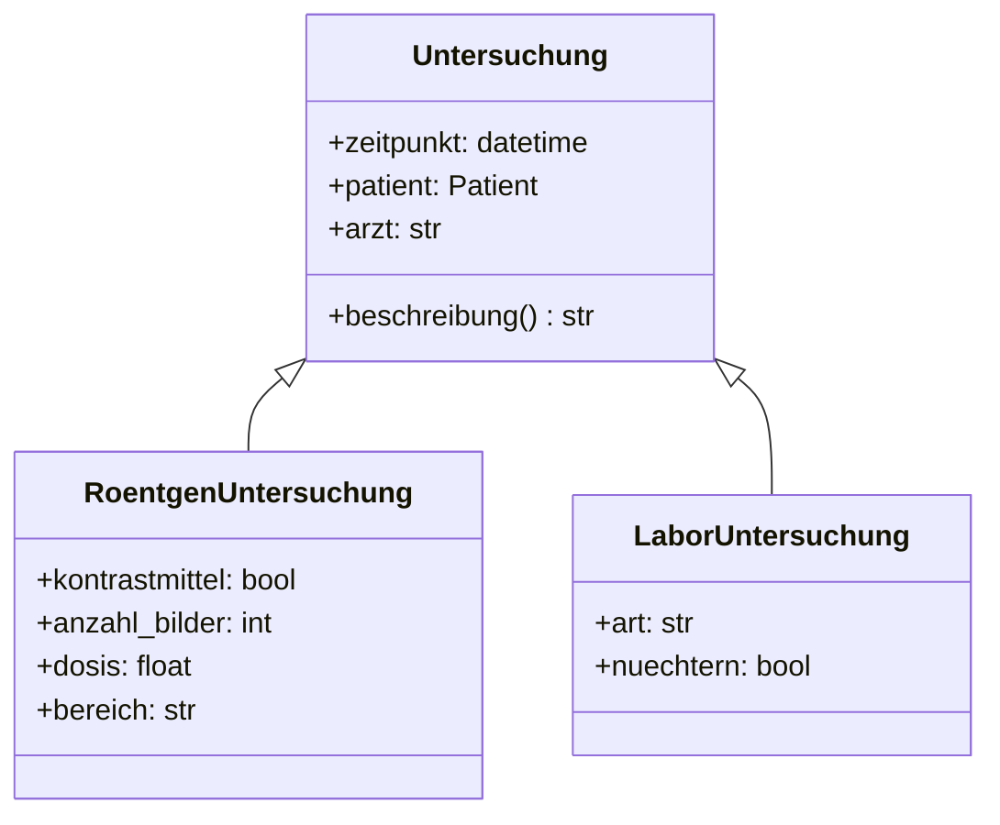

# 25.0 Vererbung

## Lernziele

Nach diesem Kapitel kannst du ...

- erklären, was **Vererbung** in der objektorientierten Programmierung bedeutet.
- zwischen **Basisklasse** und **Unterklasse** unterscheiden.
- die Bedeutung einer **Ist-ein-Beziehung** erklären.
- erkennen, wann Vererbung sinnvoll ist und wann eine Assoziation oder Komposition besser passt.
- eine Klasse von einer anderen Klasse ableiten.
- geerbte Methoden und Klassenattribute verwenden.
- erklären, wie Instanzattribute in einer Vererbungshierarchie entstehen.
- mit `super().__init__()` die Initialisierung der Basisklasse wiederverwenden.
- zusätzliche Attribute in einer Unterklasse ergänzen.
- zusätzliche Methoden in einer Unterklasse ergänzen.
- verstehen, dass eine Unterklasse auch ohne eigenen `__init__()`-Konstruktor funktionieren kann.
- `isinstance()` und `issubclass()` verwenden.
- erklären, warum Objekte einer Unterklasse auch als Objekte der Basisklasse betrachtet werden können.
- die **Method Resolution Order (MRO)** grundsätzlich verstehen.
- einfache Vererbung in UML lesen und zeichnen.
- ein UML-Klassendiagramm mit Vererbung in Python-Code umsetzen.
- typische Fehler beim Entwurf von Vererbungshierarchien vermeiden.

---

# 1. Warum Vererbung?

Im bisherigen objektorientierten Programm haben wir Klassen verwendet, um eigene Datentypen zu modellieren.

Stell dir ein medizinisches Informationssystem vor.

Wir möchten verschiedene Untersuchungen speichern:

- allgemeine Untersuchung,
- Röntgenuntersuchung,
- Laboruntersuchung,
- Ultraschalluntersuchung.

Alle Untersuchungen besitzen einige gemeinsame Informationen:

```text
Zeitpunkt
Patient
Arzt
```

Spezielle Untersuchungen benötigen aber zusätzliche Daten.

Eine Röntgenuntersuchung beispielsweise:

```text
Kontrastmittel
Anzahl der Bilder
Dosis
untersuchter Bereich
```

Eine Laboruntersuchung dagegen:

```text
Art der Untersuchung
nüchtern?
```

Wir könnten für jede Untersuchungsart eine vollständig eigene Klasse schreiben.

Das würde aber viel gemeinsamen Code wiederholen.

---

# 2. Das Problem der Code-Duplizierung

Eine allgemeine Untersuchung könnte so aussehen:

```python
from datetime import datetime


class Untersuchung:
    def __init__(
        self,
        zeitpunkt: datetime,
        patient: str,
        arzt: str
    ) -> None:
        self.zeitpunkt: datetime = zeitpunkt
        self.patient: str = patient
        self.arzt: str = arzt
```

Eine Röntgenuntersuchung könnte ohne Vererbung so aussehen:

```python
class RoentgenUntersuchung:
    def __init__(
        self,
        zeitpunkt: datetime,
        patient: str,
        arzt: str,
        kontrastmittel: bool,
        anzahl_bilder: int,
        dosis: float,
        bereich: str
    ) -> None:
        self.zeitpunkt: datetime = zeitpunkt
        self.patient: str = patient
        self.arzt: str = arzt

        self.kontrastmittel: bool = kontrastmittel
        self.anzahl_bilder: int = anzahl_bilder
        self.dosis: float = dosis
        self.bereich: str = bereich
```

Die Attribute

```text
zeitpunkt
patient
arzt
```

kommen in beiden Klassen vor.

Für eine Laboruntersuchung müssten wir sie erneut wiederholen.

Das ist ungünstig.

---

# 3. Warum duplizierter Code problematisch ist

Doppelter Code bedeutet nicht nur mehr Schreibarbeit.

Er verursacht auch Wartungsprobleme.

Angenommen, wir ändern später:

```text
patient: str
```

zu:

```text
patient: Patient
```

Dann müssten wir diese Änderung in mehreren Klassen durchführen:

```text
Untersuchung
RoentgenUntersuchung
LaborUntersuchung
UltraschallUntersuchung
...
```

Je mehr Klassen existieren, desto leichter wird eine Stelle vergessen.

Eine wichtige Grundidee guter Software lautet daher:

> Gemeinsame Logik sollte möglichst an einer gemeinsamen Stelle definiert werden.

Vererbung ist eine Möglichkeit, genau das zu erreichen.

---

# 4. Die Grundidee der Vererbung

Wir erkennen:

```text
Eine Röntgenuntersuchung ist eine Untersuchung.

Eine Laboruntersuchung ist eine Untersuchung.
```

Diese Beziehung nennen wir eine **Ist-ein-Beziehung**.

```text
RoentgenUntersuchung
IST EINE
Untersuchung
```

und:

```text
LaborUntersuchung
IST EINE
Untersuchung
```

Das lässt sich mit Vererbung modellieren.

---

# 5. Basisklasse und Unterklasse

Die allgemeinere Klasse heißt:

```text
Basisklasse
```

oder auch:

```text
Oberklasse
Superklasse
```

Die speziellere Klasse heißt:

```text
Unterklasse
```

oder:

```text
abgeleitete Klasse
Subklasse
```

In unserem Beispiel:

```text
                 Untersuchung
                 Basisklasse
                      │
             ┌────────┴────────┐
             ▼                 ▼
RoentgenUntersuchung   LaborUntersuchung
   Unterklasse            Unterklasse
```

---

# 6. Syntax der Vererbung

Eine Unterklasse wird so definiert:

```python
class RoentgenUntersuchung(Untersuchung):
    pass
```

Die Klasse in den runden Klammern ist die Basisklasse:

```text
Untersuchung
```

Damit sagt der Code:

> `RoentgenUntersuchung` ist eine spezielle Form von `Untersuchung`.

---

# 7. Was wird tatsächlich geerbt?

Diese Frage ist wichtig.

Eine Unterklasse erhält Zugriff auf die in der Basisklasse definierten:

- Methoden,
- Klassenattribute,
- spezielle Methoden wie `__init__()`, sofern sie nicht überschrieben werden.

Instanzattribute wie

```python
self.zeitpunkt
```

sind etwas anderes:

> Sie entstehen erst, wenn eine Initialisierungsmethode sie für ein konkretes Objekt anlegt.

Deshalb ist die verkürzte Aussage

```text
Die Unterklasse erbt einfach alle Instanzattribute.
```

nicht ganz präzise.

Genauer ist:

> Die Unterklasse erbt die Methoden der Basisklasse. Wenn dabei `Untersuchung.__init__()` ausgeführt wird, erzeugt diese Methode die gemeinsamen Instanzattribute.

---

# 8. Eine Unterklasse ohne eigenen `__init__()`

Betrachte:

```python
class Untersuchung:
    def __init__(
        self,
        zeitpunkt: datetime,
        patient: str,
        arzt: str
    ) -> None:
        self.zeitpunkt: datetime = zeitpunkt
        self.patient: str = patient
        self.arzt: str = arzt


class KontrollUntersuchung(Untersuchung):
    pass
```

`KontrollUntersuchung` besitzt keinen eigenen `__init__()`.

Darum verwendet sie den geerbten `__init__()` aus `Untersuchung`.

```python
kontrolle = KontrollUntersuchung(
    datetime(2026, 9, 1, 9, 30),
    "Anna Berger",
    "Dr. Huber"
)
```

Das funktioniert.

Die Instanz besitzt danach:

```python
print(kontrolle.patient)
print(kontrolle.arzt)
```

Denn der geerbte Konstruktor wurde ausgeführt.

---

# 9. Eine Unterklasse mit zusätzlichen Attributen

Eine Röntgenuntersuchung benötigt zusätzliche Daten.

Deshalb definieren wir einen eigenen `__init__()`:

```python
class RoentgenUntersuchung(Untersuchung):
    def __init__(
        self,
        zeitpunkt: datetime,
        patient: str,
        arzt: str,
        kontrastmittel: bool,
        anzahl_bilder: int,
        dosis: float,
        bereich: str
    ) -> None:
        ...
```

Nun müssen wir zwei Dinge initialisieren:

```text
1. gemeinsame Attribute der Basisklasse
2. zusätzliche Attribute der Unterklasse
```

Dafür verwenden wir `super()`.

---

# 10. `super().__init__()`

```python
class RoentgenUntersuchung(Untersuchung):
    def __init__(
        self,
        zeitpunkt: datetime,
        patient: str,
        arzt: str,
        kontrastmittel: bool,
        anzahl_bilder: int,
        dosis: float,
        bereich: str
    ) -> None:
        super().__init__(
            zeitpunkt,
            patient,
            arzt
        )

        self.kontrastmittel: bool = kontrastmittel
        self.anzahl_bilder: int = anzahl_bilder
        self.dosis: float = dosis
        self.bereich: str = bereich
```

Die Zeile

```python
super().__init__(
    zeitpunkt,
    patient,
    arzt
)
```

führt die Initialisierungslogik der Basisklasse aus.

Dadurch entstehen:

```text
self.zeitpunkt
self.patient
self.arzt
```

Danach ergänzt die Unterklasse ihre eigenen Attribute:

```text
self.kontrastmittel
self.anzahl_bilder
self.dosis
self.bereich
```

---

# 11. Was bedeutet `super()`?

Für den Einstieg kannst du dir merken:

> `super()` ermöglicht den Zugriff auf die nächste passende Implementierung in der Vererbungshierarchie.

Bei einfacher Vererbung führt

```python
super().__init__(...)
```

typischerweise zum `__init__()` der Basisklasse.

Wichtig:

> `super()` erzeugt kein zusätzliches Objekt der Basisklasse.

Es gibt nur das eine Objekt der Unterklasse.

---

# 12. Ein Objekt – zwei Ebenen der Initialisierung

Bei:

```python
roentgen = RoentgenUntersuchung(...)
```

entsteht genau **ein** Objekt.

Vereinfacht:

```text
RoentgenUntersuchung-Objekt
│
├── Attribute aus der Initialisierung von Untersuchung
│   ├── zeitpunkt
│   ├── patient
│   └── arzt
│
└── zusätzliche Attribute
    ├── kontrastmittel
    ├── anzahl_bilder
    ├── dosis
    └── bereich
```

`super().__init__()` erzeugt also kein zweites `Untersuchung`-Objekt.

Es initialisiert den gemeinsamen Teil desselben Objekts.

---

# 13. Warum nicht einfach alles in der Unterklasse erneut zuweisen?

Man könnte schreiben:

```python
class RoentgenUntersuchung(Untersuchung):
    def __init__(
        self,
        zeitpunkt: datetime,
        patient: str,
        arzt: str,
        kontrastmittel: bool
    ) -> None:
        self.zeitpunkt = zeitpunkt
        self.patient = patient
        self.arzt = arzt

        self.kontrastmittel = kontrastmittel
```

Das funktioniert technisch.

Aber die gemeinsame Initialisierungslogik wird wieder dupliziert.

Wenn `Untersuchung.__init__()` später zusätzliche Regeln bekommt, profitiert die Unterklasse davon nicht automatisch.

Beispiel:

```python
class Untersuchung:
    def __init__(
        self,
        zeitpunkt: datetime,
        patient: str,
        arzt: str
    ) -> None:
        if patient == "":
            raise ValueError("Patient darf nicht leer sein.")

        self.zeitpunkt = zeitpunkt
        self.patient = patient
        self.arzt = arzt
```

Wenn die Unterklasse `super().__init__()` verwendet, gilt diese Regel automatisch auch dort.

---

# 14. Gemeinsame Logik gehört in die Basisklasse

Die Basisklasse kann nicht nur Attribute initialisieren.

Sie kann auch gemeinsame Methoden bereitstellen.

```python
class Untersuchung:
    def __init__(
        self,
        zeitpunkt: datetime,
        patient: str,
        arzt: str
    ) -> None:
        self.zeitpunkt: datetime = zeitpunkt
        self.patient: str = patient
        self.arzt: str = arzt

    def beschreibung(self) -> str:
        return (
            f"Untersuchung von {self.patient} "
            f"bei {self.arzt} "
            f"am {self.zeitpunkt:%d.%m.%Y %H:%M}"
        )
```

Eine Unterklasse kann diese Methode direkt verwenden:

```python
roentgen = RoentgenUntersuchung(
    datetime(2026, 9, 1, 10, 0),
    "Anna Berger",
    "Dr. Huber",
    False,
    4,
    0.3,
    "Thorax"
)

print(roentgen.beschreibung())
```

Obwohl `beschreibung()` nicht in `RoentgenUntersuchung` definiert wurde, kann das Objekt die geerbte Methode verwenden.

---

# 15. Unterklassen können eigene Methoden ergänzen

```python
class RoentgenUntersuchung(Untersuchung):
    def __init__(
        self,
        zeitpunkt: datetime,
        patient: str,
        arzt: str,
        kontrastmittel: bool,
        anzahl_bilder: int,
        dosis: float,
        bereich: str
    ) -> None:
        super().__init__(
            zeitpunkt,
            patient,
            arzt
        )

        self.kontrastmittel: bool = kontrastmittel
        self.anzahl_bilder: int = anzahl_bilder
        self.dosis: float = dosis
        self.bereich: str = bereich

    def dosis_warnung(self) -> bool:
        return self.dosis > 1.0
```

Nun besitzt ein Röntgenobjekt:

```text
geerbte Methoden
+
eigene Methoden
```

Zum Beispiel:

```python
print(roentgen.beschreibung())
print(roentgen.dosis_warnung())
```

---

# 16. Eine zweite Unterklasse

```python
class LaborUntersuchung(Untersuchung):
    def __init__(
        self,
        zeitpunkt: datetime,
        patient: str,
        arzt: str,
        art: str,
        nuechtern: bool
    ) -> None:
        super().__init__(
            zeitpunkt,
            patient,
            arzt
        )

        self.art: str = art
        self.nuechtern: bool = nuechtern
```

Nun gilt:

```text
Untersuchung
├── RoentgenUntersuchung
└── LaborUntersuchung
```

Gemeinsam:

```text
zeitpunkt
patient
arzt
beschreibung()
```

Nur Röntgen:

```text
kontrastmittel
anzahl_bilder
dosis
bereich
dosis_warnung()
```

Nur Labor:

```text
art
nuechtern
```

---

# 17. Vererbung beschreibt Spezialisierung

Eine Unterklasse sollte fachlich eine **speziellere Form** der Basisklasse darstellen.

```text
RoentgenUntersuchung
→ spezielle Untersuchung

LaborUntersuchung
→ spezielle Untersuchung
```

Daher ist dieser Satz sinnvoll:

```text
Jede Röntgenuntersuchung ist eine Untersuchung.
```

Das ist ein guter Hinweis auf Vererbung.

---

# 18. Die Ist-ein-Frage

Beim Entwurf hilft folgende Frage:

> Kann ich sinnvoll sagen: „Unterklasse ist eine Basisklasse“?

Beispiel:

```text
Ein MRScanner ist ein Gerät.
→ Vererbung kann passen.

Eine Laboruntersuchung ist eine Untersuchung.
→ Vererbung kann passen.
```

Dagegen:

```text
Eine Bibliothek ist ein Buch.
→ falsch
```

Eine Bibliothek **hat** Bücher.

Das ist eine Assoziation bzw. Teil-Ganzes-Beziehung, keine Vererbung.

---

# 19. Ist-ein vs. Hat-ein

Diese Unterscheidung verbindet das Kapitel mit Kapitel 23.

## Ist-ein

```text
MRScanner IST EIN Geraet.
```

→ Vererbung

```text
LaborUntersuchung IST EINE Untersuchung.
```

→ Vererbung

## Hat-ein

```text
Bibliothek HAT Bücher.
```

→ Assoziation / Aggregation

```text
Krankenakte HAT Messwerte.
```

→ Assoziation / möglicherweise Komposition

Merksatz:

```text
IST EIN
→ denke an Vererbung

HAT EIN
→ denke an Objektbeziehung
```

---

# 20. Vererbung ist nicht nur Code-Wiederverwendung

Es wäre zu kurz gedacht zu sagen:

```text
Vererbung dient dazu, Code zu sparen.
```

Code-Wiederverwendung ist ein Vorteil.

Der wichtigere Gedanke ist aber:

> Vererbung modelliert eine gemeinsame Bedeutung und eine gemeinsame Schnittstelle.

Wenn eine Klasse nur deshalb von einer anderen erbt, weil irgendwo ein paar Methoden praktisch wären, obwohl fachlich keine Ist-ein-Beziehung besteht, ist das Design oft problematisch.

---

# 21. Beispiel für schlechte Vererbung

Angenommen, wir haben:

```python
class ListeMitDruckfunktion(list):
    def drucken(self) -> None:
        print(self)
```

Technisch ist das möglich.

Aber bei eigenen Fachmodellen sollte man fragen:

```text
Ist mein neues Fachobjekt wirklich eine spezielle Liste?
```

Oft lautet die Antwort nein.

Dann ist eine interne Liste als Attribut besser:

```python
class Warteschlange:
    def __init__(self) -> None:
        self.elemente: list[str] = []
```

Die Klasse **hat** eine Liste, sie **ist** nicht unbedingt fachlich eine Liste.

---

# 22. Komposition statt Vererbung

In vielen Fällen ist diese Struktur besser:

```python
class Motor:
    ...


class Auto:
    def __init__(self, motor: Motor) -> None:
        self.motor: Motor = motor
```

Ein Auto:

```text
HAT einen Motor.
```

Es ist kein Motor.

Daher wäre:

```python
class Auto(Motor):
    ...
```

fachlich falsch.

> Vererbung modelliert Spezialisierung. Komposition und Assoziation modellieren Zusammenarbeit.

---

# 23. Unterklassen sind auch Instanzen der Basisklasse

```python
untersuchung = Untersuchung(
    datetime.now(),
    "Anna",
    "Dr. Huber"
)

roentgen = RoentgenUntersuchung(
    datetime.now(),
    "Ben",
    "Dr. Maier",
    False,
    3,
    0.2,
    "Thorax"
)
```

Nun:

```python
print(isinstance(untersuchung, Untersuchung))
print(isinstance(roentgen, RoentgenUntersuchung))
print(isinstance(roentgen, Untersuchung))
```

Ausgabe:

```text
True
True
True
```

Das dritte `True` ist besonders wichtig.

Ein `RoentgenUntersuchung`-Objekt ist auch eine Instanz der Basisklasse `Untersuchung`.

---

# 24. `isinstance()`

`isinstance()` beantwortet:

> Ist dieses Objekt eine Instanz dieser Klasse oder einer davon abgeleiteten Klasse?

```python
isinstance(roentgen, Untersuchung)
```

liefert:

```text
True
```

Das unterscheidet sich von einer exakten Typprüfung:

```python
type(roentgen) is Untersuchung
```

Diese wäre:

```text
False
```

weil der konkrete Typ `RoentgenUntersuchung` ist.

Für Vererbungshierarchien ist `isinstance()` daher meist die passendere Prüfung.

---

# 25. `issubclass()`

Mit `issubclass()` kann die Beziehung zwischen Klassen geprüft werden.

```python
print(
    issubclass(
        RoentgenUntersuchung,
        Untersuchung
    )
)
```

Ausgabe:

```text
True
```

Auch:

```python
print(
    issubclass(
        LaborUntersuchung,
        Untersuchung
    )
)
```

ergibt:

```text
True
```

---

# 26. Jede Klasse erbt letztlich von `object`

Wenn keine Basisklasse angegeben wird:

```python
class Untersuchung:
    pass
```

erbt die Klasse in Python letztlich von `object`.

Man könnte auch schreiben:

```python
class Untersuchung(object):
    pass
```

Das ist in modernem Python aber nicht notwendig.

Daher gilt vereinfacht:

```text
object
   ▲
   │
Untersuchung
   ▲
   │
RoentgenUntersuchung
```

`object` ist die gemeinsame Wurzel normaler Python-Klassen.

---

# 27. Methoden werden entlang der Vererbungshierarchie gesucht

Angenommen:

```python
roentgen.beschreibung()
```

Python sucht die Methode zunächst in:

```text
RoentgenUntersuchung
```

Wenn sie dort nicht definiert ist, wird in der Basisklasse gesucht:

```text
Untersuchung
```

Wenn nötig, geht die Suche weiter.

Diese Suchreihenfolge nennt man:

```text
Method Resolution Order
```

kurz:

```text
MRO
```

---

# 28. Die MRO anzeigen

```python
print(RoentgenUntersuchung.mro())
```

Die Ausgabe enthält sinngemäß:

```text
RoentgenUntersuchung
Untersuchung
object
```

Das bedeutet:

```text
1. Suche in RoentgenUntersuchung
2. dann in Untersuchung
3. dann in object
```

Bei einfacher Vererbung ist diese Reihenfolge meist intuitiv.

Bei Mehrfachvererbung wird die MRO noch wichtiger.

---

# 29. `super()` und die MRO

Darum ist diese Erklärung genauer:

> `super()` bedeutet nicht einfach „nimm immer direkt die Basisklasse“, sondern „verwende die nächste passende Klasse gemäß MRO“.

Bei einfacher Vererbung:

```text
RoentgenUntersuchung
        │
        ▼
Untersuchung
```

ist das praktisch dasselbe.

Später bei komplexeren Hierarchien kann der Unterschied wichtig werden.

---

# 30. Die Patient-Klasse als eigenes Objekt

Bisher war:

```python
patient: str
```

nur ein Name.

Das ist für ein realistisches System zu wenig.

Wir definieren:

```python
from datetime import date


class Patient:
    def __init__(
        self,
        name: str,
        svnr: str,
        geburtsdatum: date
    ) -> None:
        self.name: str = name
        self.svnr: str = svnr
        self.geburtsdatum: date = geburtsdatum
```

Nun ändern wir die Basisklasse:

```python
class Untersuchung:
    def __init__(
        self,
        zeitpunkt: datetime,
        patient: Patient,
        arzt: str
    ) -> None:
        self.zeitpunkt: datetime = zeitpunkt
        self.patient: Patient = patient
        self.arzt: str = arzt
```

---

# 31. Warum Vererbung diese Änderung erleichtert

Die Unterklasse verwendet:

```python
super().__init__(
    zeitpunkt,
    patient,
    arzt
)
```

Dadurch bleibt die gemeinsame Initialisierung in der Basisklasse.

Die Unterklasse muss nicht selbst erneut festlegen:

```python
self.patient = patient
```

Die Verantwortung dafür bleibt bei `Untersuchung`.

Das reduziert duplizierte Logik.

---

# 32. Type Hints in der Unterklasse anpassen

Die Parameter der Unterklasse sollten natürlich ebenfalls den neuen Typ zeigen:

```python
class RoentgenUntersuchung(Untersuchung):
    def __init__(
        self,
        zeitpunkt: datetime,
        patient: Patient,
        arzt: str,
        kontrastmittel: bool,
        anzahl_bilder: int,
        dosis: float,
        bereich: str
    ) -> None:
        super().__init__(
            zeitpunkt,
            patient,
            arzt
        )

        self.kontrastmittel: bool = kontrastmittel
        self.anzahl_bilder: int = anzahl_bilder
        self.dosis: float = dosis
        self.bereich: str = bereich
```

Die Typinformation im Konstruktor bleibt damit konsistent.

---

# 33. Vererbung und Assoziation gleichzeitig

Dieses Beispiel enthält nun zwei verschiedene Arten von Beziehungen.

```text
RoentgenUntersuchung
IST EINE
Untersuchung
```

→ Vererbung

Aber:

```text
Untersuchung
HAT EINEN
Patienten
```

→ Assoziation

Vereinfacht:

```text
Patient ◄──────── Untersuchung
                     ▲
                     │
                     │ Vererbung
                     │
            RoentgenUntersuchung
```

Ein Klassendiagramm kann also gleichzeitig verschiedene Beziehungstypen enthalten.

---

# 34. Eine Hierarchie mit mehreren Ebenen

Vererbung kann mehr als eine Ebene besitzen.

Beispiel:

```text
Untersuchung
    │
    ▼
BildgebendeUntersuchung
    │
    ├── RoentgenUntersuchung
    └── UltraschallUntersuchung
```

Eine mögliche Zwischenklasse:

```python
class BildgebendeUntersuchung(Untersuchung):
    def __init__(
        self,
        zeitpunkt: datetime,
        patient: Patient,
        arzt: str,
        bereich: str
    ) -> None:
        super().__init__(
            zeitpunkt,
            patient,
            arzt
        )

        self.bereich: str = bereich
```

Dann:

```python
class RoentgenUntersuchung(
    BildgebendeUntersuchung
):
    ...
```

Eine Zwischenklasse ist sinnvoll, wenn mehrere Unterklassen zusätzliche gemeinsame Eigenschaften besitzen.

---

# 35. Nicht zu tiefe Hierarchien bauen

Technisch könnte man sehr tiefe Hierarchien bauen:

```text
A
└── B
    └── C
        └── D
            └── E
```

Das ist nicht automatisch gutes Design.

Tiefe Hierarchien können schwer verständlich werden:

```text
Woher kommt diese Methode?

Welche Klasse initialisiert welches Attribut?

Welche Regeln gelten auf welcher Ebene?
```

Für Unterricht und Praxis gilt:

> Verwende Vererbung dort, wo eine klare fachliche Spezialisierung vorliegt. Halte Hierarchien möglichst verständlich.

---

# 36. Mehrfachvererbung

Python erlaubt auch, von mehreren Basisklassen gleichzeitig zu erben:

```python
class A:
    pass


class B:
    pass


class C(A, B):
    pass
```

`C` erbt hier von `A` und `B`.

Das nennt man **Mehrfachvererbung**.

Sie kann sinnvoll sein, macht Methodensuche und Initialisierung aber deutlich komplexer.

Für die meisten Aufgaben in diesem Skriptum genügt zunächst **einfache Vererbung**.

Die MRO wird bei Mehrfachvererbung besonders wichtig.

---

# 37. Vererbte Methoden können später überschrieben werden

Eine Unterklasse kann nicht nur neue Methoden ergänzen.

Sie kann auch eine geerbte Methode mit einer eigenen Implementierung versehen.

Basisklasse:

```python
class Untersuchung:
    def beschreibung(self) -> str:
        return "Allgemeine Untersuchung"
```

Unterklasse:

```python
class LaborUntersuchung(Untersuchung):
    def beschreibung(self) -> str:
        return "Laboruntersuchung"
```

Das nennt man **Überschreiben**.

Dieses Verhalten ist die Grundlage für das nächste Kapitel:

```text
25.1 Polymorphie
```

Dort wird ausführlich behandelt, wie verschiedene Unterklassen dieselbe Methode unterschiedlich implementieren können.

---

# 38. Ein gemeinsamer Basistyp

Vererbung ermöglicht eine gemeinsame Sicht auf verschiedene Unterklassen.

```python
untersuchungen: list[Untersuchung] = [
    RoentgenUntersuchung(
        datetime(2026, 9, 1, 9, 0),
        Patient(
            "Anna",
            "1234",
            date(2000, 5, 4)
        ),
        "Dr. Huber",
        False,
        4,
        0.3,
        "Thorax"
    ),
    LaborUntersuchung(
        datetime(2026, 9, 1, 9, 30),
        Patient(
            "Ben",
            "5678",
            date(1998, 8, 12)
        ),
        "Dr. Maier",
        "Blutbild",
        True
    )
]
```

Obwohl die Objekte unterschiedliche konkrete Klassen besitzen, können sie gemeinsam als `Untersuchung` betrachtet werden.

Das wird im nächsten Kapitel für polymorphen Code besonders wichtig.

---

# 39. UML-Darstellung der Vererbung

In UML wird Vererbung mit einer Linie und einem **hohlen Dreieck** dargestellt.

Das Dreieck zeigt zur Basisklasse.


```mermaid
classDiagram
direction TB

class Untersuchung {
    +zeitpunkt: datetime
    +patient: Patient
    +arzt: str
    +beschreibung() str
}

class RoentgenUntersuchung {
    +kontrastmittel: bool
    +anzahl_bilder: int
    +dosis: float
    +bereich: str
}

class LaborUntersuchung {
    +art: str
    +nuechtern: bool
}

Untersuchung <|-- RoentgenUntersuchung
Untersuchung <|-- LaborUntersuchung
```

Merke:

```text
Das Dreieck zeigt immer zur allgemeineren Klasse.
```

---

# 40. Vererbung im UML-Diagramm lesen

Wenn du siehst:

```text
Untersuchung <|-- RoentgenUntersuchung
```

lies:

```text
RoentgenUntersuchung erbt von Untersuchung.
```

oder:

```text
RoentgenUntersuchung ist eine spezielle Untersuchung.
```

Nicht umgekehrt.

---

# 41. Vom UML-Diagramm zum Python-Code

UML:

```text
        Fahrzeug
           ▲
           │
      ┌────┴────┐
      │         │
     Auto     Fahrrad
```

Python:

```python
class Fahrzeug:
    pass


class Auto(Fahrzeug):
    pass


class Fahrrad(Fahrzeug):
    pass
```

Das hohle Dreieck im UML-Diagramm wird in Python durch die Basisklasse in Klammern ausgedrückt:

```python
class Auto(Fahrzeug):
    pass
```

---

# 42. Vom Python-Code zum UML-Diagramm

Gegeben:

```python
class Mitarbeiter:
    pass


class Entwickler(Mitarbeiter):
    pass


class Administrator(Mitarbeiter):
    pass
```

Dann enthält das UML-Modell:

```text
Mitarbeiter
├── Entwickler
└── Administrator
```

Mit Vererbungsbeziehungen von den Unterklassen zur Basisklasse.

---

# 43. Ein vollständiges Beispiel

```python
from datetime import date, datetime


class Patient:
    def __init__(
        self,
        name: str,
        svnr: str,
        geburtsdatum: date
    ) -> None:
        self.name: str = name
        self.svnr: str = svnr
        self.geburtsdatum: date = geburtsdatum


class Untersuchung:
    def __init__(
        self,
        zeitpunkt: datetime,
        patient: Patient,
        arzt: str
    ) -> None:
        self.zeitpunkt: datetime = zeitpunkt
        self.patient: Patient = patient
        self.arzt: str = arzt

    def beschreibung(self) -> str:
        return (
            f"{self.patient.name}, "
            f"{self.zeitpunkt:%d.%m.%Y %H:%M}, "
            f"Arzt: {self.arzt}"
        )


class RoentgenUntersuchung(Untersuchung):
    def __init__(
        self,
        zeitpunkt: datetime,
        patient: Patient,
        arzt: str,
        kontrastmittel: bool,
        anzahl_bilder: int,
        dosis: float,
        bereich: str
    ) -> None:
        super().__init__(
            zeitpunkt,
            patient,
            arzt
        )

        self.kontrastmittel: bool = kontrastmittel
        self.anzahl_bilder: int = anzahl_bilder
        self.dosis: float = dosis
        self.bereich: str = bereich

    def dosis_warnung(self) -> bool:
        return self.dosis > 1.0


class LaborUntersuchung(Untersuchung):
    def __init__(
        self,
        zeitpunkt: datetime,
        patient: Patient,
        arzt: str,
        art: str,
        nuechtern: bool
    ) -> None:
        super().__init__(
            zeitpunkt,
            patient,
            arzt
        )

        self.art: str = art
        self.nuechtern: bool = nuechtern
```

---

# 44. Das Beispiel verwenden

```python
patient = Patient(
    "Anna Berger",
    "1234567890",
    date(2000, 5, 4)
)

roentgen = RoentgenUntersuchung(
    datetime(2026, 9, 1, 10, 30),
    patient,
    "Dr. Huber",
    False,
    6,
    0.4,
    "Thorax"
)

labor = LaborUntersuchung(
    datetime(2026, 9, 1, 11, 15),
    patient,
    "Dr. Maier",
    "Blutbild",
    True
)

print(roentgen.beschreibung())
print(labor.beschreibung())

print(roentgen.dosis_warnung())
```

Beide Untersuchungen verwenden dieselbe geerbte Methode:

```python
beschreibung()
```

Nur die Röntgenuntersuchung besitzt zusätzlich:

```python
dosis_warnung()
```

---

# 45. Was passiert beim Erzeugen einer Röntgenuntersuchung?

Aufruf:

```python
roentgen = RoentgenUntersuchung(...)
```

Ablauf vereinfacht:

```text
1. Ein RoentgenUntersuchung-Objekt wird erzeugt.

2. RoentgenUntersuchung.__init__() wird ausgeführt.

3. Darin:
   super().__init__(...)
   → Untersuchung.__init__() initialisiert
     zeitpunkt, patient und arzt.

4. Danach initialisiert RoentgenUntersuchung.__init__()
   kontrastmittel, anzahl_bilder, dosis und bereich.

5. Das fertige Objekt besitzt den gesamten Zustand.
```

---

# 46. Eine wichtige Designfrage: Ist die Basisklasse selbst sinnvoll?

Manchmal ist die Basisklasse selbst ein sinnvolles konkretes Objekt:

```python
Untersuchung(...)
```

Dann kann sie normal instanziiert werden.

Manchmal dient eine Basisklasse aber nur dazu, Gemeinsamkeiten für Unterklassen festzulegen.

Zum Beispiel könnte ein System sagen:

```text
Es gibt keine unspezifizierte allgemeine Untersuchung.

Jede Untersuchung muss entweder Labor,
Röntgen oder etwas anderes sein.
```

Dann könnte später eine **abstrakte Basisklasse** sinnvoll sein.

Dieses Konzept wird im Zusammenhang mit Polymorphie noch einmal aufgegriffen.

---

# 47. Vererbung und Wartbarkeit

Richtig eingesetzt kann Vererbung Wartbarkeit verbessern.

Änderung in der Basisklasse:

```python
class Untersuchung:
    def beschreibung(self) -> str:
        ...
```

Alle Unterklassen, die diese Methode nicht überschreiben, verwenden automatisch die neue Implementierung.

Das ist ein Vorteil gemeinsamer Logik.

Aber:

> Eine schlecht gewählte Basisklasse kann Unterklassen unnötig stark koppeln.

Deshalb sollte Vererbung bewusst eingesetzt werden.

---

# 48. Vererbung erzeugt Kopplung

Wenn `RoentgenUntersuchung` von `Untersuchung` erbt, hängt die Unterklasse von der Basisklasse ab.

Änderungen an der Basisklasse können Auswirkungen auf alle Unterklassen haben.

Das kann erwünscht sein:

```text
gemeinsame Schnittstelle
gemeinsame Logik
gemeinsame Regeln
```

Es bedeutet aber auch:

```text
Unterklassen müssen zur Basisklasse passen.
```

Vererbung sollte daher eine echte fachliche Beziehung ausdrücken und nicht nur aus Bequemlichkeit verwendet werden.

---

# 49. Wann ist Vererbung sinnvoll?

Vererbung ist häufig sinnvoll, wenn:

- eine klare **Ist-ein-Beziehung** besteht,
- mehrere Klassen gemeinsame Eigenschaften besitzen,
- mehrere Klassen gemeinsame Methoden besitzen,
- Unterklassen eine gemeinsame Schnittstelle benötigen,
- Unterklassen tatsächlich als Basisklasse verwendet werden können.

Beispiel:

```text
MRScanner ist ein Geraet.
```

---

# 50. Wann eher keine Vererbung?

Sei vorsichtig, wenn:

- nur einzelne Hilfsmethoden wiederverwendet werden sollen,
- die Beziehung eigentlich **Hat-ein** lautet,
- Unterklassen viele geerbte Dinge gar nicht sinnvoll verwenden können,
- immer mehr Sonderfälle entstehen,
- die Hierarchie sehr tief und unübersichtlich wird.

Dann sind oft besser:

- Assoziation,
- Aggregation,
- Komposition,
- normale Hilfsfunktionen.

---

# 51. Typische Fehler und Missverständnisse

## Denken, dass Vererbung nur Code spart

Code-Wiederverwendung ist nur ein Teil.

Vererbung modelliert vor allem eine fachliche Spezialisierung und gemeinsame Schnittstelle.

---

## „Hat-ein“ als Vererbung modellieren

Falsch:

```text
Bibliothek ist Buch
```

Richtig:

```text
Bibliothek hat Bücher
```

→ Assoziation / Aggregation.

---

## `super()` vergessen

Wenn eine Unterklasse einen eigenen `__init__()` definiert und die gemeinsame Initialisierung benötigt, muss sie diese Logik ebenfalls ausführen.

Typisch:

```python
super().__init__(...)
```

---

## Denken, `super()` erzeuge ein zweites Objekt

Es gibt weiterhin nur eine Instanz der Unterklasse.

---

## Gemeinsame Attribute doppelt initialisieren

Ungünstig:

```python
self.patient = patient
self.arzt = arzt
```

in jeder Unterklasse erneut zu schreiben, obwohl die Basisklasse bereits dafür verantwortlich ist.

---

## `type(...)` statt `isinstance(...)` verwenden

Bei Vererbung:

```python
isinstance(roentgen, Untersuchung)
```

ist typischerweise sinnvoller als:

```python
type(roentgen) is Untersuchung
```

weil Unterklassen berücksichtigt werden.

---

## Vererbungshierarchie zu tief machen

Mehr Ebenen sind nicht automatisch besser.

Das Modell sollte verständlich bleiben.

---

# Übungen

Analysiere vor dem Programmieren zuerst die fachliche Beziehung.

Frage:

```text
Ist die Unterklasse wirklich eine spezielle Form der Basisklasse?

Welche Eigenschaften sind gemeinsam?

Welche Eigenschaften sind spezifisch?

Welche Initialisierung gehört in die Basisklasse?

Welche Initialisierung gehört in die Unterklasse?
```

---

## Übung 1 – Vererbung erkennen

Entscheide für jede Beziehung, ob Vererbung sinnvoll ist.

### a)

`Hund` und `Tier`

### b)

`Auto` und `Motor`

### c)

`Lehrperson` und `Person`

### d)

`Bibliothek` und `Buch`

### e)

`Sparkonto` und `Bankkonto`

### Lösungsschema

Verwende die Ist-ein-Frage:

```text
Hund IST EIN Tier?
Auto IST EIN Motor?
Lehrperson IST EINE Person?
Bibliothek IST EIN Buch?
Sparkonto IST EIN Bankkonto?
```

Wenn der Satz fachlich sinnvoll ist, kann Vererbung passen.

Wenn eher gilt:

```text
A HAT EIN B
```

ist eine Assoziation oder Komposition wahrscheinlich besser.

<details>
<summary>Vollständige Lösung anzeigen</summary>

### a) Hund und Tier

```text
Vererbung sinnvoll
```

Ein Hund ist ein Tier.

### b) Auto und Motor

```text
keine Vererbung
```

Ein Auto hat einen Motor.

### c) Lehrperson und Person

```text
Vererbung kann sinnvoll sein
```

Eine Lehrperson ist eine Person.

### d) Bibliothek und Buch

```text
keine Vererbung
```

Eine Bibliothek hat Bücher.

### e) Sparkonto und Bankkonto

```text
Vererbung kann sinnvoll sein
```

Ein Sparkonto kann als spezielle Form eines Bankkontos modelliert werden.

</details>

---

## Übung 2 – Gemeinsame Initialisierung auslagern

Gegeben sind zwei Klassen mit dupliziertem Code:

```python
class Pkw:
    def __init__(
        self,
        marke: str,
        baujahr: int,
        sitzplaetze: int
    ) -> None:
        self.marke: str = marke
        self.baujahr: int = baujahr
        self.sitzplaetze: int = sitzplaetze


class Lkw:
    def __init__(
        self,
        marke: str,
        baujahr: int,
        nutzlast: float
    ) -> None:
        self.marke: str = marke
        self.baujahr: int = baujahr
        self.nutzlast: float = nutzlast
```

Baue eine gemeinsame Basisklasse `Fahrzeug`.

### Lösungsschema

Gemeinsam:

```text
marke
baujahr
```

Nur `Pkw`:

```text
sitzplaetze
```

Nur `Lkw`:

```text
nutzlast
```

Daher:

```text
Fahrzeug
├── Pkw
└── Lkw
```

Die Basisklasse initialisiert:

```text
marke
baujahr
```

Die Unterklassen rufen:

```python
super().__init__(...)
```

auf und ergänzen ihre spezifischen Attribute.

<details>
<summary>Vollständige Lösung anzeigen</summary>

```python
class Fahrzeug:
    def __init__(
        self,
        marke: str,
        baujahr: int
    ) -> None:
        self.marke: str = marke
        self.baujahr: int = baujahr


class Pkw(Fahrzeug):
    def __init__(
        self,
        marke: str,
        baujahr: int,
        sitzplaetze: int
    ) -> None:
        super().__init__(
            marke,
            baujahr
        )

        self.sitzplaetze: int = sitzplaetze


class Lkw(Fahrzeug):
    def __init__(
        self,
        marke: str,
        baujahr: int,
        nutzlast: float
    ) -> None:
        super().__init__(
            marke,
            baujahr
        )

        self.nutzlast: float = nutzlast
```

Verwendung:

```python
auto = Pkw(
    "Skoda",
    2024,
    5
)

lkw = Lkw(
    "MAN",
    2022,
    12.5
)

print(auto.marke)
print(auto.sitzplaetze)

print(lkw.marke)
print(lkw.nutzlast)
```

</details>

---

## Übung 3 – Vererbung und Assoziation kombinieren

Eine Schule besitzt verschiedene Räume.

Es gibt eine allgemeine Klasse `Raum`.

Gemeinsame Attribute:

```text
nummer
flaeche
```

Spezielle Räume:

```text
Klassenraum
→ sitzplaetze

Laborraum
→ labor_typ
```

Zusätzlich besitzt jeder Raum genau ein `Gebaeude`-Objekt.

Modelliere die Klassen sinnvoll.

### Lösungsschema

Zuerst die Vererbung:

```text
Klassenraum IST EIN Raum
Laborraum IST EIN Raum
```

Daher:

```text
Raum
├── Klassenraum
└── Laborraum
```

Nun die Beziehung zum Gebäude:

```text
Raum HAT EIN Gebaeude
```

Das ist keine Vererbung.

Passendes Attribut:

```python
self.gebaeude: Gebaeude
```

Die Basisklasse initialisiert:

```text
nummer
flaeche
gebaeude
```

Die Unterklassen ergänzen ihre spezifischen Daten.

<details>
<summary>Vollständige Lösung anzeigen</summary>

```python
class Gebaeude:
    def __init__(self, name: str) -> None:
        self.name: str = name


class Raum:
    def __init__(
        self,
        nummer: str,
        flaeche: float,
        gebaeude: Gebaeude
    ) -> None:
        self.nummer: str = nummer
        self.flaeche: float = flaeche
        self.gebaeude: Gebaeude = gebaeude


class Klassenraum(Raum):
    def __init__(
        self,
        nummer: str,
        flaeche: float,
        gebaeude: Gebaeude,
        sitzplaetze: int
    ) -> None:
        super().__init__(
            nummer,
            flaeche,
            gebaeude
        )

        self.sitzplaetze: int = sitzplaetze


class Laborraum(Raum):
    def __init__(
        self,
        nummer: str,
        flaeche: float,
        gebaeude: Gebaeude,
        labor_typ: str
    ) -> None:
        super().__init__(
            nummer,
            flaeche,
            gebaeude
        )

        self.labor_typ: str = labor_typ
```

Verwendung:

```python
hauptgebaeude = Gebaeude("Hauptgebäude")

raum1 = Klassenraum(
    "2.14",
    62.5,
    hauptgebaeude,
    28
)

raum2 = Laborraum(
    "1.08",
    74.0,
    hauptgebaeude,
    "Elektronik"
)

print(raum1.gebaeude.name)
print(raum2.gebaeude.name)
```

Hier kommen zwei verschiedene Beziehungen vor:

```text
Klassenraum IST EIN Raum
→ Vererbung

Raum HAT EIN Gebaeude
→ Assoziation
```

</details>

---

# Zusammenfassung

## Vererbung

Vererbung beschreibt eine Spezialisierungsbeziehung zwischen Klassen.

```python
class RoentgenUntersuchung(Untersuchung):
    ...
```

bedeutet:

```text
RoentgenUntersuchung ist eine spezielle Untersuchung.
```

---

## Basisklasse

Die allgemeinere Klasse:

```text
Untersuchung
```

---

## Unterklasse

Die speziellere Klasse:

```text
RoentgenUntersuchung
```

---

## `super().__init__()`

```python
super().__init__(
    zeitpunkt,
    patient,
    arzt
)
```

verwendet die gemeinsame Initialisierungslogik entlang der Vererbungshierarchie.

Bei einfacher Vererbung ist das typischerweise der `__init__()` der Basisklasse.

---

## Geerbte Methode

Eine Unterklasse kann eine Methode der Basisklasse verwenden, ohne sie erneut zu definieren.

```python
roentgen.beschreibung()
```

kann eine Methode aus `Untersuchung` aufrufen.

---

## Eigene Erweiterung

Eine Unterklasse kann zusätzliche Attribute und Methoden besitzen.

```text
Untersuchung
→ gemeinsame Daten

RoentgenUntersuchung
→ zusätzliche Röntgendaten
```

---

## Ist-ein-Beziehung

```text
RoentgenUntersuchung IST EINE Untersuchung.
```

→ Vererbung

---

## Hat-ein-Beziehung

```text
Untersuchung HAT EINEN Patienten.
```

→ Assoziation

---

## `isinstance()`

```python
isinstance(
    roentgen,
    Untersuchung
)
```

prüft, ob ein Objekt eine Instanz der Klasse oder einer Unterklasse davon ist.

---

## `issubclass()`

```python
issubclass(
    RoentgenUntersuchung,
    Untersuchung
)
```

prüft eine Vererbungsbeziehung zwischen Klassen.

---

## Method Resolution Order

Die MRO beschreibt die Reihenfolge, in der Python bei Vererbung nach Methoden sucht.

```python
RoentgenUntersuchung.mro()
```

---

# Wichtige Begriffe

- Vererbung
- Basisklasse
- Oberklasse
- Superklasse
- Unterklasse
- abgeleitete Klasse
- Subklasse
- Ist-ein-Beziehung
- Hat-ein-Beziehung
- gemeinsame Schnittstelle
- Spezialisierung
- `super()`
- `super().__init__()`
- geerbte Methode
- `isinstance()`
- `issubclass()`
- Method Resolution Order
- MRO
- `object`
- einfache Vererbung
- Mehrfachvererbung
- Überschreiben

---

# Das sollst du können

Nach diesem Kapitel solltest du ...

- Vererbung in eigenen Worten erklären können.
- Basisklasse und Unterklasse unterscheiden können.
- eine Ist-ein-Beziehung erkennen können.
- Vererbung von Assoziation und Komposition unterscheiden können.
- eine Klasse mit `class Unterklasse(Basisklasse):` ableiten können.
- geerbte Methoden verwenden können.
- erklären können, wie Instanzattribute durch Initialisierung entstehen.
- `super().__init__()` korrekt verwenden können.
- gemeinsame Attribute in der Basisklasse initialisieren können.
- zusätzliche Attribute in der Unterklasse ergänzen können.
- zusätzliche Methoden in einer Unterklasse definieren können.
- erklären können, wann eine Unterklasse den geerbten `__init__()` direkt verwenden kann.
- mit `isinstance()` Objekte in einer Vererbungshierarchie prüfen können.
- mit `issubclass()` Klassenbeziehungen prüfen können.
- verstehen können, dass ein Unterklassenobjekt auch als Objekt der Basisklasse verwendet werden kann.
- die MRO grundsätzlich erklären können.
- verstehen können, warum `super()` mit der MRO zusammenhängt.
- einfache Vererbung in UML lesen und darstellen können.
- ein UML-Diagramm mit Vererbung in Python-Code übersetzen können.
- erkennen können, wann Komposition statt Vererbung sinnvoller ist.
- verstehen können, dass Vererbung fachliche Spezialisierung und nicht nur Code-Wiederverwendung modelliert.
- wissen, dass Methoden in Unterklassen überschrieben werden können und damit die Grundlage für Polymorphie entsteht.

---

## Merksätze

```text
Unterklasse IST EINE Basisklasse
→ Vererbung kann passen.

Objekt HAT EIN anderes Objekt
→ eher Assoziation oder Komposition.

class Kind(Eltern):
→ Kind erbt von Eltern.

super().__init__(...)
→ gemeinsame Initialisierung wiederverwenden.

isinstance(objekt, Klasse)
→ gehört das Objekt zu dieser Klasse oder einer Unterklasse?

issubclass(A, B)
→ erbt A von B?

MRO
→ in welcher Reihenfolge sucht Python nach Methoden?
```

Der wichtigste Gedanke:

> Vererbung verbindet Klassen, die fachlich in einer Spezialisierungsbeziehung stehen. Die Basisklasse beschreibt gemeinsame Eigenschaften und Verhalten, während Unterklassen diese Grundlage übernehmen und gezielt erweitern oder später auch überschreiben können.

Damit ist die Grundlage für das nächste Kapitel geschaffen:

```text
25.1 Polymorphie
```

Dort wird gezeigt, wie unterschiedliche Unterklassen dieselbe geerbte Methode unterschiedlich implementieren können.

---

## Weitere Übungen

[Hier geht's zu den Übungen](../uebungen/UE_25.0_Vererbung.md)

---

[<<](24.0_Referenzen.md) &emsp; [>>](25.1_Polymorphie.md)
