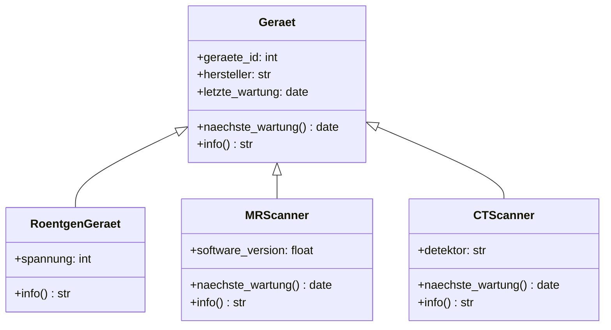

# 25.1 Polymorphie

## Lernziele

Nach diesem Kapitel kannst du ...

- erklären, was **Polymorphie** in der objektorientierten Programmierung bedeutet.
- den Zusammenhang zwischen **Vererbung**, **Überschreiben** und **Polymorphie** erklären.
- Methoden in Unterklassen gezielt überschreiben.
- verstehen, dass bei einem Methodenaufruf der **konkrete Objekttyp zur Laufzeit** entscheidet, welche Implementierung ausgeführt wird.
- Objekte verschiedener Unterklassen über einen gemeinsamen Basistyp verwenden.
- heterogene Listen wie `list[Geraet]` sinnvoll einsetzen.
- erklären, warum polymorpher Code häufig ohne `if isinstance(...)`-Ketten auskommt.
- mit `super()` die Implementierung einer Basisklasse wiederverwenden und erweitern.
- `@override` verwenden und seinen Zweck erklären.
- erklären, was beim Überschreiben bezüglich Parameter- und Rückgabetypen beachtet werden sollte.
- zwischen **Überschreiben** und **Überladen** unterscheiden.
- erklären, warum Polymorphie nicht auf Vererbung beschränkt ist.
- das Python-Prinzip **Duck Typing** verstehen.
- mit `Protocol` eine gemeinsame Schnittstelle für strukturelle Polymorphie beschreiben.
- abstrakte Methoden und abstrakte Basisklassen als Möglichkeit für gemeinsame Schnittstellen einordnen.
- erkennen, wann Polymorphie ein Klassendesign vereinfacht und erweiterbarer macht.

> Die Beispiele mit `from typing import override` setzen **Python 3.12 oder neuer** voraus. Für ältere Python-Versionen kann `override` aus dem Paket `typing_extensions` importiert werden.

---

# 1. Eine Methode – viele mögliche Formen

Das Wort **Polymorphie** kommt sinngemäß von:

```text
poly
→ viele

morph
→ Form
```

Beim objektorientierten Programmieren bedeutet Polymorphie:

> Derselbe Methodenaufruf kann bei verschiedenen Objekten unterschiedliches Verhalten auslösen.

Betrachte zunächst drei Geräte:

```text
Röntgengerät
MR-Scanner
CT-Scanner
```

Alle sind medizinische Geräte.

Deshalb können sie eine gemeinsame Basisklasse besitzen:

```text
Geraet
├── RoentgenGeraet
├── MRScanner
└── CTScanner
```

Alle Geräte sollen beispielsweise die Methode

```python
naechste_wartung()
```

besitzen.

Aber die konkrete Berechnung kann vom Gerätetyp abhängen.

Genau hier wird Polymorphie nützlich.

---

# 2. Ausgangspunkt: gemeinsame Basisklasse

Wir definieren zunächst eine vereinfachte Basisklasse:

```python
from datetime import date, timedelta


class Geraet:
    def __init__(
        self,
        geraete_id: int,
        hersteller: str,
        letzte_wartung: date
    ) -> None:
        self.geraete_id: int = geraete_id
        self.hersteller: str = hersteller
        self.letzte_wartung: date = letzte_wartung

    def naechste_wartung(self) -> date:
        return self.letzte_wartung + timedelta(days=365)
```

Für ein allgemeines Gerät verwenden wir hier einen Wartungsabstand von `365` Tagen.

Beispiel:

```python
geraet = Geraet(
    1001,
    "MedTech",
    date(2026, 1, 10)
)

print(geraet.naechste_wartung())
```

Ausgabe:

```text
2027-01-10
```

---

# 3. Unterklassen erben Methoden

Eine Unterklasse übernimmt zunächst die Methoden ihrer Basisklasse.

```python
class RoentgenGeraet(Geraet):
    def __init__(
        self,
        geraete_id: int,
        hersteller: str,
        letzte_wartung: date,
        spannung: int
    ) -> None:
        super().__init__(
            geraete_id,
            hersteller,
            letzte_wartung
        )

        self.spannung: int = spannung
```

`RoentgenGeraet` definiert keine eigene Methode `naechste_wartung()`.

Deshalb wird die Methode aus `Geraet` verwendet:

```python
roentgen = RoentgenGeraet(
    1002,
    "MedTech",
    date(2026, 2, 1),
    120
)

print(roentgen.naechste_wartung())
```

Die Methodensuche findet keine eigene Implementierung in `RoentgenGeraet` und verwendet deshalb die geerbte Methode aus `Geraet`.

---

# 4. Eine geerbte Methode überschreiben

Ein MR-Scanner soll häufiger gewartet werden.

Dazu definieren wir in der Unterklasse eine Methode mit demselben Namen:

```python
from typing import override


class MRScanner(Geraet):
    def __init__(
        self,
        geraete_id: int,
        hersteller: str,
        letzte_wartung: date,
        software_version: float
    ) -> None:
        super().__init__(
            geraete_id,
            hersteller,
            letzte_wartung
        )

        self.software_version: float = software_version

    @override
    def naechste_wartung(self) -> date:
        if self.software_version < 2.0:
            return self.letzte_wartung + timedelta(days=90)

        return self.letzte_wartung + timedelta(days=180)
```

Die Methode

```python
naechste_wartung()
```

aus `MRScanner` **überschreibt** die geerbte Methode aus `Geraet`.

---

# 5. Was bedeutet Überschreiben?

Überschreiben bedeutet:

> Eine Unterklasse definiert eine eigene Implementierung einer Methode, die bereits in einer Basisklasse existiert.

Basisklasse:

```python
class Geraet:
    def naechste_wartung(self) -> date:
        ...
```

Unterklasse:

```python
class MRScanner(Geraet):
    @override
    def naechste_wartung(self) -> date:
        ...
```

Der Methodenname bleibt gleich.

Auch die vorgesehene Aufgabe der Methode bleibt gleich:

```text
Berechne das Datum der nächsten Wartung.
```

Die konkrete Umsetzung ist aber unterschiedlich.

---

# 6. Eine weitere Unterklasse

Ein CT-Scanner verwendet wieder eine andere Regel:

```python
class CTScanner(Geraet):
    def __init__(
        self,
        geraete_id: int,
        hersteller: str,
        letzte_wartung: date,
        detektor: str
    ) -> None:
        super().__init__(
            geraete_id,
            hersteller,
            letzte_wartung
        )

        self.detektor: str = detektor

    @override
    def naechste_wartung(self) -> date:
        if self.detektor == "solid_state":
            return self.letzte_wartung + timedelta(days=180)

        return self.letzte_wartung + timedelta(days=365)
```

Damit gibt es nun mehrere Implementierungen derselben Methode:

```text
Geraet.naechste_wartung()
→ 365 Tage

MRScanner.naechste_wartung()
→ 90 oder 180 Tage

CTScanner.naechste_wartung()
→ 180 oder 365 Tage
```

---

# 7. Wo entsteht nun Polymorphie?

Wir erzeugen verschiedene Objekte:

```python
roentgen = RoentgenGeraet(
    1001,
    "Alpha Medical",
    date(2026, 1, 1),
    120
)

mr = MRScanner(
    1002,
    "Beta Medical",
    date(2026, 1, 1),
    1.8
)

ct = CTScanner(
    1003,
    "Gamma Medical",
    date(2026, 1, 1),
    "solid_state"
)
```

Nun verwenden wir bei allen Objekten **denselben Methodenaufruf**:

```python
print(roentgen.naechste_wartung())
print(mr.naechste_wartung())
print(ct.naechste_wartung())
```

Obwohl überall

```python
naechste_wartung()
```

aufgerufen wird, kann unterschiedlicher Code ausgeführt werden.

Das ist Polymorphie.

---

# 8. Der konkrete Objekttyp entscheidet

Der entscheidende Punkt lautet:

> Python entscheidet beim Methodenaufruf anhand des tatsächlichen Objekts, welche Methode verwendet wird.

Beispiel:

```python
geraet: Geraet = MRScanner(
    1002,
    "Beta Medical",
    date(2026, 1, 1),
    1.8
)

print(geraet.naechste_wartung())
```

Der Type Hint der Variable lautet:

```python
Geraet
```

Das konkrete Objekt ist aber ein:

```text
MRScanner
```

Deshalb wird ausgeführt:

```python
MRScanner.naechste_wartung()
```

und nicht:

```python
Geraet.naechste_wartung()
```

---

# 9. Basistyp und konkreter Typ

Hier müssen zwei Dinge unterschieden werden.

```python
geraet: Geraet = MRScanner(...)
```

## Statischer bzw. deklarierter Typ

Der Type Hint lautet:

```text
Geraet
```

Er sagt:

> Der Code soll dieses Objekt über die gemeinsame Schnittstelle von `Geraet` verwenden können.

## Konkreter Laufzeittyp

Das tatsächlich erzeugte Objekt ist:

```text
MRScanner
```

Dieser konkrete Typ bestimmt beim polymorphen Methodenaufruf das Verhalten.

---

# 10. Dynamische Methodenbindung

Dieses Verhalten wird häufig **dynamische Bindung** oder **dynamischer Methodenaufruf** genannt.

Vereinfacht:

```text
geraet.naechste_wartung()
          │
          ▼
Welcher konkrete Objekttyp?
          │
          ├── RoentgenGeraet
          │       └── geerbte Methode aus Geraet
          │
          ├── MRScanner
          │       └── MRScanner.naechste_wartung()
          │
          └── CTScanner
                  └── CTScanner.naechste_wartung()
```

Die Entscheidung erfolgt zur Laufzeit anhand des Objekts.

---

# 11. Eine heterogene Liste

Jetzt zeigt sich der praktische Nutzen besonders deutlich.

Wir können Objekte verschiedener Unterklassen in einer gemeinsamen Liste verwalten:

```python
geraete: list[Geraet] = [
    RoentgenGeraet(
        1001,
        "Alpha Medical",
        date(2026, 1, 1),
        120
    ),
    MRScanner(
        1002,
        "Beta Medical",
        date(2026, 1, 1),
        1.8
    ),
    CTScanner(
        1003,
        "Gamma Medical",
        date(2026, 1, 1),
        "solid_state"
    )
]
```

Die Liste ist als

```python
list[Geraet]
```

typisiert.

Warum dürfen darin trotzdem `MRScanner`- oder `CTScanner`-Objekte vorkommen?

Weil diese Klassen von `Geraet` erben.

Ein Objekt einer Unterklasse kann daher dort verwendet werden, wo ein Objekt des Basistyps erwartet wird, sofern es sich entsprechend der gemeinsamen Schnittstelle verhält.

---

# 12. Ein Aufruf für alle Geräte

Nun genügt eine einzige Schleife:

```python
for geraet in geraete:
    print(
        geraet.geraete_id,
        geraet.naechste_wartung()
    )
```

Der Code enthält keine Unterscheidung:

```python
if isinstance(geraet, MRScanner):
    ...
elif isinstance(geraet, CTScanner):
    ...
```

Stattdessen lautet der Code einfach:

```python
geraet.naechste_wartung()
```

Jedes Objekt entscheidet durch seine Klasse selbst, welche Implementierung verwendet wird.

---

# 13. Polymorphie verlagert Entscheidungen an die passende Stelle

Ohne Polymorphie könnte man versuchen:

```python
def naechste_wartung(geraet: Geraet) -> date:
    if isinstance(geraet, MRScanner):
        if geraet.software_version < 2.0:
            return geraet.letzte_wartung + timedelta(days=90)

        return geraet.letzte_wartung + timedelta(days=180)

    if isinstance(geraet, CTScanner):
        if geraet.detektor == "solid_state":
            return geraet.letzte_wartung + timedelta(days=180)

    return geraet.letzte_wartung + timedelta(days=365)
```

Diese Funktion muss alle Gerätetypen kennen.

Das hat mehrere Nachteile:

- Die Funktion wird immer länger.
- Neue Gerätetypen erfordern Änderungen an bestehendem Code.
- Gerätespezifische Logik befindet sich außerhalb der Geräteklasse.
- Die Verantwortlichkeiten werden unklar.

Mit Polymorphie gehört die jeweilige Regel zur passenden Klasse:

```text
MRScanner
→ kennt die MR-Wartungsregel.

CTScanner
→ kennt die CT-Wartungsregel.

Geraet
→ stellt die gemeinsame Schnittstelle bereit.
```

---

# 14. Neue Unterklasse ohne Änderung der Verwaltung

Angenommen, später kommt ein Ultraschallgerät hinzu:

```python
class UltraschallGeraet(Geraet):
    @override
    def naechste_wartung(self) -> date:
        return self.letzte_wartung + timedelta(days=270)
```

Dann kann es sofort in die bestehende Liste aufgenommen werden:

```python
geraete.append(
    UltraschallGeraet(
        1004,
        "Delta Medical",
        date(2026, 1, 1)
    )
)
```

Die bestehende Schleife muss nicht geändert werden:

```python
for geraet in geraete:
    print(geraet.naechste_wartung())
```

Das macht polymorphen Code oft gut **erweiterbar**.

---

# 15. Gemeinsame Schnittstelle

Damit Polymorphie sinnvoll funktioniert, benötigen die verschiedenen Klassen eine gemeinsame erwartete Schnittstelle.

In unserem Beispiel:

```python
def naechste_wartung(self) -> date:
    ...
```

Der aufrufende Code verlässt sich darauf:

```text
Jedes Geraet kann nach seiner nächsten Wartung gefragt werden.

Die Methode heißt:
naechste_wartung()

Sie benötigt keine zusätzlichen Argumente.

Sie liefert ein date-Objekt.
```

Die Implementierung darf unterschiedlich sein.

Die Bedeutung der Methode sollte aber erhalten bleiben.

---

# 16. Austauschbarkeit

Eine wichtige Entwurfsidee lautet:

> Ein Objekt einer Unterklasse sollte dort sinnvoll verwendet werden können, wo ein Objekt der Basisklasse erwartet wird.

Beispiel:

```python
def zeige_wartung(geraet: Geraet) -> None:
    print(geraet.naechste_wartung())
```

Diese Funktion sollte funktionieren mit:

```python
zeige_wartung(roentgen)
zeige_wartung(mr)
zeige_wartung(ct)
```

Der Funktionscode muss den konkreten Gerätetyp nicht kennen.

---

# 17. Beim Überschreiben sollte der Vertrag erhalten bleiben

Angenommen, die Basisklasse definiert:

```python
def naechste_wartung(self) -> date:
    ...
```

Eine schlechte Überschreibung wäre beispielsweise:

```python
class FalschesGeraet(Geraet):
    def naechste_wartung(
        self,
        dringlichkeit: int
    ) -> str:
        return "irgendwann"
```

Probleme:

- Plötzlich ist ein zusätzliches Pflichtargument notwendig.
- Der Rückgabetyp ist nicht mehr `date`.
- Aufrufender Code kann das Objekt nicht mehr wie ein normales `Geraet` verwenden.

Polymorphie funktioniert gut, wenn Unterklassen den erwarteten **Vertrag** der Basisklasse einhalten.

---

# 18. Was prüft `@override`?

Seit Python 3.12 gibt es den Decorator:

```python
from typing import override
```

Verwendung:

```python
class MRScanner(Geraet):
    @override
    def naechste_wartung(self) -> date:
        ...
```

`@override` dokumentiert:

> Diese Methode soll absichtlich eine Methode der Basisklasse überschreiben.

Ein Type Checker kann dann prüfen, ob eine entsprechende Methode tatsächlich in einer Basisklasse existiert.

---

# 19. Ein Tippfehler, den `@override` erkennen kann

Angenommen, wir schreiben versehentlich:

```python
class MRScanner(Geraet):
    @override
    def naechste_warung(self) -> date:
        return self.letzte_wartung + timedelta(days=90)
```

Es fehlt ein `t` in:

```text
wartung
```

Ohne zusätzliche Prüfung entsteht einfach eine neue Methode:

```python
naechste_warung()
```

Die geerbte Methode

```python
naechste_wartung()
```

bleibt unverändert.

Ein Type Checker kann wegen `@override` melden:

```text
Diese Methode überschreibt keine Methode der Basisklasse.
```

Genau solche Fehler soll der Decorator leichter erkennbar machen.

---

# 20. `@override` erzwingt das Verhalten nicht zur Laufzeit

`@override` ist ähnlich wie Type Hints vor allem für:

- Type Checker,
- Entwicklungsumgebungen,
- Leserinnen und Leser des Codes

gedacht.

Der Decorator verhindert nicht automatisch jeden Fehler während der normalen Programmausführung.

Er ist deshalb besonders nützlich zusammen mit einem Type Checker wie `mypy`.

---

# 21. `@override` bei älteren Python-Versionen

`typing.override` wurde mit Python 3.12 eingeführt.

Bei älteren Python-Versionen kann die zurückportierte Variante aus `typing_extensions` verwendet werden:

```python
from typing_extensions import override
```

Falls das Paket nicht vorhanden ist:

```bash
python -m pip install typing_extensions
```

Für dieses Kapitel verwenden wir im weiteren Verlauf:

```python
from typing import override
```

und gehen damit von Python 3.12 oder neuer aus.

---

# 22. Die Methode `info()`

Neben `naechste_wartung()` soll jedes Gerät auch eine Beschreibung liefern.

Die Basisklasse kann allgemeine Informationen bereitstellen:

```python
class Geraet:
    def __init__(
        self,
        geraete_id: int,
        hersteller: str,
        letzte_wartung: date
    ) -> None:
        self.geraete_id: int = geraete_id
        self.hersteller: str = hersteller
        self.letzte_wartung: date = letzte_wartung

    def naechste_wartung(self) -> date:
        return self.letzte_wartung + timedelta(days=365)

    def info(self) -> str:
        wartung = self.naechste_wartung()

        return (
            f"Gerät {self.geraete_id}, "
            f"Hersteller: {self.hersteller}, "
            f"nächste Wartung: "
            f"{wartung.strftime('%d.%m.%Y')}"
        )
```

Beachte in `info()`:

```python
self.naechste_wartung()
```

Diese Zeile ist besonders interessant.

---

# 23. Polymorphie wirkt auch innerhalb geerbter Methoden

Angenommen, ein `MRScanner` erbt `info()` unverändert von `Geraet`.

```python
mr = MRScanner(
    1002,
    "Beta Medical",
    date(2026, 1, 1),
    1.8
)

print(mr.info())
```

Die Methode `info()` selbst stammt aus `Geraet`.

Darin steht:

```python
self.naechste_wartung()
```

Da `self` aber auf ein `MRScanner`-Objekt verweist, wird trotzdem

```python
MRScanner.naechste_wartung()
```

aufgerufen.

Nicht:

```python
Geraet.naechste_wartung()
```

Das zeigt die dynamische Methodenbindung besonders deutlich.

---

# 24. Methoden vollständig ersetzen

Eine Unterklasse kann eine geerbte Methode vollständig ersetzen:

```python
class MRScanner(Geraet):
    @override
    def info(self) -> str:
        return (
            f"MR-Scanner {self.geraete_id}, "
            f"Software: {self.software_version}"
        )
```

Dann wird beim Aufruf

```python
mr.info()
```

nur diese Implementierung verwendet.

---

# 25. Geerbte Implementierung erweitern

Oft möchten wir aber nicht die gesamte Logik wiederholen.

Die Basisklasse kennt bereits die allgemeinen Geräteinformationen.

Die Unterklasse soll nur weitere Informationen ergänzen.

Dafür verwenden wir `super()`:

```python
class MRScanner(Geraet):
    @override
    def info(self) -> str:
        basis_info = super().info()

        return (
            f"{basis_info}, "
            f"Software-Version: {self.software_version}"
        )
```

`super().info()` ruft die nächste passende Implementierung von `info()` in der Vererbungshierarchie auf.

Bei einfacher Vererbung ist das hier die Methode aus `Geraet`.

---

# 26. `super()` arbeitet mit demselben Objekt

Ein häufiger Denkfehler lautet:

```text
super() erzeugt ein Objekt der Basisklasse.
```

Das ist falsch.

Es existiert weiterhin nur das ursprüngliche Objekt.

Bei:

```python
super().info()
```

wird die Basisklassenlogik für **dasselbe Objekt** verwendet.

Vereinfacht:

```text
mr ─────► ein MRScanner-Objekt
             │
             ├── MRScanner.info()
             │
             └── super().info()
                    │
                    └── Geraet.info()
                        für dasselbe Objekt
```

---

# 27. Warum `super()` meist besser ist als ein direkter Klassenaufruf

Technisch könnte man bei einfacher Vererbung teilweise schreiben:

```python
Geraet.info(self)
```

Besser ist normalerweise:

```python
super().info()
```

`super()` berücksichtigt die sogenannte **Method Resolution Order**, kurz **MRO**.

Das wird besonders bei komplexeren Vererbungshierarchien wichtig.

Für den Einstieg genügt:

> Verwende `super()`, wenn du von einer überschriebenen Methode aus die geerbte Implementierung sinnvoll weiterverwenden möchtest.

---

# 28. Method Resolution Order

Wenn Python eine Methode sucht, beginnt die Suche beim konkreten Objekttyp.

Vereinfacht bei einfacher Vererbung:

```text
MRScanner
    │
    ▼
Geraet
    │
    ▼
object
```

Bei:

```python
mr.info()
```

sucht Python zuerst:

```text
MRScanner.info
```

Wenn dort keine Methode gefunden wird, geht die Suche weiter:

```text
Geraet.info
```

Diese Suchreihenfolge nennt man **Method Resolution Order**.

Man kann sie untersuchen:

```python
print(MRScanner.mro())
```

---

# 29. Ein vollständiges polymorphes Beispiel

```python
from datetime import date, timedelta
from typing import override


class Geraet:
    def __init__(
        self,
        geraete_id: int,
        hersteller: str,
        letzte_wartung: date
    ) -> None:
        self.geraete_id: int = geraete_id
        self.hersteller: str = hersteller
        self.letzte_wartung: date = letzte_wartung

    def naechste_wartung(self) -> date:
        return self.letzte_wartung + timedelta(days=365)

    def info(self) -> str:
        return (
            f"Gerät {self.geraete_id}, "
            f"Hersteller: {self.hersteller}, "
            f"nächste Wartung: "
            f"{self.naechste_wartung().strftime('%d.%m.%Y')}"
        )


class RoentgenGeraet(Geraet):
    def __init__(
        self,
        geraete_id: int,
        hersteller: str,
        letzte_wartung: date,
        spannung: int
    ) -> None:
        super().__init__(
            geraete_id,
            hersteller,
            letzte_wartung
        )

        self.spannung: int = spannung

    @override
    def info(self) -> str:
        return (
            f"Röntgen-{super().info()}, "
            f"Spannung: {self.spannung} kV"
        )


class MRScanner(Geraet):
    def __init__(
        self,
        geraete_id: int,
        hersteller: str,
        letzte_wartung: date,
        software_version: float
    ) -> None:
        super().__init__(
            geraete_id,
            hersteller,
            letzte_wartung
        )

        self.software_version: float = software_version

    @override
    def naechste_wartung(self) -> date:
        if self.software_version < 2.0:
            return self.letzte_wartung + timedelta(days=90)

        return self.letzte_wartung + timedelta(days=180)

    @override
    def info(self) -> str:
        return (
            f"MR-{super().info()}, "
            f"Software-Version: {self.software_version}"
        )


class CTScanner(Geraet):
    def __init__(
        self,
        geraete_id: int,
        hersteller: str,
        letzte_wartung: date,
        detektor: str
    ) -> None:
        super().__init__(
            geraete_id,
            hersteller,
            letzte_wartung
        )

        self.detektor: str = detektor

    @override
    def naechste_wartung(self) -> date:
        if self.detektor == "solid_state":
            return self.letzte_wartung + timedelta(days=180)

        return self.letzte_wartung + timedelta(days=365)

    @override
    def info(self) -> str:
        return (
            f"CT-{super().info()}, "
            f"Detektor: {self.detektor}"
        )
```

---

# 30. Die Geräteverwaltung muss die Unterklassen nicht kennen

```python
class GeraeteVerwaltung:
    def __init__(self) -> None:
        self.geraete: list[Geraet] = []

    def hinzufuegen(self, geraet: Geraet) -> None:
        self.geraete.append(geraet)

    def zeige_geraete(self) -> None:
        for geraet in self.geraete:
            print(geraet.info())
```

Verwendung:

```python
verwaltung = GeraeteVerwaltung()

verwaltung.hinzufuegen(
    RoentgenGeraet(
        1001,
        "Alpha Medical",
        date(2026, 1, 1),
        120
    )
)

verwaltung.hinzufuegen(
    MRScanner(
        1002,
        "Beta Medical",
        date(2026, 1, 1),
        1.8
    )
)

verwaltung.hinzufuegen(
    CTScanner(
        1003,
        "Gamma Medical",
        date(2026, 1, 1),
        "solid_state"
    )
)

verwaltung.zeige_geraete()
```

Die Verwaltung ruft immer nur auf:

```python
geraet.info()
```

Sie muss nicht wissen, ob `geraet` gerade

- ein `RoentgenGeraet`,
- ein `MRScanner`,
- ein `CTScanner`
- oder später eine weitere Unterklasse

ist.

---

# 31. Das ist der Kern von Polymorphie

Vereinfacht:

```text
GeraeteVerwaltung
       │
       │ kennt nur
       ▼
     Geraet
       │
       │ gleicher Aufruf
       ▼
   geraet.info()
       │
       ├── RoentgenGeraet.info()
       ├── MRScanner.info()
       ├── CTScanner.info()
       └── ...
```

Der aufrufende Code arbeitet gegen eine gemeinsame Schnittstelle.

Die Objekte liefern die jeweils passende Implementierung.

---

# 32. Polymorphie reduziert Typabfragen

Ohne polymorphes Design sieht Code häufig so aus:

```python
for geraet in geraete:
    if isinstance(geraet, RoentgenGeraet):
        print("Röntgen:", geraet.spannung)

    elif isinstance(geraet, MRScanner):
        print("MR:", geraet.software_version)

    elif isinstance(geraet, CTScanner):
        print("CT:", geraet.detektor)
```

Das ist nicht grundsätzlich verboten.

Manchmal sind Typprüfungen sinnvoll.

Wenn die Fallunterscheidung aber immer nur dazu dient, abhängig vom Typ unterschiedliches Verhalten auszuführen, ist eine polymorphe Methode oft die bessere Lösung:

```python
for geraet in geraete:
    print(geraet.info())
```

---

# 33. Das Open-Closed-Prinzip als Entwurfsidee

Polymorphie unterstützt eine wichtige Idee guten Softwaredesigns:

> Bestehender Code sollte möglichst erweitert werden können, ohne dass dafür an vielen vorhandenen Stellen Änderungen notwendig sind.

Wir fügen beispielsweise hinzu:

```python
class UltraschallGeraet(Geraet):
    ...
```

Die vorhandene `GeraeteVerwaltung` muss dafür nicht um einen neuen `elif`-Zweig erweitert werden.

Sie kennt weiterhin nur:

```python
Geraet
```

Diese Entwurfsidee wird häufig **Open-Closed-Prinzip** genannt:

```text
offen für Erweiterung
geschlossen gegenüber unnötigen Änderungen
```

Das ist keine starre Regel, aber eine hilfreiche Orientierung.

---

# 34. Überschreiben ist nicht dasselbe wie Überladen

Die Begriffe klingen ähnlich, bedeuten aber etwas anderes.

## Überschreiben – Overriding

Eine Unterklasse ersetzt oder erweitert eine geerbte Methode:

```python
class Geraet:
    def info(self) -> str:
        ...


class MRScanner(Geraet):
    def info(self) -> str:
        ...
```

Das ist **Overriding**.

---

## Überladen – Overloading

In manchen Programmiersprachen kann man mehrere Methoden mit demselben Namen, aber unterschiedlichen Parameterlisten definieren.

Zum Beispiel gedanklich:

```text
berechne(int)
berechne(str)
berechne(int, int)
```

Das nennt man **Overloading**.

Python unterstützt diese Form des Methodenüberladens nicht auf dieselbe Weise.

Wenn man in derselben Klasse denselben Methodennamen zweimal definiert, ersetzt die spätere Definition die frühere.

---

# 35. `typing.overload` ist etwas anderes

Python besitzt zwar:

```python
from typing import overload
```

Dieser Decorator beschreibt für Type Checker verschiedene mögliche Aufrufsignaturen.

Zur Laufzeit existiert aber weiterhin eine tatsächliche Implementierung.

`@overload` ist daher nicht dasselbe wie das klassische automatische Auswählen mehrerer Methodenimplementierungen anhand ihrer Parameter.

Für dieses Kapitel ist wichtig:

```text
@override
→ eine geerbte Methode wird überschrieben

@overload
→ Type-Hint-Werkzeug für mehrere mögliche Signaturen
```

---

# 36. Polymorphie gibt es in Python auch ohne Vererbung

Bis jetzt haben wir Polymorphie über Vererbung betrachtet.

Python verwendet aber häufig ein noch allgemeineres Prinzip:

> Entscheidend ist oft nicht, von welcher Klasse ein Objekt erbt, sondern ob es die benötigten Methoden besitzt.

Dieses Prinzip nennt man **Duck Typing**.

Der bekannte Merksatz lautet sinngemäß:

```text
Wenn sich ein Objekt wie eine Ente verhält,
kann es für diesen Zweck wie eine Ente verwendet werden.
```

Für Python bedeutet das:

```text
Hat das Objekt die benötigte Methode?
→ Dann kann der Code diese Methode verwenden.
```

---

# 37. Beispiel für Duck Typing

```python
class Bildschirm:
    def info(self) -> str:
        return "Bildschirm: betriebsbereit"


class Drucker:
    def info(self) -> str:
        return "Drucker: Papier vorhanden"
```

Die beiden Klassen besitzen keine gemeinsame selbst definierte Basisklasse.

Trotzdem kann folgender Code mit beiden Objekten arbeiten:

```python
def zeige_info(objekt) -> None:
    print(objekt.info())


zeige_info(Bildschirm())
zeige_info(Drucker())
```

Zur Laufzeit ist für diese Funktion nur wichtig:

```text
Besitzt das Objekt eine aufrufbare Methode info()?
```

---

# 38. Duck Typing und Type Hints

Seit Kapitel 21 verwenden wir Type Hints.

Ein unannotierter Parameter wie

```python
def zeige_info(objekt) -> None:
    ...
```

ist deshalb für unseren weiteren Code nicht ideal.

Wir könnten eine gemeinsame Basisklasse einführen.

Aber manchmal möchten wir gerade **keine Vererbungsbeziehung** erzwingen.

Dafür gibt es `Protocol`.

---

# 39. Strukturelle Polymorphie mit `Protocol`

```python
from typing import Protocol


class Informierbar(Protocol):
    def info(self) -> str:
        ...
```

`Informierbar` beschreibt eine Schnittstelle:

```text
Ein passendes Objekt besitzt eine Methode:

info() -> str
```

Nun können wir schreiben:

```python
def zeige_info(objekt: Informierbar) -> None:
    print(objekt.info())
```

Die Klassen müssen nicht ausdrücklich von `Informierbar` erben:

```python
class Bildschirm:
    def info(self) -> str:
        return "Bildschirm: betriebsbereit"


class Drucker:
    def info(self) -> str:
        return "Drucker: Papier vorhanden"
```

Beide erfüllen strukturell das Protokoll, weil sie die erwartete Methode besitzen.

---

# 40. Zwei wichtige Formen von Polymorphie in Python

Für dieses Kapitel unterscheiden wir:

## Polymorphie über Vererbung

```text
Geraet
├── MRScanner
└── CTScanner
```

Der Basistyp definiert die gemeinsame Schnittstelle.

Unterklassen überschreiben Methoden.

---

## Strukturelle Polymorphie / Duck Typing

Klassen müssen nicht zwingend dieselbe Basisklasse besitzen.

Entscheidend ist, dass sie die benötigten Operationen anbieten.

```text
Bildschirm.info()
Drucker.info()
```

Beide können als `Informierbar` behandelt werden.

---

# 41. Polymorphie hast du bereits früher verwendet

Polymorphie ist kein völlig neues Verhalten.

Betrachte den Operator `+`:

```python
print(2 + 3)
print("Py" + "thon")
print([1, 2] + [3, 4])
```

Der gleiche Operator

```text
+
```

führt je nach Objekttyp unterschiedliche Operationen aus:

```text
int
→ Addition

str
→ Verkettung

list
→ Listenverkettung
```

Auch das ist eine Form polymorphen Verhaltens.

---

# 42. Auch `len()` arbeitet polymorph

```python
print(len("Python"))
print(len([1, 2, 3]))
print(len({"a": 1, "b": 2}))
```

Der gleiche Aufruf

```python
len(objekt)
```

funktioniert mit verschiedenen Objekttypen.

Intern stellen diese Typen das passende Verhalten über Pythons Datenmodell bereit.

Das zeigt:

> Polymorphie ist ein grundlegendes Prinzip in Python und nicht nur eine Besonderheit eigener Vererbungshierarchien.

---

# 43. Wann braucht eine Basisklasse überhaupt eine Implementierung?

In unserem Gerätebeispiel besitzt `Geraet.naechste_wartung()` eine sinnvolle Standardimplementierung:

```python
def naechste_wartung(self) -> date:
    return self.letzte_wartung + timedelta(days=365)
```

Unterklassen können diese Methode:

- unverändert erben,
- überschreiben.

Manchmal gibt es aber **keine sinnvolle allgemeine Standardimplementierung**.

Dann kann eine abstrakte Methode sinnvoll sein.

---

# 44. Abstrakte Basisklassen

Python stellt dafür das Modul `abc` bereit.

```python
from abc import ABC, abstractmethod


class Geraet(ABC):
    @abstractmethod
    def naechste_wartung(self) -> date:
        ...
```

Die Methode beschreibt damit:

> Jedes konkrete Gerät muss diese Operation anbieten.

Die Basisklasse selbst liefert aber keine allgemeine Berechnung.

---

# 45. Eine abstrakte Methode implementieren

```python
class MRScanner(Geraet):
    @override
    def naechste_wartung(self) -> date:
        return self.letzte_wartung + timedelta(days=180)
```

Wenn eine Unterklasse die abstrakten Methoden nicht implementiert, bleibt sie selbst abstrakt.

Eine abstrakte Klasse mit noch nicht implementierten abstrakten Methoden kann nicht einfach wie eine normale konkrete Klasse instanziiert werden.

---

# 46. Wann abstrakte Basisklasse, wann normale Basisklasse?

## Normale Basisklasse

Sinnvoll, wenn es eine brauchbare gemeinsame Standardimplementierung gibt:

```python
class Geraet:
    def naechste_wartung(self) -> date:
        return ...
```

Unterklassen überschreiben nur bei Bedarf.

---

## Abstrakte Basisklasse

Sinnvoll, wenn jede konkrete Unterklasse selbst festlegen muss, wie eine Operation funktioniert:

```python
class Geraet(ABC):
    @abstractmethod
    def naechste_wartung(self) -> date:
        ...
```

---

# 47. Abstraktion und Polymorphie ergänzen sich

Eine abstrakte Basisklasse kann eine gemeinsame Schnittstelle festlegen:

```text
Geraet
→ jedes Gerät besitzt naechste_wartung()
```

Die Unterklassen liefern die konkrete Implementierung:

```text
MRScanner
→ eigene Berechnung

CTScanner
→ eigene Berechnung
```

Der aufrufende Code arbeitet nur mit der abstrakten Sicht:

```python
def plane_wartung(geraet: Geraet) -> None:
    print(geraet.naechste_wartung())
```

Das ist ein typisches Zusammenspiel aus:

```text
Abstraktion
+
Vererbung
+
Polymorphie
```

---

# 48. UML-Darstellung

Eine vereinfachte Vererbungshierarchie kann so dargestellt werden:


```mermaid
classDiagram
direction TB

class Geraet {
    +geraete_id: int
    +hersteller: str
    +letzte_wartung: date
    +naechste_wartung() date
    +info() str
}

class RoentgenGeraet {
    +spannung: int
    +info() str
}

class MRScanner {
    +software_version: float
    +naechste_wartung() date
    +info() str
}

class CTScanner {
    +detektor: str
    +naechste_wartung() date
    +info() str
}

Geraet <|-- RoentgenGeraet
Geraet <|-- MRScanner
Geraet <|-- CTScanner
```

In einem UML-Werkzeug können überschriebene Methoden je nach verwendeter Notation zusätzlich markiert oder durch die Wiederholung in der Unterklasse sichtbar gemacht werden.

---

# 49. Vom UML-Diagramm zum polymorphen Code

Wenn mehrere Unterklassen dieselbe Operation anbieten:

```text
Geraet
├── MRScanner.naechste_wartung()
└── CTScanner.naechste_wartung()
```

sollte der aufrufende Code typischerweise nicht fragen:

```text
Welcher Untertyp bist du?
```

sondern:

```text
Was ist deine nächste Wartung?
```

Im Code:

```python
datum = geraet.naechste_wartung()
```

Diese Denkweise ist für objektorientiertes Design sehr wichtig.

---

# 50. „Sag dem Objekt, was es tun soll“

Ein häufiger Vorteil objektorientierter Polymorphie ist:

Statt außerhalb eines Objekts dessen Typ zu untersuchen und dann seine Regeln selbst nachzubauen, ruft man eine passende Methode auf.

Ungünstig:

```python
if isinstance(geraet, MRScanner):
    ...
elif isinstance(geraet, CTScanner):
    ...
```

Polymorph:

```python
geraet.naechste_wartung()
```

Die gerätespezifische Entscheidung bleibt bei der Klasse, die sie am besten kennt.

---

# 51. Typische Fehler und Missverständnisse

## Polymorphie nur als „gleicher Methodenname“ verstehen

Nur gleiche Methodennamen reichen als Erklärung nicht aus.

Entscheidend ist:

> Aufrufender Code verwendet eine gemeinsame Schnittstelle, während verschiedene konkrete Objekte unterschiedliche Implementierungen bereitstellen.

---

## Überschreiben und Überladen verwechseln

```text
Overriding
→ geerbte Methode neu implementieren

Overloading
→ gleicher Name mit verschiedenen Signaturen
```

Dieses Kapitel behandelt vor allem **Overriding**.

---

## Beim Überschreiben die Bedeutung der Methode verändern

Eine Methode

```text
naechste_wartung() -> date
```

sollte in einer Unterklasse weiterhin genau diese fachliche Aufgabe erfüllen.

---

## Zusätzliche Pflichtparameter einführen

Problematisch:

```python
class MRScanner(Geraet):
    def naechste_wartung(self, modus: str) -> date:
        ...
```

Code, der nur `Geraet` kennt, ruft auf:

```python
geraet.naechste_wartung()
```

und würde damit scheitern.

---

## Falschen Rückgabetyp verwenden

Basisklasse:

```python
def naechste_wartung(self) -> date:
    ...
```

Unterklasse sollte nicht plötzlich liefern:

```python
str
```

wenn die gemeinsame Schnittstelle `date` verspricht.

---

## `super()` als zweites Objekt verstehen

`super()` erzeugt keine separate Basisklasseninstanz.

Es hilft bei der Methodensuche für dasselbe Objekt.

---

## `@override` mit Laufzeitkontrolle verwechseln

`@override` unterstützt vor allem statische Analyse und Dokumentation.

Ein Type Checker sollte verwendet werden, damit der Decorator seinen größten Nutzen entfaltet.

---

## Jede Typabfrage verbieten wollen

`isinstance()` ist nicht grundsätzlich schlecht.

Es gibt Situationen, in denen eine explizite Typprüfung sinnvoll ist.

Wenn aber große `if`-/`elif`-Ketten nur unterschiedliche Varianten derselben Operation auswählen, sollte geprüft werden, ob Polymorphie die bessere Struktur ergibt.

---

# Übungen

Versuche zuerst zu bestimmen:

```text
Was ist die gemeinsame Schnittstelle?

Welche Methode soll polymorph sein?

Welche Klasse besitzt welche Verantwortung?

Kann aufrufender Code nur mit dem Basistyp arbeiten?
```

Erst danach solltest du die vollständige Lösung ansehen.

---

## Übung 1 – Dynamischen Methodenaufruf vorhersagen

Gegeben ist:

```python
class Tier:
    def laut(self) -> str:
        return "?"


class Hund(Tier):
    def laut(self) -> str:
        return "Wuff"


class Katze(Tier):
    def laut(self) -> str:
        return "Miau"


tiere: list[Tier] = [
    Hund(),
    Katze(),
    Tier()
]

for tier in tiere:
    print(tier.laut())
```

Bestimme die Ausgabe, ohne den Code auszuführen.

### Lösungsschema

Die Variable der Schleife ist als

```text
Tier
```

gedacht.

Für jeden Listeneintrag musst du aber den **konkreten Objekttyp** betrachten:

```text
Hund()
→ Welche laut()-Methode?

Katze()
→ Welche laut()-Methode?

Tier()
→ Welche laut()-Methode?
```

<details>
<summary>Vollständige Lösung anzeigen</summary>

Ausgabe:

```text
Wuff
Miau
?
```

Obwohl die Liste als

```python
list[Tier]
```

typisiert ist und immer

```python
tier.laut()
```

aufgerufen wird, bestimmt der konkrete Objekttyp die verwendete Implementierung.

</details>

---

## Übung 2 – Typabfragen durch Polymorphie ersetzen

Gegeben ist folgendes Design:

```python
class Rechteck:
    def __init__(
        self,
        breite: float,
        hoehe: float
    ) -> None:
        self.breite: float = breite
        self.hoehe: float = hoehe


class Kreis:
    def __init__(self, radius: float) -> None:
        self.radius: float = radius
```

Die Flächen werden bisher außerhalb berechnet:

```python
from math import pi


def flaeche(form) -> float:
    if isinstance(form, Rechteck):
        return form.breite * form.hoehe

    if isinstance(form, Kreis):
        return pi * form.radius ** 2

    raise TypeError("Unbekannte Form")
```

Baue das Programm so um, dass Polymorphie verwendet wird.

### Lösungsschema

Gesucht ist eine gemeinsame Operation:

```text
flaeche() -> float
```

Daher:

```text
Basisklasse:
Form

Unterklassen:
Rechteck
Kreis

Jede Unterklasse implementiert:
flaeche()
```

Danach kann der aufrufende Code nur noch schreiben:

```python
form.flaeche()
```

<details>
<summary>Vollständige Lösung anzeigen</summary>

```python
from abc import ABC, abstractmethod
from math import pi
from typing import override


class Form(ABC):
    @abstractmethod
    def flaeche(self) -> float:
        ...


class Rechteck(Form):
    def __init__(
        self,
        breite: float,
        hoehe: float
    ) -> None:
        self.breite: float = breite
        self.hoehe: float = hoehe

    @override
    def flaeche(self) -> float:
        return self.breite * self.hoehe


class Kreis(Form):
    def __init__(self, radius: float) -> None:
        self.radius: float = radius

    @override
    def flaeche(self) -> float:
        return pi * self.radius ** 2
```

Verwendung:

```python
formen: list[Form] = [
    Rechteck(4.0, 3.0),
    Kreis(2.0)
]

for form in formen:
    print(form.flaeche())
```

Die Schleife muss nicht wissen, welche konkrete Form gerade verarbeitet wird.

</details>

---

## Übung 3 – Geräteverwaltung erweitern

Die Geräteverwaltung soll um die Klasse `Infusionspumpe` erweitert werden.

Für eine Infusionspumpe gelten folgende Regeln:

- Sie erbt von `Geraet`.
- Sie besitzt das zusätzliche Attribut `pumpenstunden: int`.
- Bis einschließlich `5000` Pumpenstunden erfolgt die nächste Wartung nach `180` Tagen.
- Bei mehr als `5000` Pumpenstunden erfolgt die nächste Wartung nach `90` Tagen.
- `info()` soll die allgemeine Geräteinformation mit der Anzahl der Pumpenstunden ergänzen.
- Die bestehende Klasse `GeraeteVerwaltung` darf nicht verändert werden.

### Lösungsschema

Bestimme zuerst, welche Methoden bereits als gemeinsame Schnittstelle existieren:

```text
Geraet.naechste_wartung() -> date
Geraet.info() -> str
```

Die neue Unterklasse benötigt:

```text
Attribut:
pumpenstunden

überschriebene Methode:
naechste_wartung()

überschriebene Methode:
info()
```

Für `info()` muss nicht alles neu geschrieben werden:

```text
super().info()
+
spezifische Information
```

<details>
<summary>Vollständige Lösung anzeigen</summary>

```python
class Infusionspumpe(Geraet):
    def __init__(
        self,
        geraete_id: int,
        hersteller: str,
        letzte_wartung: date,
        pumpenstunden: int
    ) -> None:
        super().__init__(
            geraete_id,
            hersteller,
            letzte_wartung
        )

        self.pumpenstunden: int = pumpenstunden

    @override
    def naechste_wartung(self) -> date:
        if self.pumpenstunden > 5000:
            return self.letzte_wartung + timedelta(days=90)

        return self.letzte_wartung + timedelta(days=180)

    @override
    def info(self) -> str:
        return (
            f"Infusionspumpe-{super().info()}, "
            f"Pumpenstunden: {self.pumpenstunden}"
        )
```

Nun kann die vorhandene Verwaltung das neue Gerät verwenden:

```python
verwaltung.hinzufuegen(
    Infusionspumpe(
        1005,
        "Epsilon Medical",
        date(2026, 3, 1),
        6200
    )
)

verwaltung.zeige_geraete()
```

An `GeraeteVerwaltung` war keine Änderung notwendig.

Das ist ein wichtiger Vorteil des polymorphen Designs.

</details>

---

# Zusammenfassung

## Polymorphie

Polymorphie bedeutet:

> Derselbe Aufruf kann bei verschiedenen konkreten Objekten unterschiedliches Verhalten auslösen.

```python
geraet.naechste_wartung()
```

kann beispielsweise ausführen:

```text
Geraet.naechste_wartung()
MRScanner.naechste_wartung()
CTScanner.naechste_wartung()
```

abhängig vom konkreten Objekt.

---

## Überschreiben

Eine Unterklasse definiert eine geerbte Methode neu:

```python
class MRScanner(Geraet):
    @override
    def naechste_wartung(self) -> date:
        ...
```

---

## Dynamische Bindung

Der konkrete Laufzeittyp des Objekts bestimmt, welche Implementierung einer überschriebenen Methode verwendet wird.

```text
Variable vom Typ Geraet
        │
        ▼
Objekt vom Typ MRScanner
        │
        ▼
MRScanner.naechste_wartung()
```

---

## Gemeinsamer Basistyp

Objekte verschiedener Unterklassen können gemeinsam verwaltet werden:

```python
geraete: list[Geraet] = [
    RoentgenGeraet(...),
    MRScanner(...),
    CTScanner(...)
]
```

---

## `super()`

```python
super().info()
```

verwendet die nächste passende Implementierung in der Vererbungshierarchie für dasselbe Objekt.

Damit kann eine geerbte Methode erweitert werden.

---

## `@override`

```python
from typing import override
```

kennzeichnet eine Methode ausdrücklich als Überschreibung.

Type Checker können dadurch Fehler erkennen, wenn tatsächlich keine passende Methode in einer Basisklasse existiert.

Direkt in `typing` steht `override` ab Python 3.12 zur Verfügung.

---

## Duck Typing

Python erlaubt polymorphes Verhalten auch ohne gemeinsame Vererbung:

```text
Entscheidend ist, ob ein Objekt die benötigte Operation anbietet.
```

---

## `Protocol`

Mit einem `Protocol` kann diese erwartete Schnittstelle statisch beschrieben werden:

```python
class Informierbar(Protocol):
    def info(self) -> str:
        ...
```

Eine Klasse muss nicht ausdrücklich davon erben, solange sie strukturell die geforderte Schnittstelle erfüllt.

---

## Abstrakte Basisklasse

Eine abstrakte Basisklasse kann gemeinsame Operationen vorschreiben, ohne selbst eine sinnvolle Standardimplementierung bereitzustellen:

```python
class Geraet(ABC):
    @abstractmethod
    def naechste_wartung(self) -> date:
        ...
```

---

# Wichtige Begriffe

- Polymorphie
- Überschreiben
- Overriding
- dynamische Bindung
- dynamischer Methodenaufruf
- Basisklasse
- Unterklasse
- gemeinsamer Basistyp
- konkrete Klasse
- Austauschbarkeit
- gemeinsame Schnittstelle
- `@override`
- `super()`
- Method Resolution Order
- MRO
- Duck Typing
- strukturelle Polymorphie
- `Protocol`
- abstrakte Basisklasse
- `ABC`
- `@abstractmethod`
- Open-Closed-Prinzip

---

# Das sollst du können

Nach diesem Kapitel solltest du ...

- Polymorphie in eigenen Worten erklären können.
- erklären können, wie Vererbung und Polymorphie zusammenhängen.
- eine Methode in einer Unterklasse überschreiben können.
- verstehen können, dass der konkrete Objekttyp die verwendete Methodenimplementierung bestimmt.
- eine Variable des Basistyps mit einem Objekt einer Unterklasse verwenden können.
- verschiedene Unterklassen gemeinsam in einer Liste des Basistyps verwalten können.
- polymorphe Methoden in Schleifen verwenden können.
- erkennen können, wann `if isinstance(...)`-Ketten durch Polymorphie ersetzt werden können.
- `super()` verwenden können, um eine geerbte Implementierung zu erweitern.
- erklären können, dass `super()` kein zusätzliches Basisklassenobjekt erzeugt.
- `@override` korrekt verwenden können.
- wissen, dass `typing.override` Python 3.12 oder neuer benötigt.
- beim Überschreiben die gemeinsame Methodenschnittstelle erhalten können.
- Overriding und Overloading unterscheiden können.
- die Method Resolution Order grundsätzlich erklären können.
- Duck Typing als Python-typische Form der Polymorphie erklären können.
- mit `Protocol` eine einfache strukturelle Schnittstelle beschreiben können.
- den Zweck abstrakter Methoden erklären können.
- eine abstrakte Basisklasse mit `ABC` und `@abstractmethod` definieren können.
- erklären können, warum Polymorphie Programme leichter erweiterbar machen kann.

---

## Merksätze

```text
Polymorphie
→ gleicher Aufruf, unterschiedliches Verhalten.

Overriding
→ eine Unterklasse implementiert eine geerbte Methode neu.

Konkreter Objekttyp
→ entscheidet zur Laufzeit, welche überschriebene Methode ausgeführt wird.

Basistyp
→ beschreibt die gemeinsame Sicht auf verschiedene Unterklassen.

super()
→ verwendet die nächste passende geerbte Implementierung für dasselbe Objekt.

@override
→ diese Methode soll absichtlich eine geerbte Methode überschreiben.

Duck Typing
→ wichtig ist, was ein Objekt kann, nicht nur wovon es erbt.
```

Der wichtigste Gedanke:

> Polymorphie erlaubt es, Code gegen eine gemeinsame Schnittstelle zu schreiben. Der aufrufende Code muss nicht alle konkreten Unterklassen kennen. Jedes Objekt stellt selbst die zu seinem Typ passende Implementierung bereit.

---

## Weiterführende Dokumentation

- [Python-Dokumentation: Klassen und Vererbung](https://docs.python.org/3/tutorial/classes.html)
- [Python-Dokumentation: `typing.override`](https://docs.python.org/3/library/typing.html#typing.override)
- [Python-Dokumentation: `abc`](https://docs.python.org/3/library/abc.html)
- [Python-Dokumentation: `typing.Protocol`](https://docs.python.org/3/library/typing.html#typing.Protocol)

---

## Weitere Übungen

[Hier geht's zu den Übungen](../uebungen/UE_25.1_Polymorphie.md)

---

[<<](25.0_Vererbung.md) &emsp; [>>](26.0_Exceptions.md)
