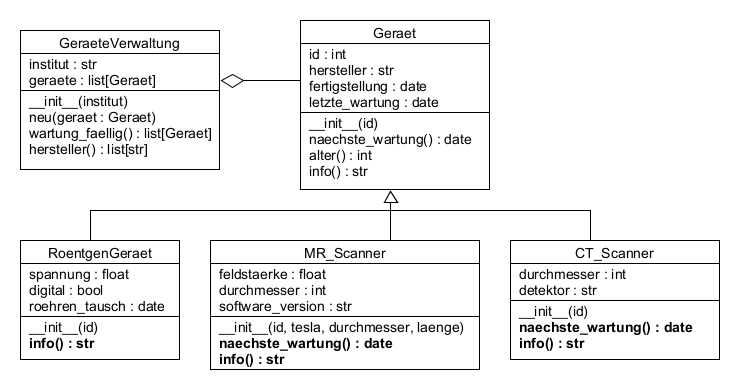

# 25.1 Polymorphie

Beim Programmieren bedeutet Polymorphie,
dass eine Methode in verschiedenen Klassen
unterschiedliche Implementierungen haben kann.

Betrachten wir als Beispiel noch einmal die Übung UE_25.0_2: Geräteverwaltung
([Übungen UE_25.0](../uebungen/UE_25.0_Vererbung.md)).
In der Klasse `Geraet` gibt es die Methode
`naechste_wartung()`, welche angibt, wann das Gerät
das nächste Mal gewartet werden muss.

Bei der Übung UE_25.0_2 ist angegeben, 
dass die Wartung 1x pro Jahr durchgeführt werden muss. 
Daher ist die nächste Wartung immer ein Jahr nach der letzten Wartung
fällig.

Bei einem realistischeren Szenario ist es wahrscheinlich so, 
dass nicht alle Geräte gleich oft gewartet werden müssen.
Die Berechnung des Termins für die nächste Wartung
kann daher von Gerät zu Gerät unterschiedlich sein.

Zu diesem Zweck kann man in den erbenden Klassen die Methode
`naechste_wartung()` überschreiben (neu definieren):

```python
from typing import override
from datetime import date, timedelta

class Geraet:
    ...
    def naechste_wartung(self) -> date:
        return self.letzte_wartung + timedelta(days=365)
    ...

class MR_Scanner(Geraet):
    ...
    @override
    def naechste_wartung(self) -> date:
        if self.software_version < "2.0":
            return self.letzte_wartung + timedelta(days=90)
        else:
            return self.letzte_wartung + timedelta(days=180)
    ...
        
class CT_Scanner(Geraet):
    ...
    @override
    def naechste_wartung(self) -> date:
        if self.detektor == "solid_state":
            return self.letzte_wartung + timedelta(days=180)
        else:
            return self.letzte_wartung + timedelta(days=365)
    ...
```

Die Methode `naechste_wartung()` in der Klasse `Geraet`
berechnet die nächste Wartung für alle Geräte
für 1 Jahr nach der letzten Wartung.
Alle Geräte, für welche das zutrifft
(in diesem Fall `RoentgenGeraet`),
erben die Methode einfach von der Klasse `Geraet`.

Bei Geräten, für welche ein anderer Wartungszyklus gilt,
kann die Methode in der jeweils erbenden Klasse überschrieben werden:

Die Methode `naechste_wartung()` in der Klasse `MR_Scanner`
berechnet die nächste Wartung für MR-Scanner
basierend auf der letzten Wartung und der Software-Version.

Die Methode `naechste_wartung()` in der Klasse `CT_Scanner`
berechnet die nächste Wartung für CT-Scanner
basierend auf der letzten Wartung und dem Detektor-Typ.

Aus Sicht der Klasse `GeraeteVerwaltung`
ist klar, dass jedes Gerät eine Methode `naechste_wartung()`
hat, welche das Datum der nächsten Wartung zurückgibt.
Die konkrete Implementierung der Methode
hängt jedoch von der Art des Geräts ab.

*Bemerkung: der Decorator `@override` dient ähnlich
wie type annotations zur Kennzeichnung, dass diese
Methode eine Methode der Basisklasse überschreibt.
Das ist nicht notwendig aber guter Stil, 
um sicherzustellen, dass nicht unabsichtlich
Methoden überschrieben werden.*

Ähnlich verhält es sich mit der Methode `info()`.
In der Basisklasse `Geraet` soll diese Methode laut Aufgabe UE_25.0_2
eine Beschreibung liefern,
welche die ID, den Hersteller, das Alter in Monaten 
und das Datum der nächsten Wartung enthält, z.B.: 
`"Gerät 1234, Hersteller: Siemens, Alter: 38 Monate, nächste Wartung am 1.1.2026`.

In den erbenden Klassen könnte man die Methode überschreiben,
so dass noch weitere relevante Informationen
in die Beschreibung aufgenommen werden:

```python
class Geraet:
    ...
    def info(self) -> str:
        return f'Gerät: {self.id}, Hersteller: {self.hersteller}, ' +\
            f'Alter: {self.alter()} Monate, ' +\
            f'nächste Wartung am {self.naechste_wartung().strftime("%d.%m.%Y")}'
    ...

class RoentgenGeraet(Geraet):
    ...
    @override
    def info(self) -> str:
        return 'Röntgen-' + super().info() + \
            f', Spannung: {self.spannung} kV, Digital: {self.digital}, ' +\
            f'Röhrentausch am {self.roehren_tausch.strftime("%d.%m.%Y")}'
    ...

class MR_Scanner(Geraet):
    ...
    @override
    def info(self) -> str:
        return 'MR-' + super().info() + \
            f', Feldstärke: {self.feldstaerke} T, Durchmesser: {self.durchmesser} cm, ' +\
            f'Software-Version: {self.software_version}'
    ...
        
class CT_Scanner(Geraet):
    ...
    @override
    def info(self) -> str:
        return 'CT-' + super().info() + \
            f', Durchmesser: {self.durchmesser} cm, Detektor: {self.detektor}'
    ...
```

Die Methode `info()` in der Klasse `Geraet`
liefert eine allgemeine Beschreibung des Geräts.

Die erbenden Klassen `RoentgenGeraet`, `MR_Scanner` und `CT_Scanner`
überschreiben die Methode `info()`,
um zusätzliche Informationen
über das jeweilige Gerät hinzuzufügen.

Mit `super().info()` wird die Methode `info()`
der Basisklasse `Geraet` aufgerufen,
um die allgemeine Beschreibung zu erhalten.
Dann werden die spezifischen Informationen
über das jeweilige Gerät hinzugefügt.

(Den Aufruf `super().__init(...)__` hast du schon im Abschnitt
[25.0 Vererbung](25.0_Vererbung.md) kennengelernt.
Dort hat der Konstruktor einer erbendern Klasse
den Konstruktor der Basisklasse aufgerufen.) 

Im folgenden UML-Diagramm ist das Ganze noch einmal
grafisch dargestellt. Die Methoden,
welche eine Methode der Basisklasse überschreiben,
sind fett hier markiert:




## Übungen
[Hier geht's zu den Übungen](../uebungen/UE_25.1_Polymorphie.md)

## Zusammenfassung
### Wichtige Begriffe
- Polymorphie
- Überschreiben 
- super(): 
- @override


### Das sollst du können
- Verstehen, was Polymorphie ist.
- eine Methode überschreiben
- die Methode der Basisklasse aufrufen
- die Annotation @override verwenden


[<<](25.0_Vererbung.md) &emsp; [>>](#)