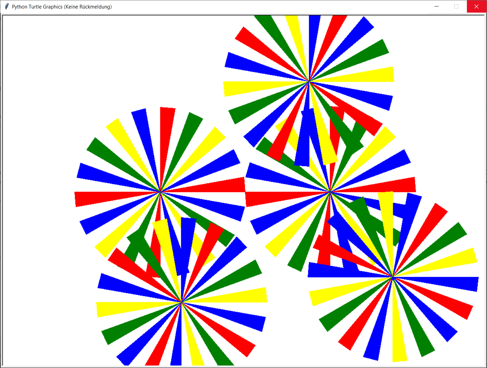

# UE_6.0 Turtle - Übungen

Zu diesen Übungen besteht die Qualitätssicherung darin,
dass du als Dokumentation Screenshots von deinen Lösungen machst
und diese in deinem Protokoll speicherst.

Außerdem soll wie immer der Programmcode 
in dein Protokoll kopiert werden.

Außer dem Protokoll sollen die Script-Dateien abgegeben werden.

### UE_6.0_1: Blume mit Funktionen

Der Code, der die Blume zeichnet, enthält sehr viele 
Anweisungen, welche sich immer wiederholen.
Versuche, den Code zu vereinfachen, indem du die Anweisugen, 
welche sich immer wiederholen in eine Funktion verpackst,
die du dann mehrmals aufrufst.
Insgesamt sollte der Code dann deutlich kürzer werden.

### UE_6.0_2: Mehrere Blumen

Verpacke den gesamten Code, der die Blume zeichnet, in eine Funktion.
Diese kannst du nun mehrmals aufrufen, nachdem du die Schildkröte jeweils
an eine andere Position bewegt hast, um mehrere Blumen zu zeichnen:

Versuche, dieses Bild mit möglichst wenig Code zu zeichnen.

### UE_6.0_3: Dein eigenes Kunstwerk

Zeichne mit der Schildkröte dein eigenes Kunstwerk.

[<<](../skriptum/06.0_turtle.md)