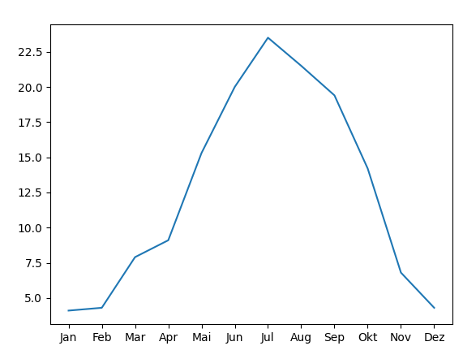

# UE_11.0 Methoden

Bei den folgende Übungen soll wieder eine Qualitätssicherung
durchgeführt werden. Führe entweder ein Review durch,
oder teste deine Programme systematisch. 
Die Qualitätssicherung ist wieder im Protokoll und auch
in den Skripten zu dokumentieren.

### UE_11.0_1 Text untersuchen

*Untersuche zuerst die Methoden des Datentyps `str`,
damit du sie in dieser Aufgabe verwenden kannst.
Außerdem solltest du wissen, dass ein String
in Python sich wie eine Liste von Zeichen verhält.
Das bedeutet, dass du auf die einzelnen Zeichen
genauso zugreifen kannst wie auf die Elemente einer Liste.*

Schreibe ein Skript, das den Benutzer einen Text 
eingeben lässt und dann folgende Informationen ausgibt:
- Die Anzahl der Zeichen im Text
- Die Anzahl der Wörter im Text
- Die Anzahl der groß geschriebenen Wörter
- Die Information, ob im Text Zahlen vorkommen

### UE_11.0_2 Text-Datei lesen

Die Funktion `open` ermöglicht es dir, eine Datei zu öffnen.
Erstelle zuerst in deinem Arbeitsverzeichnis eine Textdatei `datei.txt`
und schreibe ein paar Zeilen Text hinein.
Dann öffne die Datei mit der Funktion `open`:

```python
datei = open("datei.txt", "r")
```

Mit dem Parameter `"r"` gibst du an, dass die Datei zum Lesen geöffnet wird.

Die Funktion `open` gibt ein Objekt zurück, das die Datei repräsentiert.
Untersuche nun, welchen Datentyp und welche Methoden dieses Objekt `datei` hat.
Wie heißen die Methoden, um eine oder mehrere Zeilen aus der Datei zu lesen?

Schreibe nun ein Skript, welches die Datei `datei.txt` öffnet und den Inhalt
der Datei analysiert.
Das Script soll die gleichen Informationen wie bei Übung
`UE_11.0_1` ausgeben, aber diesmal für den Inhalt der Datei.

### UE_11.0_3 Text-Datei schreiben

Erstelle ein Skript, das den Benutzer einen Text eingeben lässt
und diesen Text in eine Datei `ausgabe.txt` schreibt.
Die Datei soll im Arbeitsverzeichnis erstellt werden.
In diesem Fall musst du die Funktion `open` mit dem Parameter `"w"` verwenden.
Finde selbst heraus, 
mit welchen Methoden du den Text in die Datei schreiben kannst.

### UE_11.0_4 Info-Datei für Textdatei

Kombiniere nun die bisherigen Aufgaben:
Schreibe ein Skript, das den Benutzer nach dem Namen einer Textdatei fragt.
Dann soll das Skript diese Textdatei einlesen und den enthaltenen Text
analysieren. Es soll dann eine Info-Datei erstellen, 
welche die Informationen, die in Übung `UE_11.0_1` aufgezählt wurden, 
enthält.

### UE_11.0_5 Wetterdaten grafisch darstellen

Lade mit dem folgenden Link historische Wetterdaten der Wetterstation Hohe Warte herunter:
https://www.wien.gv.at/gogv/l9viebdleclwea1872f

Schreibe nun ein Python-Skript, in welchem du eine Liste mit den durchschnittlichen
Temperaturwerten der Monate des vergangenen Jahres befüllst.
Eine andere Liste befüllst du mit den Namen der 12 Monate.

Erstelle dann ein Diagramm, in dem die Temperaturwerte dargestellt werden.
Verwende dazu die Bibliothek `matplotlib`.
Darin gibt es ein Modul `pyplot`, das du verwenden kannst.
Du musst die Methoden `plot` und `show` verwenden, 
um das Diagramm zu erstellen.
Für das Jahr 2023 würde es ca. so aussehen:




[<<](../skriptum/11.0_Methoden.md)