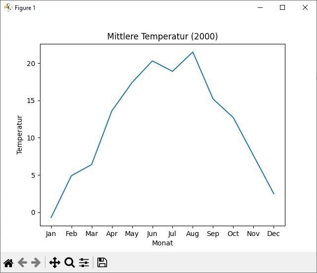

# UE_14.0 CSV-Dateien - Übungen

## UE_14.0_1: Personenstatistik

In der Datei [`personen.csv`](../daten/personen.csv) sind Daten von frei erfundenen
Personen gespeichert, jeweils Vorname, Nachname, Geschlecht
Geburtsdatum, Größe und Gewicht.

Achtung: als Trennzeichen zwischen den Datenfeldern wird ein Komma (`,`) verwendet.

Erstelle ein Python-Skript, welches diese Datei einliest und
eine Statistik ausgibt, welche folgende Informationen enthält:

* Anzahl der Personen
* Durchschnittsalter
* Durchschnittsgröße
* Durchschnittsgewicht
* Anzahl der Frauen
* Anzahl der Männer
* Größte und kleinste Person (Vorname, Nachname, Größe, Gewicht)
* Schwerste und leichteste Person (Vorname, Nachname, Größe, Gewicht)
* Älteste und jüngste Person (Vorname, Nachname, Geburtsdatum)


## UE_14.0_2: Wetterdaten

Falls du sie nicht mehr hast, 
lade noch einmal mit dem folgenden Link historische 
Wetterdaten der Wetterstation Hohe Warte herunter: 
https://www.wien.gv.at/gogv/l9viebdleclwea1872f

Bei der Übung 11.0_5 hast du bereits ein Skript erstellt, 
welches die Temperatur grafisch darstellt. 
Die Temperaturwerte hast du allerdings händisch aus der CSV-Datei kopiert.

Erstelle nun ein Skript, welches Benutzer fragt, von welchem 
Jahr die Temperaturwerte dargestellt werden sollen.

Das Skript soll dann die entsprechenden Temperaturwerte aus der CSV-Datei
lesen und grafisch darstellen.

Beispiel:

```
%Run ue_14.py
Jahr: 2000
```

sollte ungefähr folgende Grafik ausgeben:



**Hinweise:**

Für den Aufruf von `read_csv` benötigst du folgend Parameter:

Die CSV-Datei enthält eine Überschrift, welche mit dem Parameter
`skiprows=1` übersprungen werden kann.

Um Dezimalzahlen richtig einzulesen, welche  `,` statt `.` als Dezimaltrennzeichen verwenden,
kannst du den Parameter `decimal=','` verwenden.


## UE_14.0_3: Diabetes Dataset

Auf der Seite https://www.kaggle.com
gibt es sehr viele frei verfügbare Daten, 
welche für Übungszwecke verwendet werden können. 
Die Datei [diabetes.csv](../daten/diabetes.csv)
stammt von dort. 
Sie enthält Daten von Patienten, welche auf Diabetes getestet wurden.
In den Spalten sind verschiedene Messwerte enthalten. 
Die letzte Spalte enthält die Information, 
ob Diabetes diagnostiziert wurde (1) oder nicht (0).


Eine Beschreibung der Daten kannst du hier finden:
https://www.kaggle.com/datasets/whenamancodes/predict-diabities

Erstelle ein Python-Skript, welches diese Daten einliest und 
folgende Fragen beantwortet:

* Wie viele Personen wurden untersucht?
* Wie viele Personen haben Diabetes?
* Sind die Personen mit Diabetes älter als die Personen ohne Diabetes?
    Wenn ja, wie viel älter sind sie im Durchschnitt?
* Um wie viel ist der durchschnittliche Glucose-Wert bei Personen 
    mit Diabetes höher als bei Personen ohne Diabetes?
* Wie hoch ist der prozentuelle Anteil an Übergewichtigen (BMI>25) bei
    Personen mit Diabetes und bei Personen ohne Diabetes?

Überlege dir noch 3 weitere Fragen, welche man von diesem
Datensatz beantworten könnte und implementiere diese.


[<<](../skriptum/14.0_CSV_Dateien.md)