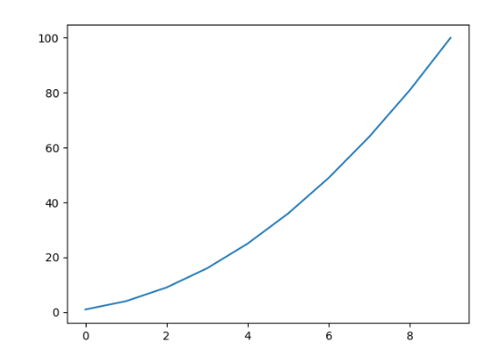

# UE_20.2 Virtuelle Python Umgebung (venv) - Übungen

### UE_20.2_1: PyCharm Projekt mit bereits existierender Virtueller Umgebung

Erstelle in dem Verzeichnis, welches du für deine PyCharm-Projekte verwendest, 
eine virtuelle Umgebung mit dem Namen `.venv`.
Verwende dazu die Konsole und den Befehl:

```bash
python -m venv .venv
```
*(Es kann auch `python3` oder nur `py` sein, je nach Installation)*

Öffne PyCharm und erstelle ein neues Projekt.
Wähle dabei die Option "Custom Environment" aus
und wähle die `.venv`-Umgebung aus,
die du gerade erstellt hast.


### UE_20.2_2: Package in der Virtuellen Umgebung installieren
Öffne das Terminal in PyCharm
und installiere das Package `matplotlib` in der virtuellen Umgebung mit dem Befehl:

```bash
pip install matplotlib
```

Erstelle danach ein neues Python-Skript
mit dem Namen `plot_example.py`.
In diesem Skript sollst du ein einfaches Diagramm erstellen,
welches die Quadratzahlen von 1 bis 10 darstellt:



[<<](../skriptum/20.2_venv.md)