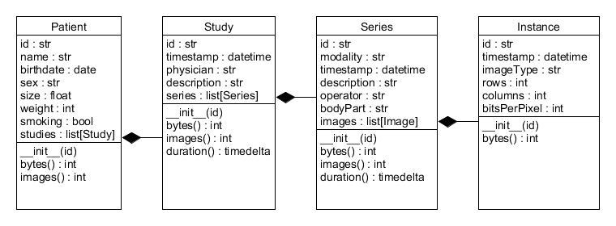

# UE_23.0 Assoziationen - Übungen

### UE_23.0_1: Krankenakte

Erstelle die Klassen `Patient`, `Messwert` und `Krankenakte`
aus dem Abschnitt 23.0 Assoziationen.

(Hinweis: Kopiere den Code nicht einfach, 
sondern erstelle ihn selbständig mit dem UML-Diagramm als Vorlage.)

Füge dann noch weitere Methoden in die Klasse `Krankenakte` ein:

- durchschnittstemperatur(self) -> float:
  Gibt die durchschnittliche Körpertemperatur von allen Messwerte zurück.
- blutdruck(self) -> tuple[int, int]:
  Gibt den durchschnittlichen Blutdruck (Systole, Diastole) von allen Messwerten zurück.
- info(self) -> str:
  Gibt eine kurze Beschreibung der Krankenakte zurück, z.B.
  *"Patient: Max Mustermann, SVNR: 123456789, Geburtsdatum: 01.01.1990,
  Anzahl Messwerte: 3"*.
- pathologische_messwerte(self) -> list[Messwert]:
  Gibt eine Liste aller Messwerte zurück, 
  die außerhalb des normalen Bereichs liegen:
  - Temperatur < 36.0 oder > 37.5
  - Systole < 90 oder > 140
  - Diastole < 60 oder > 90

Erstelle dann ein Python-Skript, welches diese Klassen verwendet,
um folgende Objekte zu erstellen:

Rufe dann die Methoden auf:
* `durchschnittstemperatur()`
* `blutdruck()`
* `info()`
* `pathologische_messwerte()`

Überprüfe im Debugger, ob die Objektstruktur richtig aufgebaut wurde.

Gib die Ergebnisse aus und überprüfe sie.

### UE_23.0_2: DICOM

Medizinische Bilder werden normalerweise im 
[DICOM-Format](https://de.wikipedia.org/wiki/Digital_Imaging_and_Communications_in_Medicine)
gespeichert.
Jedes DICOM-Bild enthält neben den Bilddaten auch Metadaten.
Diese Metadaten umfassen viele Informationen entsprechend 
dem DICOM information model. Dieses ist hierarchisch strukturiert:
Für einen Patienten können mehrere Studien (Untersuchungen) existieren,
wobei jede Studie mehrere Serien (Bildserien) enthalten kann,
wobei jede Serie mehrere Bilder (Instanzen) enthält.

Erstelle die folgenden Klassen, welche dieses Informationsmodell
abbilden:

Die Daten (Attribute) sind im UML-Diagramm angegeben.
Sie entsprechen ungefähr den wichtigsten DICOM-Metadaten.
Einige sind vielleicht nicht ganz klar 
und sollen hier erklärt werden:
Jede Klasse hat eine id. Das ist eine eindeutige Kennung.
- Patient:
  - smoking: Raucher-Status (Raucher/Nichtraucher)
- Study:
  - timestamp: Zeitpunkt des Beginns der Untersuchung
  - description: Beschreibung der Studie
  - physician: Name des Arztes, der die Studie durchgeführt hat
- Series:
  - timestamp: Zeitpunkt des Beginns der Serie
  - modality: Modalität (z.B. CT, MR, Ultraschall)
  - bodyPart: Körperteil, der untersucht wurde (z.B. Kopf, Thorax)
- Instance:
  - rows: Anzahl der Bildzeilen
  - columns: Anzahl der Bildspalten
  - bitsPerPixel: Anzahl der Bits pro Pixel
  - timestamp: Zeitpunkt der Bildaufnahme

Daneben sollen folgende Methoden implementiert werden
(sind in dieser Form nicht im DICOM-Standard definiert):
- Instance:
  - bytes() -> int:
    Gibt die Größe des Bildes in Bytes zurück. 
    Diese lässt sich aus den Bildzeilen und -spalten
    sowie aus den bitsPerPixel berechnen.
- Series:
  - images() -> int:
    Gibt die Anzahl der Bilder in der Serie zurück.
  - bytes() -> int:
    Gibt die Gesamtgröße aller Bilder in der Serie in Bytes zurück.
  - duration() -> timedelta:
    Gibt die Dauer der Serie als timedelta zurück.
    Diese lässt sich aus den Zeitpunkten der 
    ersten und letzten Instanz berechnen.
- Study:
  - series() -> int:
    Gibt die Anzahl der Serien in der Studie zurück.
  - images() -> int:
    Gibt die Gesamtanzahl der Bilder in der Studie zurück.
  - bytes() -> int:
    Gibt die Gesamtgröße aller Bilder in der Studie in Bytes zurück.
  - duration() -> timedelta:
    Gibt die Dauer der Studie als timedelta zurück.
    Diese lässt sich aus den Zeitpunkten der 
    ersten und letzten Instanz berechnen.
- Patient:
  - images() -> int:
    Gibt die Gesamtanzahl der Bilder des Patienten zurück.
  - bytes() -> int:
    Gibt die Gesamtgröße aller Bilder des Patienten in Bytes zurück.

Erstelle zusätzlich ein Python-Skript, in welchem diese Klassen verwendet werden, 
um im Speicher folgende Objekt-Struktur aufzubauen:

Überprüfe mit dem Debugger, ob die Objektstruktur richtig aufgebaut wurde.

Rufe dann für beide Studien die Methode `duration()` auf und gib das Erebnis aus.

Rufe für den Patienten die Methoden `images()` und `bytes()` auf 
und gib jeweils das Ergebnis aus.

Überprüfe die Ergebnisse

[<<](../skriptum/23.0_Assoziationen.md)

