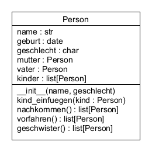

# UE_24.0 Referenzen - Übungen

### UE_20.0_1 Stammbaum

Erweitere die Klasse `Person`, welche für den Stammbaum verwendet wird,
so dass sie dem folgenden UML-Klassendiagramm entspricht:

**zusätzliche Attribute:**
- `geschlecht` kann den Wert `w` oder `m` enthalten (`char`)
- `geburt` das Geburtsdatum (`date`, wird mit `None` initialisiert)

**zusätzliche Methoden:**
- `kind_einfuegen(self, kind)` 
  Fügt eine andere Person-Instanz als Kind ein. 
  Gleichzeitig wird die Person, bei welcher das Kind eingefügt wird,
  dem Kind als Mutter oder Vater gesetzt (je nach Geschlecht)
- `nachkommen(self)` gibt eine Liste aller Nachkommen der Person
  (Kinder, Enkelkinder, Urenkel, ...) zurück
- `vorfahren(self)` gibt eine Liste aller Vorfahren der Person
  (Eltern, Großeltern, ...) zurück
- `geschwister(self)` gibt eine Liste aller Geschwister der Person zurück

Erstelle dann ein Skript, in welchem mithilfe deiner erweiterten
Klasse `Person` dein eigener Stammbaum zusammengestellt wird.
Es sollten Personen von mindestens 3 Generationen vorkommen.
(Falls du nicht deine eigenen Daten verwenden willst,
kannst du auch einen fiktiven Stammbaum zusammensetzen.)

Rufe dann die Methoden `nachkommen`, `vorfahren` und `geschwister` 
von einigen Personen in deinem Stammbaum
auf und gib die Namen der Personen aus, 
welche in der jeweiligen Listen enthalten sind.

[<<](../skriptum/24.0_Referenzen.md)

