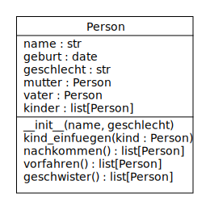
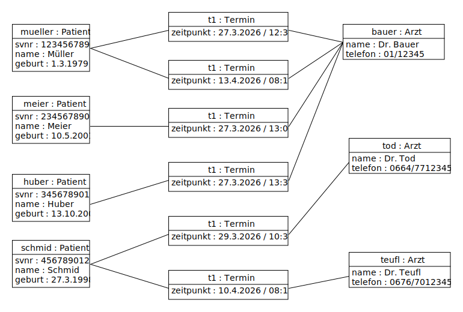

# UE_24.0 Referenzen - Übungen

### UE_24.0_1 Stammbaum

Erweitere die Klasse `Person`, welche für den Stammbaum verwendet wird,
so dass sie dem folgenden UML-Klassendiagramm entspricht:

**zusätzliche Attribute:**
- `geschlecht` kann den Wert `w` oder `m` enthalten (`str`)
- `geburt` das Geburtsdatum (`date`, wird mit `None` initialisiert)

**zusätzliche Methoden:**
- `kind_einfuegen(self, kind)` 
  Fügt eine andere Person-Instanz als Kind ein. 
  Gleichzeitig wird die Person, bei welcher das Kind eingefügt wird,
  dem Kind als Mutter oder Vater gesetzt (je nach Geschlecht)
- `nachkommen(self)` gibt eine Liste aller Nachkommen der Person
  (Kinder, Enkelkinder, Urenkel, ...) zurück
- `vorfahren(self)` gibt eine Liste aller Vorfahren der Person
  (Eltern, Großeltern, ...) zurück
- `geschwister(self)` gibt eine Liste aller Geschwister der Person zurück

Erstelle dann ein Skript, in welchem mithilfe deiner erweiterten
Klasse `Person` dein eigener Stammbaum zusammengestellt wird.
Es sollten Personen von mindestens 3 Generationen vorkommen.
(Falls du nicht deine eigenen Daten verwenden willst,
kannst du auch einen fiktiven Stammbaum zusammensetzen.)

Du kannst z.B. auch einen Teil des Stammbaums der Habsburger nachbilden: 
https://habsburg.org/familiengeschichte-stammbaum/grosser-stammbaum/

Rufe dann die Methoden `nachkommen`, `vorfahren` und `geschwister` 
von einigen Personen in deinem Stammbaum
auf und gib die Namen der Personen aus, 
welche in der jeweiligen Listen enthalten sind.

### UE_24.0_2 Terminverwaltung

Für die Verwaltung von Arztterminen sollen die folgenden 
Klassen `Patient`, `Arzt` und `Termin` erstellt werden.
Implementiere sie genau entsprechend dem folgenden UML-Diagramm:

Jeder `Patient` hat einen Namen (`str`), 
eine Sozialversicherungsnummer (`int`),
ein Geburtsdatum (`date`)
und eine Liste von Terminen (`list[Termin]`).

Jeder `Arzt` hat einen Namen (`str`),
eine Telefonnummer (`str`),
und eine Liste von Terminen (`list[Termin]`).

Ein `Termin` wird immer zwischen einem `Patient` und einem `Arzt`
vereinbart und hat ein Datum und eine Uhrzeit (`datetime`).

Der Konstruktor der Klasse `Patient` 
bekommt den Namen, die Sozialversicherungsnummer und
das Geburtsdatum als Parameter übergeben.

Die Klasse `Patient` hat eine Methode
`neuer_termin(...)`, welche einen neuen Termin in die Liste
einfügt. 
Der neue Termin muss danach mit seiner `patient`-Referenz
auf diesen Patienten verweisen.
Davor muss aber überprüft werden,
ob der Patient keinen anderen Termin hat, 
welcher sich mit dem neuen Termin überschneidet.
Es wird angenommen, dass jeder Termin 30 Minuten dauert.
Sollte der Termin nicht eingefügt werden können,
wird eine Exception ausgelöst.

Der Konstruktor der Klasse `Arzt`
bekommt den Namen und die Telefonnummer als Parameter übergeben.

Die Klasse `Arzt` hat ebenfalls eine Methode
`neuer_termin(...)`, welche einen neuen Termin in die Liste
einfügt. 
Der neue Termin muss danach mit seiner `arzt`-Referenz
auf diesen Arzt verweisen.
Davor muss aber überprüft werden,
ob der Arzt keinen anderen Termin hat,
welcher sich mit dem neuen Termin überschneidet.
Sollte der Termin nicht eingefügt werden können,
wird eine Exception ausgelöst.

Die Klasse `Termin` hat einen Konstruktor,
welcher Datum/Uhrzeit als Parameter übergeben bekommt.

Die Methode `gleichzeitig(...)` bekommt als Parameter
eine Referenz auf einen anderen Termin übergeben
und überprüft,
ob sich der aktuelle Termin mit dem anderen Termin überschneidet.
Es wird angenommen, dass jeder Termin 30 Minuten dauert.
Falls sich die Termine überschneiden, wird `True` zurückgegeben,
ansonsten `False`.

Die Klasse `Arzt` hat zusätzlich eine Methode
`reserviere_termin(...)`,
welche eine Referenz auf einen Patienten und 
ein Datum/Uhrzeit als Parameter übergeben bekommt.
Sie soll einen neuen Termin
zwischen dem Arzt und dem Patienten
an dem angegebenen Datum/Uhrzeit vereinbaren.

**Verwendung der Klassen**

Erstelle dann ein Python-Skript, welches diese Klassen verwendet,
um mit möglichst wenig Code das folgende Objektmodell 
im Speicher aufzubauen:

Überprüfe mit dem Debugger, dass die Referenzen
richtig gesetzt sind.

Füge dann noch den Code ein, welcher versucht,
am 10.4.2026 um 8:00 
einen Termin zwischen Patient Huber und Arzt Dr. Teufl
zu vereinbaren. Das sollte nicht funktionieren,
da Dr. Teufl am selben Tag um 8:15 schon einen Termin hat.

Füge eine Fehlerbehandlung (try-except) ein,
um den Fehler abzufangen und eine Fehlermeldung auszugeben.

[<<](../skriptum/24.0_Referenzen.md)

