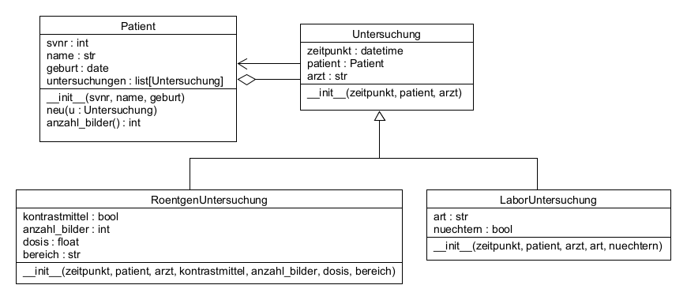
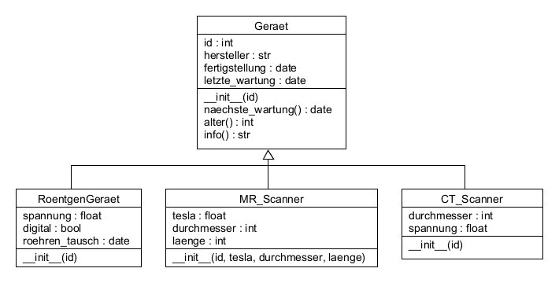

# UE_25.0 Vererbung - Übungen

### UE_25.0_1: Untersuchungen

Erstelle die Klassen `Untersuchung`, `Roentgenuntersuchung` und `Laboruntersuchung`
welche im Abschnitt [25.0 Vererbung](../skriptum/25.0_Vererbung.md) 
beschrieben sind. Allerdings sollst du noch ein paar
Änderungen vornehmen (siehe UML-Diagramm und Beschreibung unten).

Hinweis: Kopiere den Code nicht einfach,
sondern erstelle ihn selbständig mit dem  
UML-Diagramm als Vorlage:



Jede Untersuchung hat eine Referenz auf den Patienten, 
zu dem sie gehört. 
Umgekehrt hat hier auch jeder Patient eine Liste von Untersuchungen,
die für ihn durchgeführt wurden.

Mit der Methode `neu(...)` wird dem Patienten eine
Untersuchung hinzugefügt.
Gleichzeitig soll hier auch der neuen Untersuchung
die Referenz auf den Patienten gesetzt werden.

Die Klasse Patient hat nun auch eine Methode `anzahl_bilder()`.
Diese soll berechnen, wie viele Röntgenbilder
für den Patienten gemacht wurden und diese Zahl zurückgeben.

ACHTUNG: Da in der Liste der Untersuchungen des Patienten
nicht nur Röntgenuntersuchungen, sondern auch Laboruntersuchungen
enthalten sind,
muss die Methode `anzahl_bilder()`
überprüfen, ob die jeweilige Untersuchung (hier `u` genannt)
eine Instanz der Klasse `Roentgenuntersuchung` ist:

```python
...
if type(u) == RoentgenUntersuchung:
    # Röntgenuntersuchung gefunden
    anzahl += u.anzahl_bilder
...
```

Erstelle zusätzlich ein Skript, in welchem
ein Patient mit einigen Untersuchungen angelegt wird.
Es sollten mindestens 2 Röntgenuntersuchungen
und 2 Laboruntersuchungen enthalten sein.
Die Untersuchungen sollen jeweils mit der Methode `neu(...)`
hinzugefügt werden.
Überprüfe dann mithilfe des Debuggers,
ob die Referenzen korrekt gesetzt sind.
Probiere aus, ob die Methode `anzahl_bilder()`
die korrekte Anzahl an Bildern zurückgibt.

### UE_25.0_2: Geräteverwaltung

Für die Verwaltung der Untersuchungsgeräte in einem 
Radiologie-Institut sollen folgende Klassen implementiert werden:



Für jedes Gerät wird eine Identifizierungsnummer (`id`) 
gespeichert. Diese wird dem Konstruktor übergeben.
Außerdem werden für jedes Gerät folgende Informationen gespeichert:
- `hersteller`: Name des Herstellers (`str`)
- `fertigstellung`: Datum, an dem das Gerät fertiggestellt wurde (`date`)
- `letzte_wartung`: Datum der letzten Wartung (`date`)

Es gibt folgende Methoden:
- `naechste_wartung()`: Diese Methode gibt das Datum der nächsten 
  fälligen Wartung zurück. Normalerweise ist eine Wartung
  pro Jahr vorgesehen.
- `alter()`: Diese Methode gibt das Alter des Geräts in Monaten zurück,
  basierend auf dem Fertigstellungsdatum.
- `info()`: Diese Methode gibt eine kurze Beschreibung des Geräts zurück,
  welche die ID, den Hersteller, das Alter in Monaten 
  und das Datum der nächsten Wartung enthält, z.B.: 
  `"Gerät 1234, Hersteller: Siemens, Alter: 38 Monate, nächste Wartung am 1.1.2026`.

Von dieser Klasse sollen folgende Unterklassen erben: 
`RoentgenGeraet`, `MR_Scanner` und `CT_Scanner`.

Die Klasse RoentgenGeraet hat zusätzlich folgende Attribute:
- `spannung`: Röhrenspannung in kV (`float`)
- `digital`: Ob das Gerät digital arbeitet (`bool`)
- `roehren_tausch`: Datum, an dem die Röhre zuletzt getauscht wurde (`date`)

Die Klasse MR_Scanner hat zusätzlich folgende Attribute:
- `feldstaerke`: Magnetfeldstärke in Tesla (`float`)
- `durchmesser`: Röhrendurchmesser in cm (`int`)
- `software_version`: Version der Software (`str`)

Die Klasse CT_Scanner hat zusätzlich folgende Attribute:
- `durchmesser`: Durchmesser der Gantry in cm (`int`)
- `detektor`: Typ des Detektors (`str`)

Die Verwaltung der Geräte übernimmt die Klasse `GeraeteVerwaltung`.
Diese hat als Attibute den Namen des Instituts (`str`)
und die Liste der Geräte.
Die Klasse hat folgende Methoden:
- `neu(geraet)`: Diese Methode fügt ein Gerät zur Liste hinzu.
  Die Methode muss außerdem die ID des Geräts überprüfen,
  ob sie bereits in der Liste vorhanden ist.
  Sollte die ID bereits vorhanden sein,
  bekommt das Gerät eine neue ID, 
  welche noch nicht vergeben ist.
- `wartung_faellig()`: Diese Methode gibt eine Liste aller Geräte zurück,
  bei denen die nächste schon Wartung fällig ist.
- `hersteller()`: Diese Methode gibt eine Liste aller Hersteller
  zurück, von welchen Geräte in der Geräteverwaltung vorhanden sind.

Erstelle dann ein Skript, in welchem
ein `GeraeteVerwaltung`-Objekt angelegt wird.
Füge mindestens 3 verschiedene Geräte hinzu,
welche jeweils Instanzen der Unterklassen 
`RoentgenGeraet`, `MR_Scanner` und `CT_Scanner` sind.

Verwende dann die Methoden `wartung_faellig()` und `hersteller()`,
um die Listen der fälligen Wartungen und der Hersteller zu erhalten.
Gib diese Informationen aus.


[<<](../skriptum/25.0_Vererbung.md)