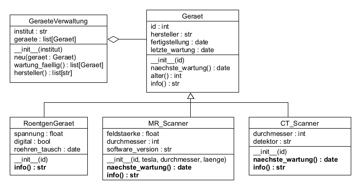

# UE_25.1 Polymorphie - Übungen

### UE_25.1_1: Geräteverwaltung mit Polymorphie
Ändere die Klassen aus Übung [UE_25.0_2](../uebungen/UE_25.0_Vererbung.md)
so, dass die Methode `naechste_wartung()` 
in den Klassen `MR_Scanner` und `CT_Scanner`
überschrieben wird.

Für MR-Scanner mit Software-Version kleiner 2.0
gilt ein Wartungsintervall von 3 Monaten,
für MR-Scanner mit Software-Version größer oder gleich 2.0
gilt ein Wartungsintervall von 6 Monaten.
MR-Scanner mit einer Feldstärke von mehr als 3 Tesla
müssen unabhängig von der Software-Version
alle 2 Monate gewartet werden.

Für CT-Scanner mit einem Solid-State-Detektor
gilt ein Wartungsintervall von 6 Monaten,
für CT-Scanner mit einem anderen Detektor
gilt ein Wartungsintervall von 12 Monaten.

Wie im Abschnitt [25.1 Polymorhie](../skriptum/25.1_Polymorphie.md) besprochen,
soll die Methode `info()` in den erbenden Klassen
überschrieben werden, so dass alle Geräte-spezifischen Informationen
im String enthalten sind.




### UE_25.1_2: ProtokollListe

Implementiere eine Klasse `ProtokollListe`,
welche von der Klasse `list` erbt.
Deine Klasse `ProtokollListe` soll folgende Methoden überschreiben:
- `append(self, item)`
- `remove(self, item)`
- `clear(self)`
- `insert(self, index, item)`
- `reverse(self)`
- `__del__(self)`

Der Konstruktor deiner Klasse `ProtokollListe` bekommt als Parameter
einen Dateinamen. Diese Datei wird im Konstruktor geöffnet.
In diese Datei wird jeweils mitgeschrieben, was mit der Liste passiert.

Beispiel:
```python
protokoll = ProtokollListe('protokoll.txt')
protokoll.append("Test 1")
protokoll.append("Test 2")
protokoll.append("Test 3")
print(protokoll)
protokoll.reverse()
print(protokoll)
protokoll.insert(1, "Test 4")
print(protokoll)
protokoll.remove("Test 2")
print(protokoll)
protokoll.clear()
print(protokoll)
```

Dieser Code sollte folgendes ausgeben:
```
['Test 1', 'Test 2', 'Test 3']
['Test 3', 'Test 2', 'Test 1']
['Test 3', 'Test 4', 'Test 2', 'Test 1']
['Test 3', 'Test 4', 'Test 1']
[]
```

In der Datei `protokoll.txt` sollten ungefähr folgende Zeilen stehen:
```
Test 1 angehängt
Test 2 angehängt
Test 3 angehängt
Liste umgekehrt
Test 4 an Position 1 eingefügt
Test 2 entfernt
Liste geleert
ProtokollListe geschlossen
```

Bemerkung: die Methode `__del__(self)` wird aufgerufen,
wenn das Objekt der Klasse `ProtokollListe` aus dem Speicher entfernt wird,
also auch beim Beenden des Programms.
Das ist ein guter Zeitpunkt, um die Protokoll-Datei zu schließen.


[<<](../skriptum/25.1_Polymorphie.md)