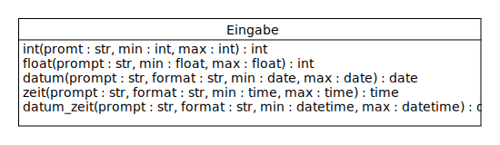
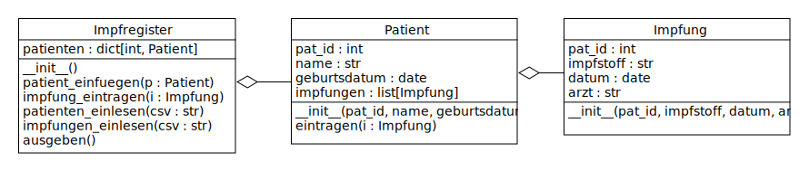

# UE_26.0 Exceptions - Übungen

### UE_26.0_1 Eingabe-Klasse

Erstelle die folgende Klasse `Eingabe`:



Sie enthält für verschiedene Datentypen (`int`, `float`, `date`, `time`, `datetime`) 
jeweils eine Methode, um die Eingabe von der Konsole zu lesen.
Der Parameter `prompt` ist ein String, 
der als Eingabeaufforderung ausgegeben wird.
Die Parameter `min` und `max` sind optional 
und geben den erlaubten Wertebereich an.
Bei Datum und Uhrzeit werden auch die erwarteten Formate als 
optionale Parameter übergeben.

Die Methoden sollen so lange die Eingabe von der Konsole lesen,
bis eine gültige Eingabe gemacht wurde.
Ungültige Eingaben sollen mit einer Fehlermeldung quittiert werden.
Beispiel:

```python
eingabe = Eingabe()
geburt = eingabe.datum("Gib dein Geburtsdatum ein (dd.mm.yyyy): ", format="%d.%m.%Y", max=date.today())
print(geburt)
```

Ein Programmlauf könnte dann z.B. könnte so aussehen:

```
Gib dein Geburtsdatum ein (dd.mm.yyyy): 1.Dezember
time data '1.Dezember' does not match format '%d.%m.%Y'
Gib dein Geburtsdatum ein (dd.mm.yyyy): 31.12.2030
ungültiges Datum: 2030-12-31
Gib dein Geburtsdatum ein (dd.mm.yyyy): 1.12.2010
2010-12-01
```

*Hinweis: 
Schließe das Umwandlen der Eingabe in einen `try`-Block ein. 
Im selben `try`-Block kannst du auch die Überprüfung des Wertebereichs vornehmen.
Falls der Wertebereich nicht eingehalten wird, 
kannst du eine `ValueError`-Exception werfen.
Alle Exceptions, die in diesem `try`-Block auftreten, 
können mit einem `except`-Block abgefangen werden,
um die Fehlermeldung auszugeben.*

**optionale Parameter (siehe [Kapitel 29](../skriptum/29.0_parameter.md)):**  
Bei einem Parameter einer Funktion oder Methode kann man einen Standardwert angeben.
Wenn der Aufrufer keinen Wert für diesen Parameter angibt,
wird der Standardwert verwendet. Beispiel:

```python
def datum(prompt, format="%Y-%m-%d", min=date.min, max=date.max):
    ...
```

Aufruf:

```python
eingabe.datum("Gib dein Geburtsdatum ein (dd.mm.yyyy): ", max=date.today())
```

In diesem Fall werden die Standardwerte für `format`  und `min`verwendet.

### UE_26.0_2 Impfregister

Erstelle die folgenden Klassen für die Verwaltung von Patienten
und ihren Impfungen:



Die Klasse `Patient` enthält die Attribute `name` und `geburtstag`
und eine Patienten-ID (`pat_id`). 
Außerdem enthält sie eine Liste von `Impfung`-Instanzen.

Die Klasse `Impfung` enthält die Attribute `datum`, `impfstoff` und `arzt` 
und die Patienten-ID des geimpften Patienten (`pat_id`).

Die Klasse Impregister enthält ein Dictionary, 
in dem die Patienten-IDs als Schlüssel 
und die `Patient`-Instanzen als Werte gespeichert werden.

Die Klasse `Patient` enthält die Methode `eintragen`, 
um eine neue Impfung für den Patienten einzutragen.
Sie bekommt als Parameter eine `Impfung`-Instanz übergeben,
die sie in die Liste der Impfungen aufnimmt.
Falls die Patienten-ID der Impfung nicht mit der Patienten-ID 
des Patienten übereinstimmt,
soll eine `ValueError`-Exception geworfen werden.
Falls für den Patienten bereits eine Impfung mit demselben Datum 
und demselben Impfstoff eingetragen ist,
soll ebenfalls eine `ValueError`-Exception geworfen werden.

Die Klasse `Impregister` enthält folgende Methoden:
- `patient_einfuegen(patient)`: Fügt einen neuen Patienten in das Register ein.
    Falls die Patienten-ID bereits im Register vorhanden ist, 
    soll eine `ValueError`-Exception geworfen werden.
- `impfung_eintragen(impfung)`: Fügt eine neue Impfung in das Register ein.
    Falls die Patienten-ID der Impfung nicht im Register vorhanden ist, 
    soll eine `ValueError`-Exception geworfen werden.
    Ansonsten wird die Impfung in die Liste der Impfungen 
    des entsprechenden Patienten eingetragen.
- `patienten_einlesen(csv)`: Liest die Patientendaten aus einer CSV-Datei ein und fügt die Patienten in das Register ein.
    Die CSV-Datei enthält die Spalten `ID`, `Name` und `Geburtstag`.
    Als Trennzeichen wird ein Semikolon verwendet.
    Die erste Zeile der CSV-Datei enthält die Spaltenüberschriften.
- `impfungen_einlesen(csv)`: Liest die Impfdaten aus einer 
    CSV-Datei ein und fügt die Impfungen in das Register ein.
    Die CSV-Datei enthält die Spalten `Patienten-ID`, `Impfstoff`, 
   `Datum` und `Arzt`.
    Als Trennzeichen wird ein Semikolon verwendet. 
    Die erste Zeile der CSV-Datei enthält die Spaltenüberschriften.
- `ausgeben()`: Gibt die Patientendaten und ihre Impfungen auf der Konsole aus.

ACHTUNG: die CSV-Dateien verwenden mehrere verschiedene
Datumsformate. Beim Einlesen der Daten soll 
das Datumsformat automatisch erkannt werden.
Das kannst du z.B. mit einer Schleife realisieren, 
in der du die verschiedenen Datumsformate ausprobierst, bis eines passt.
In der Schleife ist ein try-except-Block enthalten,
welcher die Fehlermeldung abfängt, die beim Versuch, das Datum umzuwandeln,
auftritt. Sobald ein Datumsformat gefunden wurde, das zum Datum passt,
kann die Schleife mit einem `break`-Statement verlassen werden.  
Außerdem enthalten die CSV-Dateien einige ungültige Einträge.
Diese sollen mit einer Fehlermeldung quittiert werden,
aber die restlichen Daten sollen trotzdem eingelesen werden.

Probiere deine Klassen mit den folgenden CSV-Dateien aus:
- [patienten.csv](../daten/patienten.csv)
- [impfungen.csv](../daten/impfungen.csv)

Folgender Code

```python
register = Impfregister()
register.patienten_einlesen('patienten.csv')
register.impfungen_einlesen('impfungen.csv')
register.ausgeben()
```

sollte ungefähr folgende Ausgabe erzeugen:

```
Fehler beim Einlesen der Zeile: 6;COVID-19 (Spikevax);1. Dezember 2020;Dr. Mayer. Fehler: Ungültiges Datum: 1. Dezember 2020
Fehler beim Einlesen der Zeile: 28;Influenza;19.10.2019;Dr. Schuster. Fehler: Der Patient für diese Impfung existiert nicht.
Fehler beim Einlesen der Zeile: 33;Hepatitis B;03.03.2002;Dr. Gruber. Fehler: Der Patient für diese Impfung existiert nicht.
Patient: Sophie Gruber (ID: 7, Geburtsdatum: 1988-04-08)
	Impfung: Influenza am 2020-11-11 von Dr. Schuster
	Impfung: COVID-19 (Spikevax) am 2021-04-05 von Dr. Mayer
	Impfung: Hepatitis A am 2008-09-10 von Dr. Gruber
	Impfung: Hepatitis B am 2000-11-05 von Dr. Gruber
Patient: Nina Auer (ID: 15, Geburtsdatum: 1987-01-28)
	Impfung: FSME am 2018-05-09 von Dr. Huber
	Impfung: Masern am 1994-02-09 von Dr. König
	Impfung: Influenza am 2019-10-19 von Dr. Schuster
	Impfung: Influenza am 2018-10-18 von Dr. Schuster
Patient: Lisa Schmidt (ID: 3, Geburtsdatum: 1978-11-02)
	Impfung: FSME am 2019-04-18 von Dr. Huber
	Impfung: Tetanus am 2015-07-15 von Dr. Berger
	Impfung: Influenza am 2018-10-21 von Dr. Schuster
...
```

[<<](../skriptum/26.0_Exceptions.md)