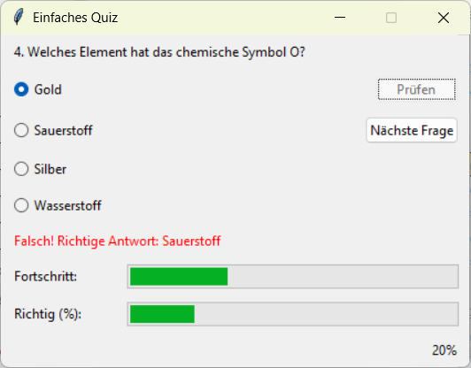
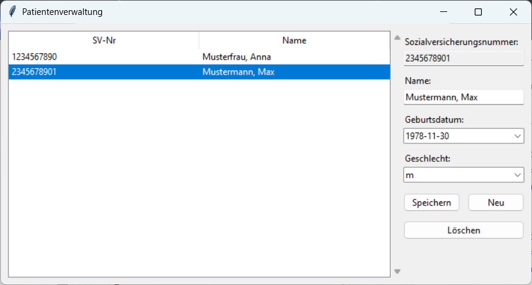

# UE_27.0 GUI-Programmierung mit Tkinter - Übungen

### UE_27.0_1 Quiz

Erstelle eine GUI mit Tkinter, die ein einfaches Quiz enthält. 
Die Fragen und Anworten werden aus einer CSV-Datei eingelesen, 
die folgende Spalten enthält:
- `Frage`
- `Antwort1`
- `Antwort2`
- `Antwort3`
- `Antwort4`
- `Richtige Antwort` (1, 2, 3 oder 4)
Die GUI soll folgende Elemente haben:
- Ein Label, das die Frage anzeigt
- Mehrere Radiobuttons, um die möglichen Antworten auszuwählen
- Einen Button, um die Antwort zu überprüfen
- Ein Label, um das Ergebnis anzuzeigen (richtig oder falsch)
- Einen Button, um zur nächsten Frage zu wechseln
- Einen Fortschrittsbalken, um den Fortschritt im Quiz anzuzeigen
- Einen Balken, welcher den Prozentsatz der richtigen Antworten anzeigt

Beispiel:

### UE_27.0_2 Verwaltungsprogramm

Erstelle eine GUI mit Tkinter, die ein einfaches Verwaltungsprogramm 
für Objekte deiner Wahl enthält.
Folgende Funktionen sollen implementiert werden:
- alle Objekte in einer Liste anzeigen
- ausgewähltes Objekt bearbeiten
- bestehendes Objekt löschen
- neues Objekt erstellen
- die Liste der Objekte in einer Datei speichern und wieder laden 
 
Hier ist ein Beispiel für ein Verwaltungsprogramm für Patienten:

[<<](../skriptum/27.0_Tkinter.md)