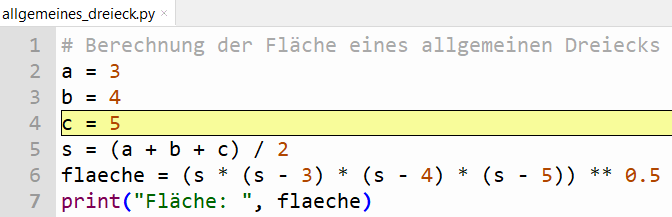

# Debugger - Übungen

### UE_F0_1: Variablenwerte im Debugger

Gehe 3 deiner Scripts aus dem vorigen Abschnitt mit dem Debugger Schritt für Schritt durch.
Erstelle dabei eine Tabelle, in welcher du nach jeder Zeile des Scripts die Variablenwerte notierst.
Beispiel:

 

| Zeile | a   | b   | c   | s   | flaeche |
|-------|-----|-----|-----|-----|---------|
| 2     | 3   |     |     |     |         |
| 3     | 3   | 4   |     |     |         |
| 4     | 3   | 4   | 5   |     |         |
| 5     | 3   | 4   | 5   | 6.0 |         |
| 6     | 3   | 4   | 5   | 6.0 | 6.0     |
| 7     | 3   | 4   | 5   | 6.0 | 6.0     |

[<<](../skriptum/4.1_Debugger.md)