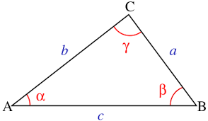

# UE_5.1 Module - Übungen

### UE_5.1_1: Funktionen in einem eigenen Modul

Erstelle ein Modul für alle Funktionen aus den  
[Übungen zum Abschnitt 5.0 Funktionen](../uebungen/UE_5.0_Funktionen.md).
Falls du sie schon alle in eine einzelne Python Datei geschrieben hast,
ist das gut, andernfalls kopiere sie in eine Datei (= Modul).

Importiere dann dieses Modul in der Python Konsole und teste jede Funktion.

Zur Dokumentation, dass alles getestet wurde und 
richtig funktioniert, kopiere den Verlauf aus
der Python Konsole in dein Protokoll. 

### UE_5.1_2: Dreiecksfläche aus Winkel und 2 Seiten

Schreibe eine Funktion `dreiecksflaeche(a, b, gamma)`,
die die Fläche eines Dreiecks berechnet, 
wenn zwei Seiten `a` und `b` und der eingeschlossene 
Winkel `gamma` bekannt sind.

Die Fläche eines Dreiecks kann mit der Formel

$$A = \frac{1}{2} \cdot a \cdot b \cdot \sin(\gamma)$$

berechnet werden.

Die Funktion `sin()` ist im Modul `math` enthalten.
Der Winkel muss dabei allerdings in der Einheit `rad` (Radiant) 
übergeben werden.
Die Umrechnung von Grad in Radiant kann mit der Funktion `radians()` 
aus dem Modul `math` erfolgen.

### UE_5.1_3: Produkt vieler Zahlen

Schreibe eine Funktion `produkt(von, bis)`, die das Produkt
aller natürlichen Zahlen vom ersten Parameterwert bis zum
zweiten Parameterwert berechnet.
Die Funktion soll dabei die Grenzwerte `von` und `bis` 
einschließen.
Du kannst dafür die Funktion `factorial` aus dem Modul `math` verwenden.
Diese Funktion berechnet das Produkt aller natürlichen Zahlen
von `1` bis `n`. (Beispiel: `factorial(5)` ergibt `120`).

[<<](../skriptum/5.1_Module.md)