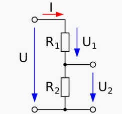
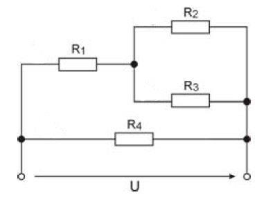

# UE_7.0 Ein-/Ausgabe - Übungen

Zur Qualitätssicherung dieser Übungen gehört,
dass du die Scripte mehrmals laufen lässt und dabei 
verschiedene Eingaben machst.
Alternativ kannst du auch ein Review durchführen.
Die Qualitätssicherungsmaßnahme muss auf jeden Fall
im Script als Kommentar vermerkt werden und auch im Protokoll
dokumentiert werden.

Abzugeben sind die Script-Dateien und das Protokoll.

### UE_7.0_1: Dreiecksfläche

Teile das Skript zur Berechnung der Dreiecksflächen in zwei Skripte auf:
  - ein Skript, das die Funktion `dreiecks_flaeche` definiert
  - ein Skript, das die Funktion aufruft und die Ein- und Ausgabe macht.
  

### UE_7.0_2: BMI

Schreibe ein Skript, welches Benutzer nach Gewicht in kg und
Größe in cm fragt und den Body Mass Index (BMI) berechnet und ausgibt.
Der BMI wird nach folgender Formel berechnet:

    $$ BMI = \frac{Gewicht}{Größe^2} $$ 
    
    (Gewicht in kg, Größe in m)

    ACHTUNG: Die Größe muss in Meter umgerechnet werden.

### UE_7.0_3: Spannungsteiler

Ein Spannungsteiler besteht aus zwei Widerständen $R_1$ und $R_2$. 
An jedem Widerstand fällt eine Spannung ab, 
die sich aus dem Verhältnis der Widerstände ergibt.

Du hast wahrscheinlich im BMSV-Unterricht bereits gelernt,
wie ein Spannungsteiler funktioniert.

Schreibe ein Skript, welches Benutzer nach den Widerständen $R_1$ und $R_1$ 
und nach der Gesamtspannung $U$ fragt
und die Spannungen $U_1$ und $U_2$ ausgibt, die an den Widerständen abfabfallen.

### UE_7.0_4: Spannungen berechnen

Erstelle ein Skript, welches Benutzer dazu auffordert, 
die Gesamtspannung $U$ und die Widerstandswerte $R_1$ bis $R_4$ 
für diesen Schaltplan einzugeben.

Das Skript soll dann die Spannungswerte $U_1$ bis $U_4$ ausgeben, 
welche an den jeweiligen Widerständen abfallen.

[<<](../skriptum/7.0_EinAusgabe.md)
