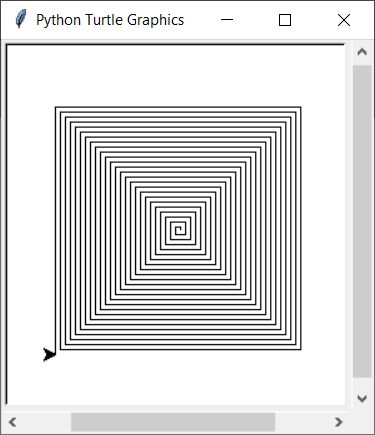

# UE_9.1 Iteration - Übungen

### UE_9.1_1: Summe der Zahlen in einer Liste

Schreibe ein Python Script, 
in dem zuerst eine Liste von 10 Zahlen definiert 
und dann die Summe dieser Zahlen berechnet wird.

### UE_9.1_2: Labyrinth

Dieses Bild wurde mit [turtle](../skriptum/6.0_turtle.md) erstellt.
In einer Schleife wurde immer wieder `forward(...)` 
und anschließend `left(90)` aufgerufen.
Der Wert für `forward` wurde in jedem Schritt um 2 erhöht.

Erstelle ein Script, welches dieses Bild nachzeichnet.

[<<](../skriptum/9.1_Iteration.md)