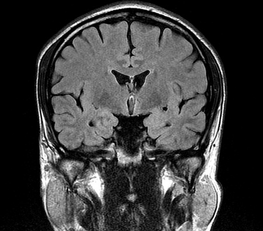

# Python als Taschenrechner - Übungen

Bei den folgenden Übungen sollst 
verschiedene Berechnungen in der Python-Konsole durchführen.
Kopiere die Berechnungen und Ergebnisse aus der Python Konsole 
in ein Word-Dokument. Erkläre kurz, wie du die Berechnungen durchgeführt hast 
und gib Links zu den verwendeten Quellen an.
Konvertiere zum Schluss das Word-Dokument in ein PDF-Dokument, 
welches du dann auf Moodle abgibst.

*Der Hauptzweck dieser Übungen ist es, dass du die Python-Konsole
und erste Python-Befehle kennenlernst. Du sollst aber auch eine
Idee davon haben, wofür diese Berechnungen gut sein könnten.
Hier werden unter anderem einige Flächen-Berechnungen von dir verlangt.
In der Medizin - speziell bei der Bildgebung - ist es oft wichtig,
Flächen und Volumina berechnen zu können.*

### UE_C0_1: Rechecktsfläche
Berechne die Fläche eines Rechtecks mit den Seitenlängen 3.5 und 4.7

### UE_C0_2: Diagonale eines Rechtecks
Berechne die Diagonale eines Rechtecks mit den Seitenlängen 3.5 und 4.7 (Hinweis: $\sqrt{x} = x^{0.5}$)

### UE_C0_3: Body Mass Index (BMI)
Berechne deinen Body Mass Index (BMI) mit deinem Gewicht und deiner Größe 
(siehe [Wikipedia: Body-Mass-Index](https://de.wikipedia.org/wiki/Body-Mass-Index)): 
$BMI = \frac{Gewicht}{Größe^2}$ (Gewicht in kg, Größe in m)

*(Der BMI ist ein Wert, der häufig verwendet wird, um eine erste
Abschätzung zu haben, ob jemand über- oder untergewichtig ist.
Wichtig ist aber anzumerken, dass der BMI alleine oft nicht sehr
aussagekräftig ist. Beispielsweise wären sehr viele Spitzensportler
übergewichtig, wenn man nur nach dem BMI gehen würde.
In Wirklichkeit haben bei ihnen aber die Muskeln sehr viel Masse.)*

### UE_C0_4: Grad Fahrenheit 
Schätze die heutige Außentemperatur und rechne sie auf Fahrenheit um 
(siehe [Wikipedia: Grad Fahrenheit](https://de.wikipedia.org/wiki/Grad_Fahrenheit)):
$F = C \cdot \frac{9}{5} + 32$

*(Die Fahrenheit-Skala wird in den USA und in einigen anderen Ländern verwendet.)*

### UE_C0_5: Körperoberfläche
Berechne deine Körperoberfläche mit der 
[Gehan-George-Formel](https://de.wikipedia.org/wiki/K%C3%B6rperoberfl%C3%A4che)

*(Die Körperoberfläche ist ein wichtiger Wert in der Medizin,
um z.B. die Dosierung von Medikamenten zu berechnen
oder um den Schweregrad von Verbrennungen zu bestimmen.)*

### UE_C0_6: Blutvolumen
Berechne dein Blutvolumen (ca. 7% deines Körpergewichts)

### UE_C0_7: Ventrikel im Gehirn

In diesem Bild siehst du ein `Magnetresonanz-Tomographie 
(MRT)` - Bild von einem menschlichen Gehirn.
Etwas oberhalb der Mitte des Bildes sind flüssigkeitsgefüllte Hohlräume, 
die `Ventrikel`, zu sehen.
Berechne die Fläche, welche von den Ventrikeln auf diesem Bild eingenommen wird.

Nimm dazu an, dass beide Ventrikel Dreiecke sind. Miss die 3 Seiten der Dreiecke ab
und suche eine Formel, wie man aus den 3 Seiten eines Dreiecks die Fläche berechnen kann.

Die Breite des aufgenommenen Bereiches (`field of view - FOV`) 
beträgt in Realität 22 cm. 
Du musst also auch abmessen, wie breit das `FOV` auf deinem 
Bildschirm ist und den Maßstab berechnen.

Beschreibe in deinem Word-Dokument, wie du genau vorgegangen bist 
um die Fläche zu berechnen. Füge einen Link zu der Seite ein, wo du die Formel gefunden hast.
Kopiere außerdem deine Eingaben von der Python-Konsole und das Ergebnis in dein Word-Dokument.

[<<](../markdown/C0_PythonAlsTaschenrechner.md)