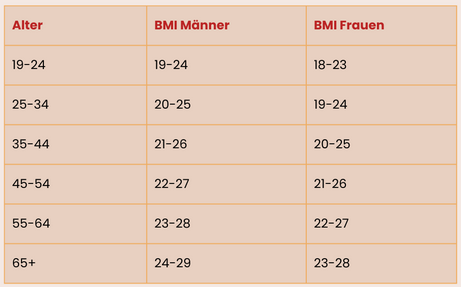

# Bedingte Anweisungen - Übungen

### (UE_J0_1) Körpertemperatur

Erstelle eine Funktion, welcher man die Körpertemperatur übergeben kann.
Die Funktion soll dann einen Text zurückgeben, welcher die Temperatur beschreibt.

Die Beschreibung soll folgendermaßen aussehen:

- unter 36.0: "Unterkühlung"
- unter 37.5: "Normaltemperatur"
- unter 38.0: "erhöhte Temperatur"
- ab 38.0: "Fieber"

### (UE_J0_2) Teiler

Erstelle eine Funktion, welcher zwei Zahlen übergeben werden.
Die Funktion soll dann zurückgeben, ob eine der beiden Zahlen durch die andere teilbar ist.
Wenn das der Fall ist, soll die Funktion `True` zurückgeben, ansonsten `False`.
Mit dem Modulo-Operator kannst du prüfen, ob eine Zahl durch eine andere teilbar ist:

```python
if zahl1 % zahl2 == 0:
    print("teilbar")
else:
    print("nicht teilbar")
```

### (UE_J0_3) Schaltjahr

Erstelle eine Funktion, welcher man eine Jahreszahl übergeben kann.
Die Funktion soll dann `True` zurückgeben, wenn das Jahr ein Schaltjahr ist, ansonsten `False`.
Ein Jahr ist ein Schaltjahr, wenn es durch 4 teilbar ist.
Jedoch ist ein Jahr kein Schaltjahr, wenn es durch 100 teilbar ist.
Es sei denn, das Jahr ist durch 400 teilbar, dann ist es doch ein Schaltjahr.

### (UE_J0_4) Datumsprüfung

Erstelle eine Funktion, welcher man drei Zahlen übergeben kann.
Die Zahlen sollen ein Datum darstellen: Tag, Monat, Jahr.
Die Funktion soll dann `True` zurückgeben, wenn das Datum korrekt ist, ansonsten `False`.

Überlege selbst, welche Bedingungen für ein korrektes Datum gelten.

### (UE_J0_5) Body Mass Index mit Bewertung


*[Quelle](https://plakos-akademie.de/bmi-rechner/)*

Diese Tabelle zeigt die Normalwerte für den Body Mass Index (BMI) für Frauen und Männer
in Abhängigkeit vom Alter.

Zum Beispiel ist ein 30-jähriger Mann mit einem BMI unter 20 untergewichtig,
von 20 bis 25 normalgewichtig und über 25 übergewichtig.

Erstelle eine Funktion, welcher man das Geschlecht, 
das Alter, die Größe in cm und das Gewicht in kg übergeben kann.
Die Funktion soll dann den BMI berechnen und eine Bewertung 
entsprechend dieser Tabelle zurückgeben.

### (UE_J0_6) Dreiecksungleichung

Erstelle eine Funktion, welcher man drei Zahlen übergeben kann.
Die Zahlen sollen die Längen der Seiten eines Dreiecks darstellen.
Die Funktion soll dann `True` zurückgeben, wenn die Dreiecksungleichung erfüllt ist, 
ansonsten `False`.

Die Dreiecksungleichung besagt, 
dass die Summe der Längen zweier Seiten eines Dreiecks
immer größer sein muss als die Länge der dritten Seite.


[<<](../markdown/J0_IfElse.md)